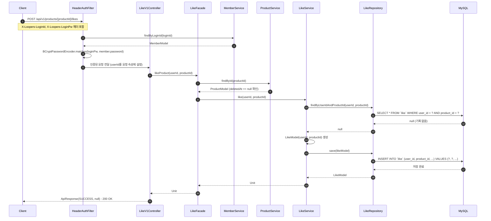
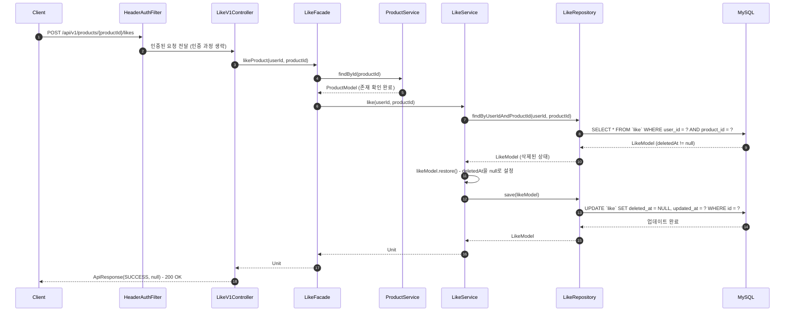
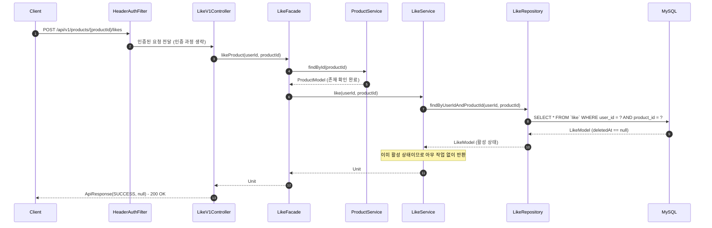
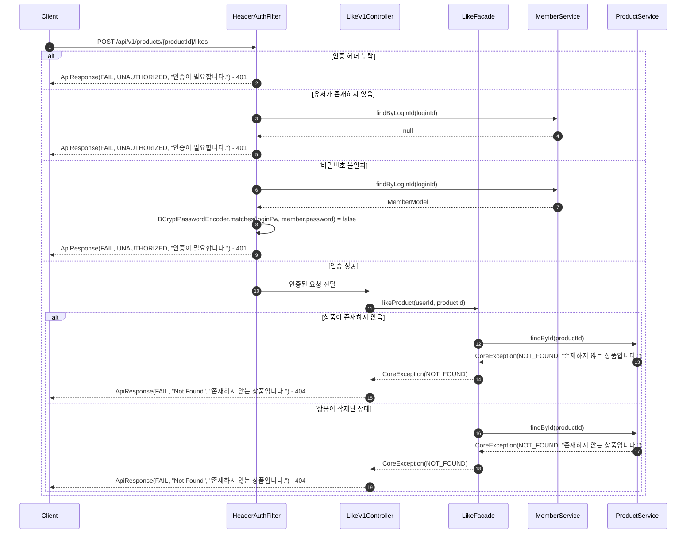
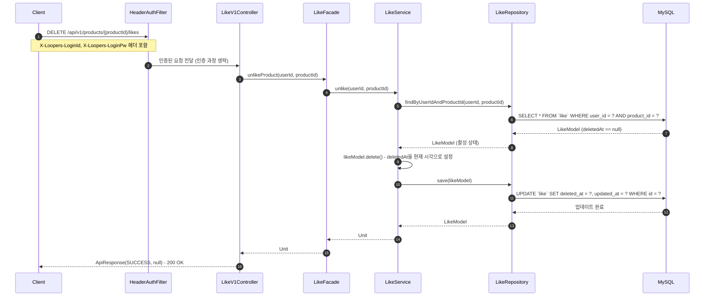
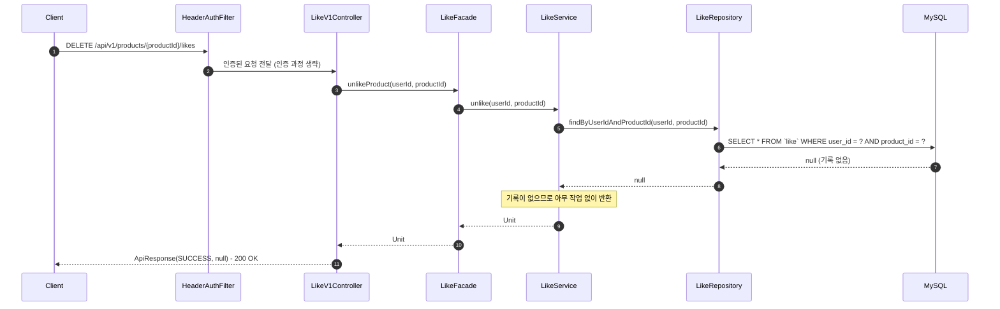
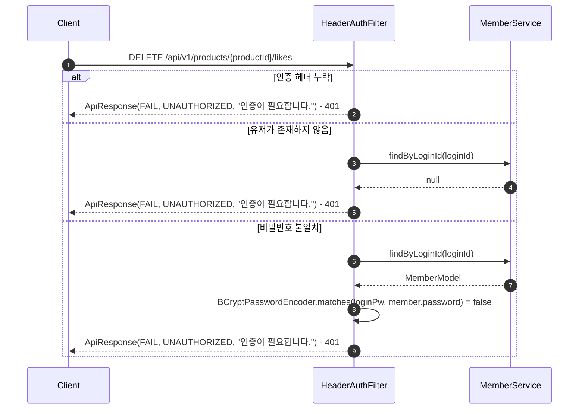
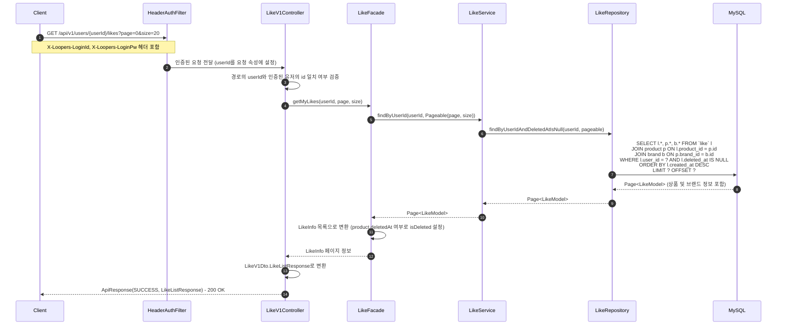
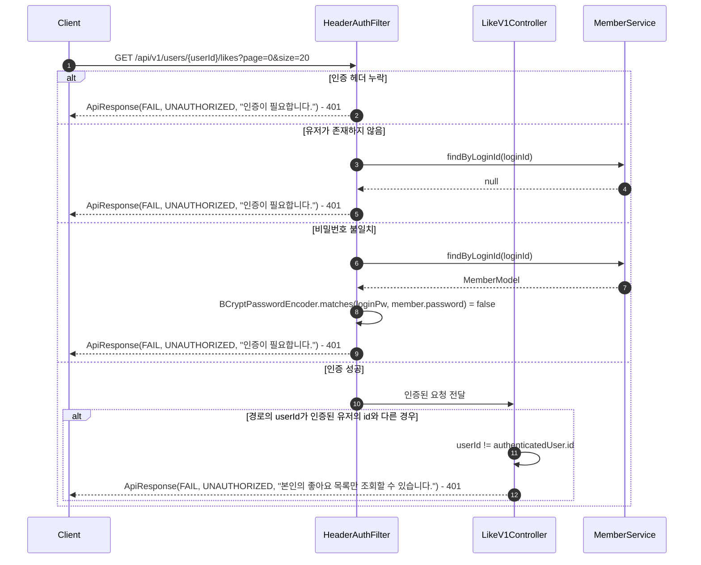

# 좋아요 시퀀스 다이어그램

## 개요

이 문서는 좋아요 기능의 3개 API 엔드포인트에 대한 시퀀스 다이어그램을 정의합니다.

| METHOD | URI | 설명 |
|--------|-----|------|
| POST | `/api/v1/products/{productId}/likes` | 상품 좋아요 등록 |
| DELETE | `/api/v1/products/{productId}/likes` | 상품 좋아요 취소 |
| GET | `/api/v1/users/{userId}/likes` | 내가 좋아요한 상품 목록 조회 |

---

## 1. 상품 좋아요 등록 - 성공 흐름

### 1-1. 신규 좋아요 등록

유저가 아직 좋아요하지 않은 상품에 좋아요를 등록하는 경우입니다.

### 1-2. 삭제된 좋아요 복원 (재등록)

유저가 이전에 좋아요를 취소한 상품에 다시 좋아요를 등록하는 경우입니다.

### 1-3. 이미 활성화된 좋아요 (멱등 처리)

유저가 이미 좋아요한 상품에 다시 좋아요를 요청하는 경우입니다.

### 흐름 설명

| 단계 | 책임 객체 | 수행 내용 |
|------|----------|----------|
| 1 | HeaderAuthFilter | `X-Loopers-LoginId`, `X-Loopers-LoginPw` 헤더에서 로그인 정보를 추출한다 |
| 2 | HeaderAuthFilter | MemberService를 통해 유저 존재 확인 및 비밀번호 검증을 수행한다 |
| 3 | LikeFacade | ProductService를 통해 상품이 존재하고 삭제되지 않았는지 검증한다 |
| 4 | LikeService | 기존 좋아요 기록을 조회하여 상태에 따라 분기 처리한다 |
| 5 | LikeService | 기록 없음: 새 LikeModel을 생성하여 저장한다 |
| 5 | LikeService | 삭제된 기록: restore()를 호출하여 deletedAt을 null로 복원한다 |
| 5 | LikeService | 활성 기록: 추가 작업 없이 반환한다 (멱등 처리) |

---

## 2. 상품 좋아요 등록 - 에러 흐름

### 에러 시나리오

| 조건 | 발생 시점 | 책임 객체 | 에러 타입 | HTTP 상태 |
|------|----------|----------|----------|----------|
| `X-Loopers-LoginId` 또는 `X-Loopers-LoginPw` 헤더가 누락된 경우 | HeaderAuthFilter | HeaderAuthFilter | UNAUTHORIZED | 401 |
| 헤더의 loginId에 해당하는 유저가 존재하지 않는 경우 | HeaderAuthFilter | MemberService | UNAUTHORIZED | 401 |
| 헤더의 비밀번호가 저장된 비밀번호와 일치하지 않는 경우 | HeaderAuthFilter | HeaderAuthFilter | UNAUTHORIZED | 401 |
| productId에 해당하는 상품이 존재하지 않는 경우 | LikeFacade | ProductService | NOT_FOUND | 404 |
| productId에 해당하는 상품이 삭제된 상태인 경우 | LikeFacade | ProductService | NOT_FOUND | 404 |

---

## 3. 상품 좋아요 취소 - 성공 흐름

### 3-1. 활성 좋아요 취소

유저가 좋아요한 상품의 좋아요를 취소하는 경우입니다.

### 3-2. 좋아요 기록이 없는 상품 취소 (멱등 처리)

유저가 좋아요하지 않은 상품에 취소를 요청하는 경우입니다.

### 흐름 설명

| 단계 | 책임 객체 | 수행 내용 |
|------|----------|----------|
| 1 | HeaderAuthFilter | `X-Loopers-LoginId`, `X-Loopers-LoginPw` 헤더로 유저를 인증한다 |
| 2 | LikeFacade | 좋아요 취소 요청을 LikeService에 위임한다 (상품 존재 검증 불필요) |
| 3 | LikeService | 기존 좋아요 기록을 조회하여 상태에 따라 분기 처리한다 |
| 4 | LikeService | 활성 기록: delete()를 호출하여 deletedAt을 현재 시각으로 설정한다 |
| 4 | LikeService | 기록 없음 또는 이미 삭제: 추가 작업 없이 반환한다 (멱등 처리) |

---

## 4. 상품 좋아요 취소 - 에러 흐름

### 에러 시나리오

| 조건 | 발생 시점 | 책임 객체 | 에러 타입 | HTTP 상태 |
|------|----------|----------|----------|----------|
| `X-Loopers-LoginId` 또는 `X-Loopers-LoginPw` 헤더가 누락된 경우 | HeaderAuthFilter | HeaderAuthFilter | UNAUTHORIZED | 401 |
| 헤더의 loginId에 해당하는 유저가 존재하지 않는 경우 | HeaderAuthFilter | MemberService | UNAUTHORIZED | 401 |
| 헤더의 비밀번호가 저장된 비밀번호와 일치하지 않는 경우 | HeaderAuthFilter | HeaderAuthFilter | UNAUTHORIZED | 401 |

> 좋아요 취소는 멱등성을 보장하므로, 인증 이후 단계에서는 에러가 발생하지 않습니다.
> 좋아요 기록이 없거나 이미 삭제된 경우에도 200 OK를 반환합니다.

---

## 5. 내가 좋아요한 상품 목록 조회 - 성공 흐름

### 흐름 설명

| 단계 | 책임 객체 | 수행 내용 |
|------|----------|----------|
| 1 | HeaderAuthFilter | `X-Loopers-LoginId`, `X-Loopers-LoginPw` 헤더로 유저를 인증한다 |
| 2 | LikeV1Controller | 경로의 `userId`와 인증된 유저의 `id`가 일치하는지 검증한다 |
| 3 | LikeFacade | LikeService에 페이징된 좋아요 목록 조회를 위임한다 |
| 4 | LikeService | 삭제되지 않은 좋아요 기록을 최신순으로 페이징하여 조회한다 |
| 5 | LikeRepository | 상품, 브랜드 정보를 JOIN하여 함께 조회한다 (삭제된 상품도 포함) |
| 6 | LikeFacade | 조회 결과를 LikeInfo로 변환하며, 상품의 deletedAt 여부를 isDeleted로 매핑한다 |
| 7 | LikeV1Controller | LikeInfo를 LikeV1Dto.LikeListResponse로 변환하여 응답한다 |

---

## 6. 내가 좋아요한 상품 목록 조회 - 에러 흐름

### 에러 시나리오

| 조건 | 발생 시점 | 책임 객체 | 에러 타입 | HTTP 상태 |
|------|----------|----------|----------|----------|
| `X-Loopers-LoginId` 또는 `X-Loopers-LoginPw` 헤더가 누락된 경우 | HeaderAuthFilter | HeaderAuthFilter | UNAUTHORIZED | 401 |
| 헤더의 loginId에 해당하는 유저가 존재하지 않는 경우 | HeaderAuthFilter | MemberService | UNAUTHORIZED | 401 |
| 헤더의 비밀번호가 저장된 비밀번호와 일치하지 않는 경우 | HeaderAuthFilter | HeaderAuthFilter | UNAUTHORIZED | 401 |
| 경로의 `userId`가 인증된 유저의 `id`와 일치하지 않는 경우 | LikeV1Controller | LikeV1Controller | UNAUTHORIZED | 401 |

---

## 품질 체크리스트

- [x] 각 participant의 책임(검증, 변환, 조회, 저장 등)이 메서드명으로 명확히 드러나는가? - HeaderAuthFilter(인증), LikeFacade(오케스트레이션/상품검증), LikeService(좋아요 비즈니스 로직), ProductService(상품 존재 검증)로 분리
- [x] 여러 도메인이 관련된 경우, 각 도메인의 Service가 별도 participant로 분리되어 있는가? - MemberService, ProductService, LikeService를 별도 participant로 분리
- [x] 인증 방식(헤더 기반)이 다이어그램에 정확히 반영되어 있는가? - `X-Loopers-LoginId`, `X-Loopers-LoginPw` 헤더 기반 인증을 HeaderAuthFilter에서 처리
- [x] 성공 흐름과 에러 흐름이 모두 포함되어 있는가? - 3개 API 모두 성공/에러 흐름을 포함 (총 6개 섹션)
- [x] 에러 시나리오 테이블에 발생 시점과 책임 객체가 명시되어 있는가? - 각 에러 시나리오 테이블에 발생 시점, 책임 객체, 에러 타입, HTTP 상태를 명시
