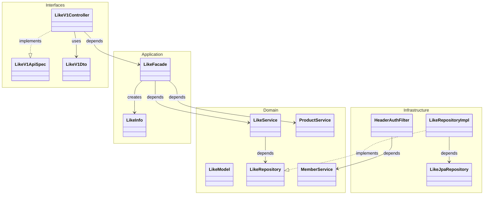
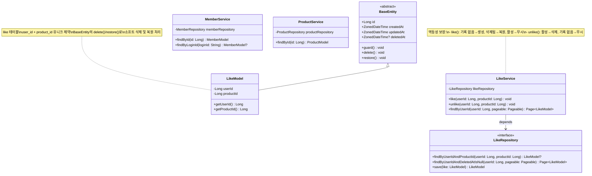
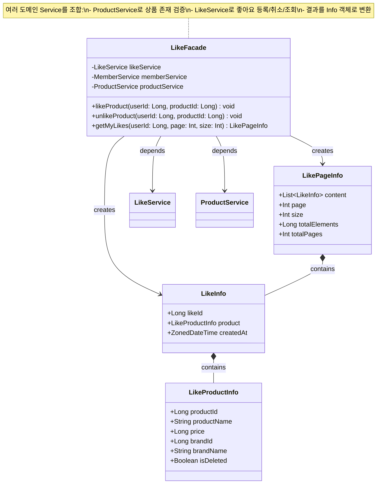
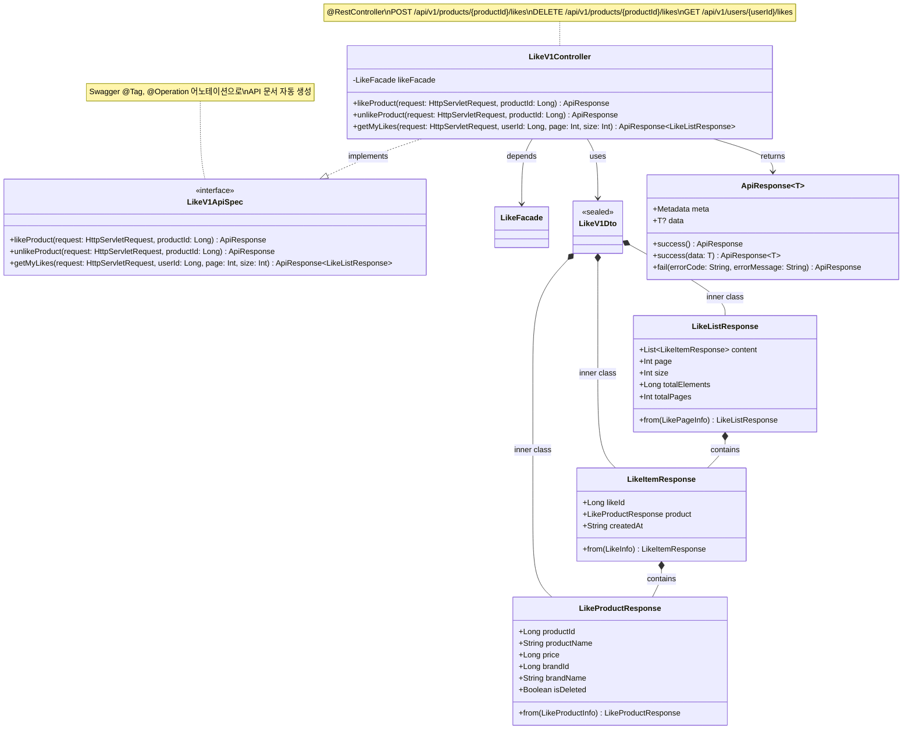
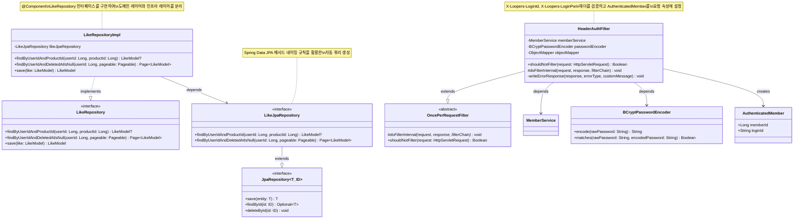
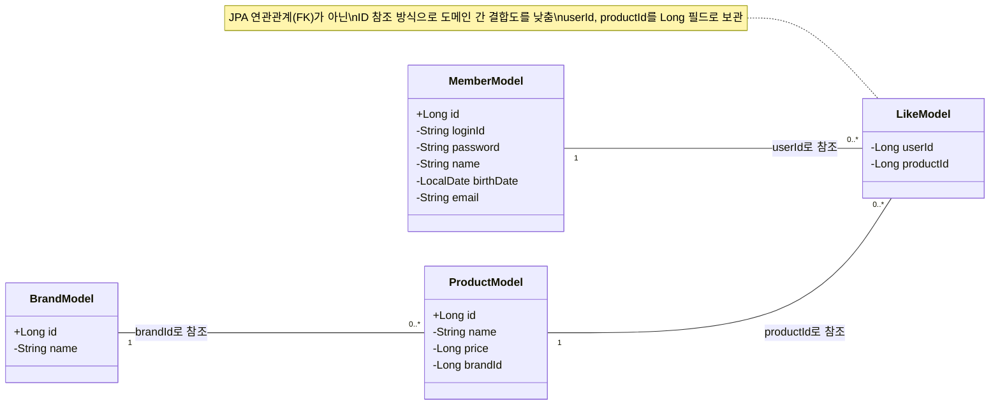

# 좋아요 클래스 다이어그램

## 개요

좋아요 기능을 구성하는 클래스들의 구조와 레이어 간 의존 관계를 정의합니다.
좋아요 도메인은 유저(Users)와 상품(Products) 도메인에 의존하며, LikeFacade가 여러 도메인 Service를 조합하여 비즈니스 흐름을 오케스트레이션합니다.

---

## 1. 전체 레이어 관계



### 레이어 간 의존 방향

```
Interfaces (Controller, Dto, ApiSpec)
    ↓
Application (Facade, Info)
    ↓
Domain (Model, Service, Repository 인터페이스)
    ↑
Infrastructure (RepositoryImpl, JpaRepository, Filter)
```

- **Interfaces → Application**: Controller가 Facade를 호출합니다.
- **Application → Domain**: Facade가 Service를 조합하고, Info로 결과를 변환합니다.
- **Infrastructure → Domain**: RepositoryImpl이 Repository 인터페이스를 구현하고, Filter가 MemberService를 사용합니다.

---

## 2. Domain 레이어 상세



### 클래스 설명

| 클래스 | 역할 | 주요 메서드 |
|--------|------|-----------|
| `BaseEntity` | 모든 엔티티의 공통 부모 클래스. id, 생성/수정/삭제 시각, 소프트 삭제/복원 메서드 제공 | `delete()`, `restore()`, `guard()` |
| `LikeModel` | 좋아요 도메인 엔티티. 유저 ID와 상품 ID의 쌍으로 좋아요 관계를 표현 | 상속받은 `delete()`, `restore()` 활용 |
| `LikeRepository` | 좋아요 저장소 인터페이스. 도메인 레이어에서 정의하고 인프라 레이어에서 구현 | `findByUserIdAndProductId()`, `findByUserIdAndDeletedAtIsNull()`, `save()` |
| `LikeService` | 좋아요 도메인 서비스. 좋아요 등록/취소의 멱등성 처리와 목록 조회 담당 | `like()`, `unlike()`, `findByUserId()` |
| `MemberService` | 유저 도메인 서비스. 인증 필터에서 유저 조회 및 검증에 사용 (기존 클래스) | `findById()`, `findByLoginId()` |
| `ProductService` | 상품 도메인 서비스. 좋아요 등록 시 상품 존재 및 삭제 여부 검증에 사용 (신규 또는 기존 클래스) | `findById()` |

---

## 3. Application 레이어 상세



### 클래스 설명

| 클래스 | 역할 | 주요 메서드 |
|--------|------|-----------|
| `LikeFacade` | 좋아요 비즈니스 흐름 오케스트레이션. ProductService로 상품 검증 후 LikeService로 좋아요 처리 | `likeProduct()`, `unlikeProduct()`, `getMyLikes()` |
| `LikeInfo` | 좋아요 단건 정보. 좋아요 ID, 상품 정보, 등록 시각을 포함 | `from(LikeModel)` companion 메서드 |
| `LikeProductInfo` | 좋아요에 포함되는 상품 정보. 상품명, 가격, 브랜드 정보, 삭제 여부를 포함 | - |
| `LikePageInfo` | 좋아요 목록 페이징 정보. content, page, size, totalElements, totalPages를 포함 | - |

---

## 4. Interfaces 레이어 상세



### 클래스 설명

| 클래스 | 역할 | 주요 메서드 |
|--------|------|-----------|
| `LikeV1ApiSpec` | Swagger 문서화를 위한 API 인터페이스. @Tag, @Operation 어노테이션 포함 | `likeProduct()`, `unlikeProduct()`, `getMyLikes()` |
| `LikeV1Controller` | REST 컨트롤러. ApiSpec을 구현하고 LikeFacade에 위임. 요청 속성에서 인증 유저 정보 추출 | `likeProduct()`, `unlikeProduct()`, `getMyLikes()` |
| `LikeV1Dto` | 요청/응답 DTO 컨테이너. 내부 data class로 Response DTO를 정의 | - |
| `LikeListResponse` | 좋아요 목록 조회 응답. 페이징 정보와 좋아요 항목 목록 포함 | `from(LikePageInfo)` |
| `LikeItemResponse` | 좋아요 단건 응답. 좋아요 ID, 상품 정보, 등록 시각 포함 | `from(LikeInfo)` |
| `LikeProductResponse` | 상품 정보 응답. 상품명, 가격, 브랜드 정보, 삭제 여부 포함 | `from(LikeProductInfo)` |

---

## 5. Infrastructure 레이어 상세



### 클래스 설명

| 클래스 | 역할 | 주요 메서드 |
|--------|------|-----------|
| `LikeRepositoryImpl` | LikeRepository 인터페이스 구현체. LikeJpaRepository에 위임하여 데이터 접근 | `findByUserIdAndProductId()`, `findByUserIdAndDeletedAtIsNull()`, `save()` |
| `LikeJpaRepository` | Spring Data JPA 인터페이스. 메서드 네이밍 규칙으로 쿼리 자동 생성 | `findByUserIdAndProductId()`, `findByUserIdAndDeletedAtIsNull()` |
| `HeaderAuthFilter` | 헤더 기반 인증 필터. `X-Loopers-LoginId/LoginPw` 헤더에서 유저를 인증하고 AuthenticatedMember를 요청 속성에 설정 | `doFilterInternal()`, `shouldNotFilter()` |
| `BCryptPasswordEncoder` | 비밀번호 해싱 및 검증 (기존 클래스) | `encode()`, `matches()` |
| `AuthenticatedMember` | 인증된 유저 정보를 전달하는 데이터 클래스 (기존 클래스) | - |

---

## 6. 도메인 간 참조 관계



### 도메인 간 관계 설명

| 관계 | 참조 방식 | 설명 |
|------|----------|------|
| MemberModel → LikeModel | `userId` (Long) | 하나의 유저는 여러 좋아요를 가질 수 있습니다. LikeModel은 유저의 ID를 Long 필드로 보관합니다. |
| ProductModel → LikeModel | `productId` (Long) | 하나의 상품은 여러 좋아요를 받을 수 있습니다. LikeModel은 상품의 ID를 Long 필드로 보관합니다. |
| BrandModel → ProductModel | `brandId` (Long) | 하나의 브랜드는 여러 상품을 가집니다. 좋아요 목록 조회 시 브랜드 정보를 함께 제공합니다. |

> JPA 엔티티 간 `@ManyToOne` 등의 연관관계를 사용하지 않고, ID 필드 참조 방식으로 도메인 간 결합도를 낮춥니다. 필요한 경우 Facade 레이어에서 각 도메인의 Service를 통해 조합합니다.

---

## 품질 체크리스트

- [x] 도메인 모델(Model)에 비즈니스 로직과 검증 메서드가 포함되어 있는가? - LikeModel은 BaseEntity의 `delete()`/`restore()`를 활용하여 소프트 삭제/복원 처리
- [x] 여러 도메인이 관련된 경우, 도메인 간 참조 관계가 명확히 표현되어 있는가? - 섹션 6에서 MemberModel, ProductModel, BrandModel과 LikeModel 간 ID 참조 관계를 표현
- [x] Facade가 조합하는 여러 Service 의존성이 모두 표현되어 있는가? - LikeFacade가 LikeService, ProductService에 의존하는 관계를 명시
- [x] 각 레이어(Domain, Application, Interfaces, Infrastructure)의 클래스가 모두 포함되어 있는가? - 섹션 2~5에서 레이어별 상세 다이어그램 포함
- [x] 클래스 간 관계(상속, 구현, 의존, 컴포지션)가 정확히 표현되어 있는가? - BaseEntity 상속, Repository 인터페이스 구현, Facade 의존, Dto 내부 클래스 컴포지션 등 표현
