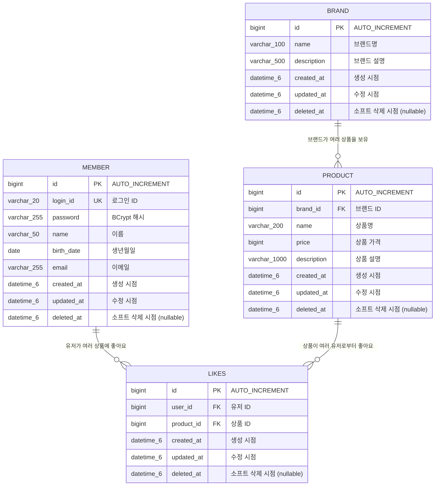

# 좋아요 ERD

## 개요

좋아요 기능에 필요한 `like` 테이블과 관련 도메인 테이블(`member`, `brand`, `product`)의 ERD 및 상세 명세를 정의합니다.
`like` 테이블은 유저(`member`)와 상품(`product`) 사이의 좋아요 관계를 관리하며, 유저-상품 쌍에 대한 유니크 제약 조건으로 중복을 방지합니다.

> `brand`와 `product` 테이블은 브랜드-상품 도메인에서 구현될 예정이며, 이 문서에서는 좋아요 기능과의 관계를 표현하기 위해 예상 구조를 포함합니다.

---

## 1. 전체 ERD



---

## 2. 테이블 상세 명세

### 2.1 기존 테이블

#### 테이블명: `member`

| 컬럼명 | 타입 | Nullable | 제약조건 | 설명 |
|--------|------|----------|---------|------|
| `id` | BIGINT | NOT NULL | PK, AUTO_INCREMENT | 기본 키 |
| `login_id` | VARCHAR(20) | NOT NULL | UNIQUE | 로그인 ID (영문 소문자, 숫자, 언더스코어) |
| `password` | VARCHAR(255) | NOT NULL | | 비밀번호 (BCrypt 해시값) |
| `name` | VARCHAR(50) | NOT NULL | | 이름 (한글 또는 영문) |
| `birth_date` | DATE | NOT NULL | | 생년월일 |
| `email` | VARCHAR(255) | NOT NULL | | 이메일 |
| `created_at` | DATETIME(6) | NOT NULL | | 생성 시점 |
| `updated_at` | DATETIME(6) | NOT NULL | | 수정 시점 |
| `deleted_at` | DATETIME(6) | NULL | | 소프트 삭제 시점 |

> `member` 테이블은 Round1에서 구현 완료된 기존 테이블입니다.

---

### 2.2 관련 테이블 (브랜드-상품 도메인에서 구현 예정)

#### 테이블명: `brand`

| 컬럼명 | 타입 | Nullable | 제약조건 | 설명 |
|--------|------|----------|---------|------|
| `id` | BIGINT | NOT NULL | PK, AUTO_INCREMENT | 기본 키 |
| `name` | VARCHAR(100) | NOT NULL | | 브랜드명 |
| `description` | VARCHAR(500) | NULL | | 브랜드 설명 |
| `created_at` | DATETIME(6) | NOT NULL | | 생성 시점 |
| `updated_at` | DATETIME(6) | NOT NULL | | 수정 시점 |
| `deleted_at` | DATETIME(6) | NULL | | 소프트 삭제 시점 |

#### 테이블명: `product`

| 컬럼명 | 타입 | Nullable | 제약조건 | 설명 |
|--------|------|----------|---------|------|
| `id` | BIGINT | NOT NULL | PK, AUTO_INCREMENT | 기본 키 |
| `brand_id` | BIGINT | NOT NULL | FK → brand.id | 소속 브랜드 ID |
| `name` | VARCHAR(200) | NOT NULL | | 상품명 |
| `price` | BIGINT | NOT NULL | | 상품 가격 (원 단위) |
| `description` | VARCHAR(1000) | NULL | | 상품 설명 |
| `created_at` | DATETIME(6) | NOT NULL | | 생성 시점 |
| `updated_at` | DATETIME(6) | NOT NULL | | 수정 시점 |
| `deleted_at` | DATETIME(6) | NULL | | 소프트 삭제 시점 |

> `brand`, `product` 테이블은 브랜드-상품 도메인에서 구현될 예정이며, 위 구조는 API 스펙을 기반으로 한 예상 구조입니다. 실제 구현 시 컬럼이 추가되거나 변경될 수 있습니다.

---

### 2.3 신규 테이블

#### 테이블명: `likes`

| 컬럼명 | 타입 | Nullable | 제약조건 | 설명 |
|--------|------|----------|---------|------|
| `id` | BIGINT | NOT NULL | PK, AUTO_INCREMENT | 기본 키 |
| `user_id` | BIGINT | NOT NULL | FK → member.id | 좋아요를 등록한 유저의 ID |
| `product_id` | BIGINT | NOT NULL | FK → product.id | 좋아요 대상 상품의 ID |
| `created_at` | DATETIME(6) | NOT NULL | | 좋아요 등록 시점 |
| `updated_at` | DATETIME(6) | NOT NULL | | 수정 시점 |
| `deleted_at` | DATETIME(6) | NULL | | 좋아요 취소 시점 (소프트 삭제) |

**테이블명 참고**: MySQL에서 `like`는 예약어이므로 테이블명을 `likes`로 사용합니다. JPA 엔티티에서 `@Table(name = "likes")`로 매핑합니다.

**유니크 제약 조건**:
- `UK_likes_user_product (user_id, product_id)`: 동일 유저가 동일 상품에 중복 좋아요를 방지합니다.
- 소프트 삭제를 사용하므로 `deleted_at`과 관계없이 물리적으로 하나의 레코드만 존재합니다. 좋아요 취소 후 재등록 시 기존 레코드의 `deleted_at`을 null로 복원합니다.

---

## 3. 테이블간 관계

| 관계 | 카디널리티 | 설명 |
|------|-----------|------|
| `member` → `likes` | 1:N | 한 유저가 여러 상품에 좋아요를 등록할 수 있습니다. |
| `product` → `likes` | 1:N | 한 상품이 여러 유저로부터 좋아요를 받을 수 있습니다. |
| `brand` → `product` | 1:N | 한 브랜드가 여러 상품을 보유합니다. |

### 참조 무결성

| FK 관계 | 삭제 정책 | 설명 |
|---------|----------|------|
| `likes.user_id` → `member.id` | 소프트 삭제 | 유저 삭제 시 좋아요 기록은 유지됩니다. 유저가 소프트 삭제되면 인증이 불가하므로 좋아요 API 접근이 차단됩니다. |
| `likes.product_id` → `product.id` | 소프트 삭제 | 상품 삭제 시 좋아요 기록은 유지됩니다. 좋아요 목록 조회 시 삭제된 상품은 `isDeleted: true`로 표시합니다. |
| `product.brand_id` → `brand.id` | 연쇄 소프트 삭제 | 브랜드 삭제 시 해당 브랜드의 모든 상품도 소프트 삭제됩니다 (Admin API 스펙 기준). |

---

## 4. 인덱스 설계

| 테이블 | 인덱스명 | 컬럼 | 타입 | 용도 |
|--------|---------|------|------|------|
| `likes` | `UK_likes_user_product` | `user_id, product_id` | UNIQUE | 동일 유저의 동일 상품 중복 좋아요 방지 및 유저+상품 조합 조회 |
| `likes` | `idx_likes_user_deleted` | `user_id, deleted_at` | INDEX | 유저별 활성 좋아요 목록 조회 (WHERE user_id = ? AND deleted_at IS NULL) |
| `likes` | `idx_likes_product_deleted` | `product_id, deleted_at` | INDEX | 상품별 좋아요 수 집계 (WHERE product_id = ? AND deleted_at IS NULL) |
| `product` | `idx_product_brand_id` | `brand_id` | INDEX | 브랜드별 상품 필터링 |

### 인덱스 설계 근거

| 인덱스 | 사용 쿼리 | 설명 |
|--------|----------|------|
| `UK_likes_user_product` | `SELECT * FROM likes WHERE user_id = ? AND product_id = ?` | 좋아요 등록/취소 시 기존 기록 조회. 유니크 제약 조건이므로 데이터 무결성도 보장합니다. |
| `idx_likes_user_deleted` | `SELECT * FROM likes WHERE user_id = ? AND deleted_at IS NULL ORDER BY created_at DESC` | 내가 좋아요한 상품 목록 조회 API에서 사용. 복합 인덱스로 커버링 인덱스 효과를 얻습니다. |
| `idx_likes_product_deleted` | `SELECT COUNT(*) FROM likes WHERE product_id = ? AND deleted_at IS NULL` | 상품 목록 조회 시 `likes_desc` 정렬이나 상품 상세의 좋아요 수 표시에 활용됩니다. |

---

## 5. DDL 참고 (MySQL)

```sql
CREATE TABLE likes (
    id          BIGINT       NOT NULL AUTO_INCREMENT,
    user_id     BIGINT       NOT NULL,
    product_id  BIGINT       NOT NULL,
    created_at  DATETIME(6)  NOT NULL,
    updated_at  DATETIME(6)  NOT NULL,
    deleted_at  DATETIME(6)  NULL,
    PRIMARY KEY (id),
    CONSTRAINT UK_likes_user_product UNIQUE (user_id, product_id),
    CONSTRAINT FK_likes_user FOREIGN KEY (user_id) REFERENCES member (id),
    CONSTRAINT FK_likes_product FOREIGN KEY (product_id) REFERENCES product (id),
    INDEX idx_likes_user_deleted (user_id, deleted_at),
    INDEX idx_likes_product_deleted (product_id, deleted_at)
) ENGINE=InnoDB DEFAULT CHARSET=utf8mb4 COLLATE=utf8mb4_unicode_ci;
```

> 이 DDL은 참고용입니다. 실제 테이블 생성은 JPA의 `hibernate.ddl-auto` 설정 또는 마이그레이션 도구를 통해 수행합니다.

---

## 품질 체크리스트

- [x] FK 제약 조건으로 참조 무결성이 보장되는가? - `likes.user_id` → `member.id`, `likes.product_id` → `product.id` FK 제약 조건을 설정
- [x] 연쇄 삭제 또는 소프트 삭제 정책이 비즈니스 규칙과 일치하는가? - 모든 테이블이 소프트 삭제 사용, 브랜드 삭제 시 상품 연쇄 소프트 삭제, 상품 삭제 시 좋아요 기록 유지(isDeleted 표시)
- [x] UNIQUE 제약 조건으로 데이터 중복이 방지되는가? - `UK_likes_user_product (user_id, product_id)` 유니크 제약으로 동일 유저의 동일 상품 중복 좋아요 방지
- [x] 스냅샷 데이터와 참조 데이터가 구분되어 있는가? - 좋아요는 참조 데이터만 사용 (userId, productId). 스냅샷이 필요한 주문 도메인과 구분됨
- [x] 조회 성능을 위한 인덱스가 적절히 설계되어 있는가? - 유저별 목록 조회, 상품별 좋아요 수 집계, 유저+상품 조합 조회를 위한 인덱스 3개 설계
- [x] 관련 도메인(유저, 브랜드, 상품, 좋아요) 테이블 간 관계가 모두 표현되어 있는가? - member, brand, product, likes 4개 테이블의 관계를 ERD와 관계 테이블로 표현
