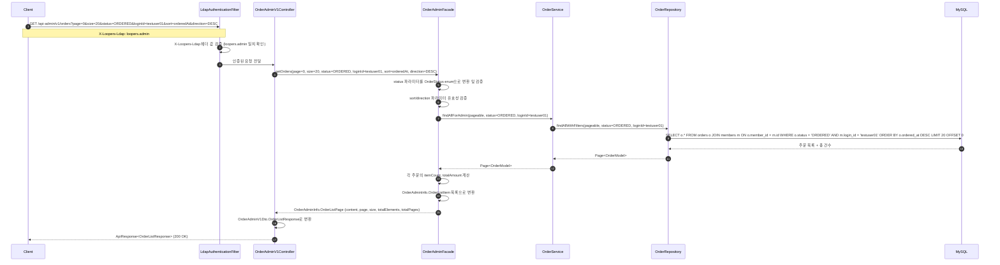
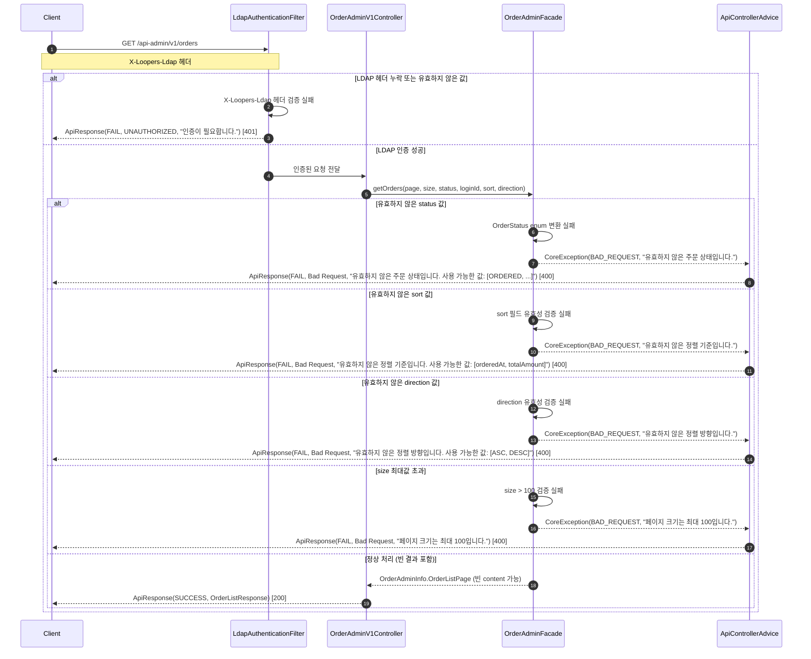
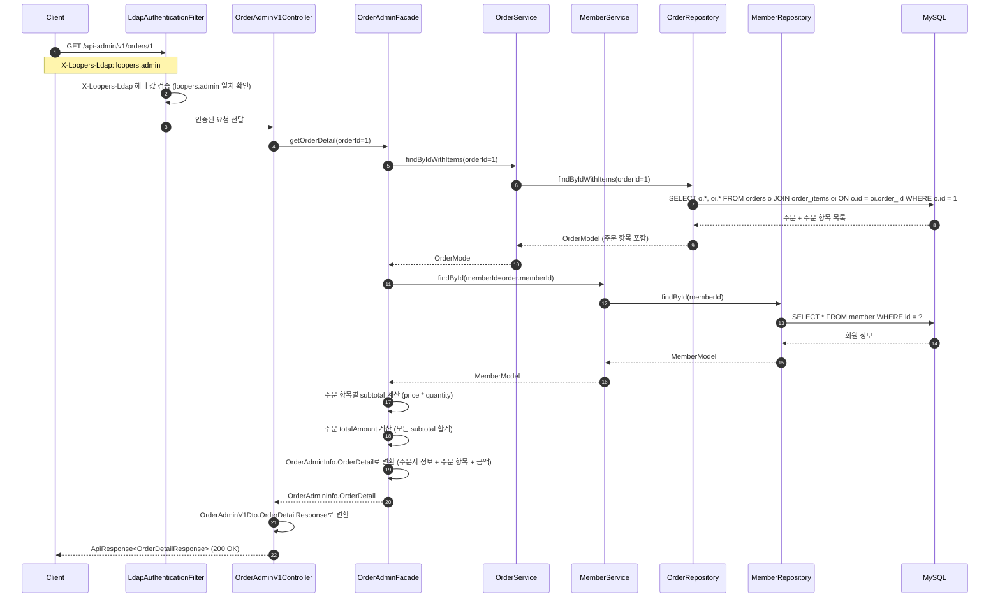
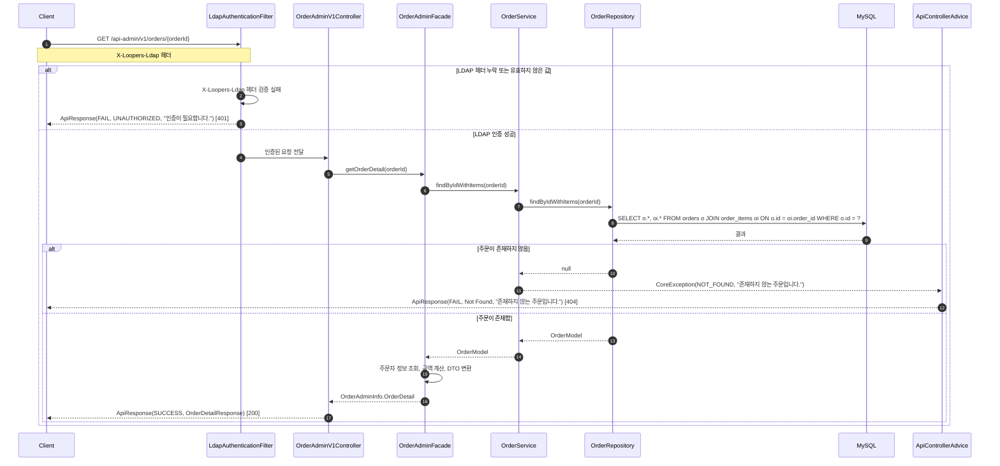

# 주문 Admin 시퀀스 다이어그램

## 개요

이 문서는 주문 Admin API의 요청 처리 흐름을 시퀀스 다이어그램으로 표현합니다.

| API | 메서드 | 경로 | 설명 |
|-----|--------|------|------|
| 주문 목록 조회 | GET | `/api-admin/v1/orders` | 전체 유저의 주문을 필터링/정렬/페이징하여 조회 |
| 주문 상세 조회 | GET | `/api-admin/v1/orders/{orderId}` | 특정 주문의 상세 내역(주문자 정보, 항목, 금액) 조회 |

**인증 방식**: 모든 어드민 API는 `X-Loopers-Ldap: loopers.admin` 헤더로 인증합니다.

---

## 1. 주문 목록 조회 - 성공 흐름

### 흐름 설명

| 단계 | 책임 객체 | 수행 내용 |
|------|-----------|----------|
| 1 | Client | 쿼리 파라미터(page, size, status, loginId, sort, direction)와 LDAP 헤더를 포함하여 요청을 전송합니다. |
| 2 | LdapAuthenticationFilter | `X-Loopers-Ldap` 헤더 값이 `loopers.admin`과 일치하는지 검증합니다. |
| 3 | LdapAuthenticationFilter | 인증 통과 후 다음 필터 체인(Controller)으로 요청을 전달합니다. |
| 4 | OrderAdminV1Controller | 쿼리 파라미터를 파싱하여 Facade의 `getOrders()` 메서드를 호출합니다. |
| 5-6 | OrderAdminFacade | status 값을 OrderStatus enum으로 변환하고, sort/direction 파라미터의 유효성을 검증합니다. |
| 7-8 | OrderService/Repository | 필터 조건(status, loginId)과 정렬/페이징 조건을 적용하여 DB에서 주문 목록을 조회합니다. |
| 9-12 | DB → Repository → Service → Facade | 쿼리 결과를 `Page<OrderModel>` 형태로 반환합니다. |
| 13-14 | OrderAdminFacade | 각 주문의 항목 수와 총액을 계산하고, `OrderAdminInfo.OrderListItem` 목록으로 변환합니다. |
| 15-17 | Facade → Controller → Client | Info DTO를 Response DTO로 변환하여 `ApiResponse<OrderListResponse>`로 응답합니다. |

---

## 2. 주문 목록 조회 - 에러 흐름

### 에러 시나리오

| 조건 | 발생 시점 | 책임 객체 | 에러 타입 | HTTP 상태 |
|------|----------|-----------|----------|----------|
| LDAP 헤더 누락 | 필터 단계 | LdapAuthenticationFilter | UNAUTHORIZED | 401 |
| 잘못된 LDAP 값 (loopers.admin이 아님) | 필터 단계 | LdapAuthenticationFilter | UNAUTHORIZED | 401 |
| 유효하지 않은 status 값 | Facade 파라미터 검증 | OrderAdminFacade | BAD_REQUEST | 400 |
| 유효하지 않은 sort 값 | Facade 파라미터 검증 | OrderAdminFacade | BAD_REQUEST | 400 |
| 유효하지 않은 direction 값 | Facade 파라미터 검증 | OrderAdminFacade | BAD_REQUEST | 400 |
| size > 100 (최대값 초과) | Facade 파라미터 검증 | OrderAdminFacade | BAD_REQUEST | 400 |
| 존재하지 않는 loginId | 정상 처리 (에러 아님) | OrderRepository | - | 200 (빈 목록) |

---

## 3. 주문 상세 조회 - 성공 흐름

### 흐름 설명

| 단계 | 책임 객체 | 수행 내용 |
|------|-----------|----------|
| 1 | Client | orderId를 경로 변수로 포함하고 LDAP 헤더와 함께 요청을 전송합니다. |
| 2-3 | LdapAuthenticationFilter | LDAP 헤더를 검증하고 인증된 요청을 Controller로 전달합니다. |
| 4 | OrderAdminV1Controller | 경로 변수에서 orderId를 추출하여 Facade의 `getOrderDetail()` 메서드를 호출합니다. |
| 5-10 | OrderAdminFacade → OrderService → OrderRepository → DB | orderId로 주문을 조회합니다. 주문 항목(OrderItem)을 함께 조회하여 상품 스냅샷 정보를 포함합니다. |
| 11-16 | OrderAdminFacade → MemberService → MemberRepository → DB | 주문에 저장된 memberId로 주문자 정보(loginId, 이름, 이메일)를 조회합니다. 어드민 조회이므로 마스킹 없이 원본을 사용합니다. |
| 17-19 | OrderAdminFacade | 각 주문 항목의 subtotal(price * quantity)을 계산하고, 모든 subtotal을 합산하여 totalAmount를 산출합니다. 주문자 정보 + 주문 항목 + 금액 정보를 `OrderAdminInfo.OrderDetail`로 변환합니다. |
| 20-22 | Facade → Controller → Client | Info DTO를 Response DTO로 변환하여 `ApiResponse<OrderDetailResponse>`로 응답합니다. 주문자 정보(orderer), 주문 항목(items), 총액(totalAmount)이 모두 포함됩니다. |

---

## 4. 주문 상세 조회 - 에러 흐름

### 에러 시나리오

| 조건 | 발생 시점 | 책임 객체 | 에러 타입 | HTTP 상태 |
|------|----------|-----------|----------|----------|
| LDAP 헤더 누락 | 필터 단계 | LdapAuthenticationFilter | UNAUTHORIZED | 401 |
| 잘못된 LDAP 값 (loopers.admin이 아님) | 필터 단계 | LdapAuthenticationFilter | UNAUTHORIZED | 401 |
| 존재하지 않는 orderId | Service 조회 단계 | OrderService | NOT_FOUND | 404 |
| orderId 타입 불일치 (숫자가 아님) | Controller 파라미터 바인딩 | ApiControllerAdvice | BAD_REQUEST | 400 |

---

## 품질 체크리스트
- [x] 각 participant의 책임(검증, 변환, 조회, 저장 등)이 메서드명으로 명확히 드러나는가?
  - LdapAuthenticationFilter: 헤더 검증, OrderAdminFacade: 파라미터 검증/금액 계산/DTO 변환, OrderService: 도메인 조회, OrderRepository: DB 쿼리
- [x] 여러 도메인이 관련된 경우, 각 도메인의 Service가 별도 participant로 분리되어 있는가?
  - 주문 상세 조회에서 OrderService와 MemberService를 별도 participant로 분리하여 책임 경계를 명확히 표현함
- [x] 인증 방식(헤더 기반)이 다이어그램에 정확히 반영되어 있는가?
  - LdapAuthenticationFilter에서 `X-Loopers-Ldap: loopers.admin` 헤더 검증을 명시하고, Note로 헤더 값을 표기함
- [x] 성공 흐름과 에러 흐름이 모두 포함되어 있는가?
  - 각 API별로 성공 다이어그램(1, 3번)과 에러 다이어그램(2, 4번) 총 4개를 작성함
- [x] 에러 시나리오 테이블에 발생 시점과 책임 객체가 명시되어 있는가?
  - 각 에러 흐름 다이어그램 하단에 조건, 발생 시점, 책임 객체, 에러 타입, HTTP 상태를 테이블로 정리함
