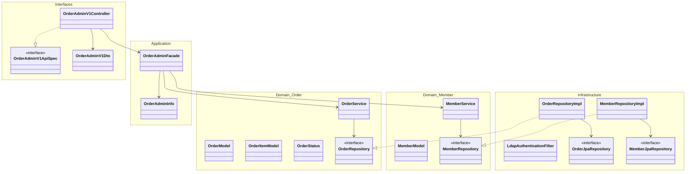
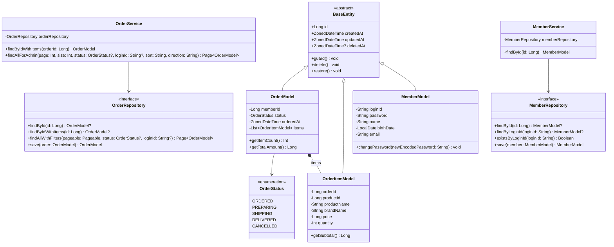
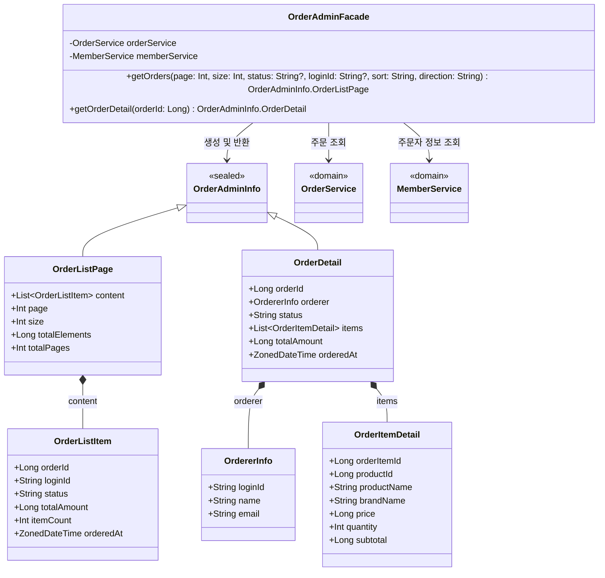
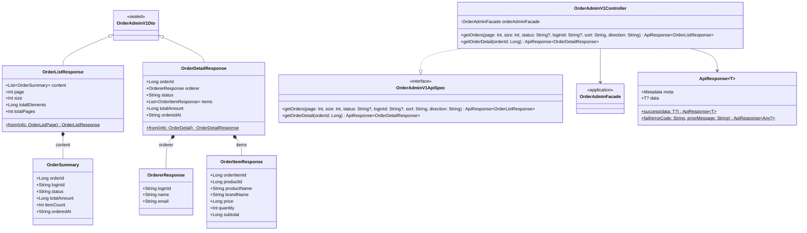
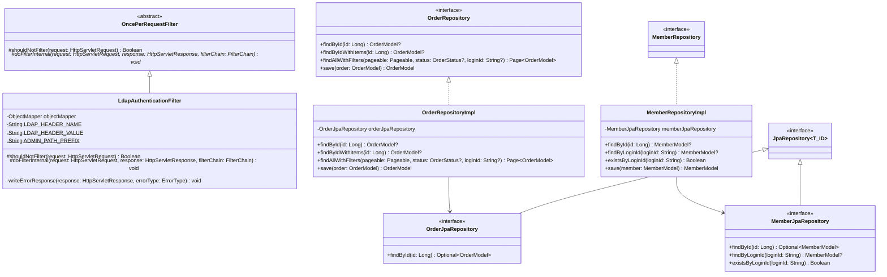

# 주문 Admin 클래스 다이어그램

## 개요

이 문서는 주문 Admin API를 구성하는 클래스의 구조와 레이어 간 의존 관계를 다이어그램으로 표현합니다.

**주요 특징:**
- 어드민 전용 레이어(`interfaces/api/admin/order`, `application/admin/order`)와 기존 주문 도메인(`domain/order`)을 분리합니다.
- `OrderAdminFacade`가 `OrderService`(주문 도메인)와 `MemberService`(유저 도메인) 두 개의 도메인 서비스를 조합하여 어드민 조회 기능을 제공합니다.
- `LdapAuthenticationFilter`가 어드민 API 경로(`/api-admin/**`)를 보호합니다.

---

## 1. 전체 레이어 관계



### 레이어 간 의존 방향

```
Interfaces (Controller, DTO)
    ↓ 의존
Application (Facade, Info)
    ↓ 의존
Domain (Model, Service, Repository 인터페이스)
    ↑ 구현
Infrastructure (RepositoryImpl, JpaRepository, Filter)
```

- **Interfaces → Application**: Controller가 Facade를 호출합니다.
- **Application → Domain**: Facade가 여러 도메인의 Service를 조합합니다.
- **Infrastructure → Domain**: RepositoryImpl이 도메인의 Repository 인터페이스를 구현합니다 (의존성 역전).
- **Infrastructure (Filter)**: LdapAuthenticationFilter는 레이어와 독립적으로 HTTP 요청을 가로채어 인증을 처리합니다.

---

## 2. Domain 레이어 상세



### 클래스 설명

| 클래스 | 역할 | 주요 메서드 |
|--------|------|-----------|
| `OrderModel` | 주문 엔티티. 주문자 ID, 상태, 주문 항목 목록을 포함합니다. | `getItemCount()`: 주문 항목 수 반환, `getTotalAmount()`: 전체 주문 금액 합산 |
| `OrderItemModel` | 주문 항목 엔티티. 주문 시점의 상품 스냅샷(상품명, 브랜드명, 가격)과 수량을 저장합니다. | `getSubtotal()`: 항목별 소계(price * quantity) 반환 |
| `OrderStatus` | 주문 상태를 나타내는 열거형. ORDERED → PREPARING → SHIPPING → DELIVERED 또는 CANCELLED로 전이합니다. | - |
| `OrderRepository` | 주문 리포지토리 인터페이스. 어드민용 필터링/페이징 조회 메서드를 포함합니다. | `findAllWithFilters()`: 상태/유저별 필터와 페이징을 적용하여 조회 |
| `OrderService` | 주문 도메인 서비스. 주문 조회 로직을 담당합니다. | `findAllForAdmin()`: 어드민 목록 조회, `findByIdWithItems()`: 주문 항목 포함 상세 조회 |
| `MemberModel` | 회원 엔티티 (기존). 어드민 주문 상세 조회에서 주문자 정보를 가져오는 데 사용됩니다. | - |
| `MemberService` | 회원 도메인 서비스 (기존). `findById()`로 주문자 정보를 조회합니다. | `findById()`: ID로 회원 조회 |

---

## 3. Application 레이어 상세



### 클래스 설명

| 클래스 | 역할 | 주요 메서드/필드 |
|--------|------|----------------|
| `OrderAdminFacade` | 어드민 주문 조회 퍼사드. OrderService와 MemberService를 조합하여 어드민 전용 조회 기능을 제공합니다. | `getOrders()`: 파라미터 검증 + 목록 조회 + 금액 계산, `getOrderDetail()`: 주문 조회 + 주문자 조회 + DTO 변환 |
| `OrderAdminInfo.OrderListPage` | 주문 목록 페이징 결과를 전달하는 Info DTO입니다. | content, page, size, totalElements, totalPages |
| `OrderAdminInfo.OrderListItem` | 주문 목록의 개별 항목을 나타내는 Info DTO입니다. | orderId, loginId, status, totalAmount, itemCount, orderedAt |
| `OrderAdminInfo.OrderDetail` | 주문 상세 정보를 전달하는 Info DTO입니다. 주문자 정보와 주문 항목 목록을 포함합니다. | orderId, orderer, status, items, totalAmount, orderedAt |
| `OrderAdminInfo.OrdererInfo` | 주문자 정보를 나타내는 Info DTO입니다. 어드민 조회이므로 마스킹 없이 원본 정보를 포함합니다. | loginId, name, email |
| `OrderAdminInfo.OrderItemDetail` | 주문 항목의 상세 정보를 나타내는 Info DTO입니다. 상품 스냅샷과 금액 소계를 포함합니다. | productName, brandName, price, quantity, subtotal |

---

## 4. Interfaces 레이어 상세



### 클래스 설명

| 클래스 | 역할 | 주요 메서드/필드 |
|--------|------|----------------|
| `OrderAdminV1ApiSpec` | OpenAPI 스펙 인터페이스. Controller가 구현할 API 엔드포인트를 정의합니다. | `getOrders()`, `getOrderDetail()` |
| `OrderAdminV1Controller` | 어드민 주문 REST 컨트롤러. `@RequestMapping("/api-admin/v1/orders")`로 매핑됩니다. | GET `/` (목록 조회), GET `/{orderId}` (상세 조회) |
| `OrderAdminV1Dto.OrderListResponse` | 주문 목록 조회 응답 DTO. 페이징 정보와 주문 요약 목록을 포함합니다. | `from()`: OrderAdminInfo.OrderListPage → OrderListResponse 변환 |
| `OrderAdminV1Dto.OrderDetailResponse` | 주문 상세 조회 응답 DTO. 주문자, 주문 항목, 금액 정보를 포함합니다. | `from()`: OrderAdminInfo.OrderDetail → OrderDetailResponse 변환 |
| `OrderAdminV1Dto.OrdererResponse` | 주문자 정보 응답 DTO. 마스킹 없이 원본 정보를 포함합니다. | loginId, name, email |
| `OrderAdminV1Dto.OrderItemResponse` | 주문 항목 응답 DTO. 상품 스냅샷과 금액 소계를 포함합니다. | subtotal = price * quantity |

---

## 5. Infrastructure 레이어 상세



### 클래스 설명

| 클래스 | 역할 | 주요 메서드 |
|--------|------|-----------|
| `LdapAuthenticationFilter` | 어드민 API 인증 필터. `OncePerRequestFilter`를 상속하여 `/api-admin/`으로 시작하는 요청에 대해 `X-Loopers-Ldap` 헤더를 검증합니다. | `shouldNotFilter()`: `/api-admin/` 경로만 필터 적용, `doFilterInternal()`: 헤더 값 검증, `writeErrorResponse()`: 인증 실패 시 JSON 응답 |
| `OrderRepositoryImpl` | 주문 리포지토리 구현체. OrderJpaRepository를 위임하여 도메인 Repository 인터페이스를 구현합니다. | `findAllWithFilters()`: 상태/유저 필터 + 페이징 + 정렬 적용 조회 |
| `OrderJpaRepository` | Spring Data JPA 리포지토리. JpaRepository를 상속하여 기본 CRUD와 커스텀 쿼리를 제공합니다. | JPA 기본 메서드 + 필터 조회용 커스텀 메서드 |
| `MemberRepositoryImpl` | 회원 리포지토리 구현체 (기존). 어드민 주문 상세 조회에서 주문자 정보를 가져올 때 사용됩니다. | `findById()`: ID로 회원 조회 |
| `MemberJpaRepository` | 회원 JPA 리포지토리 (기존). | `findById()`, `findByLoginId()`, `existsByLoginId()` |

### LdapAuthenticationFilter와 JwtAuthenticationFilter 비교

| 항목 | JwtAuthenticationFilter (기존) | LdapAuthenticationFilter (신규) |
|------|-------------------------------|-------------------------------|
| 보호 경로 | `/api/v1/members/me` (startsWith) | `/api-admin/` (startsWith) |
| 인증 헤더 | `Authorization: Bearer {token}` | `X-Loopers-Ldap: loopers.admin` |
| 인증 방식 | JWT 토큰 파싱 및 서명 검증 | 헤더 값 단순 문자열 일치 비교 |
| 인증 성공 시 | `AuthenticatedMember` 객체를 request attribute에 설정 | 별도 속성 설정 없이 필터 체인 통과 |
| 인증 실패 시 | `ApiResponse(FAIL, UNAUTHORIZED)` JSON 응답 | `ApiResponse(FAIL, UNAUTHORIZED)` JSON 응답 |

---

## 품질 체크리스트
- [x] 도메인 모델(Model)에 비즈니스 로직과 검증 메서드가 포함되어 있는가? (빈약한 도메인 모델 지양)
  - OrderModel에 `getItemCount()`, `getTotalAmount()` 비즈니스 메서드 포함, OrderItemModel에 `getSubtotal()` 포함
- [x] 여러 도메인이 관련된 경우, 도메인 간 참조 관계가 명확히 표현되어 있는가?
  - OrderModel이 MemberModel을 memberId로 참조, OrderItemModel이 상품 스냅샷으로 Product 정보를 저장하는 구조를 표현함
- [x] Facade가 조합하는 여러 Service 의존성이 모두 표현되어 있는가?
  - OrderAdminFacade가 OrderService(주문 조회)와 MemberService(주문자 정보 조회) 두 가지 의존성을 명시적으로 표현함
- [x] 각 레이어(Domain, Application, Interfaces, Infrastructure)의 클래스가 모두 포함되어 있는가?
  - 전체 레이어 관계도(섹션 1)와 레이어별 상세 다이어그램(섹션 2~5) 모두 작성함
- [x] 클래스 간 관계(상속, 구현, 의존, 컴포지션)가 정확히 표현되어 있는가?
  - 상속(`<|--`): BaseEntity ← Model, OncePerRequestFilter ← LdapAuthenticationFilter
  - 구현(`<|..`): Repository ← RepositoryImpl, ApiSpec ← Controller
  - 의존(`-->`): Controller → Facade → Service → Repository
  - 컴포지션(`*--`): OrderModel *-- OrderItemModel, OrderDetail *-- OrdererInfo
