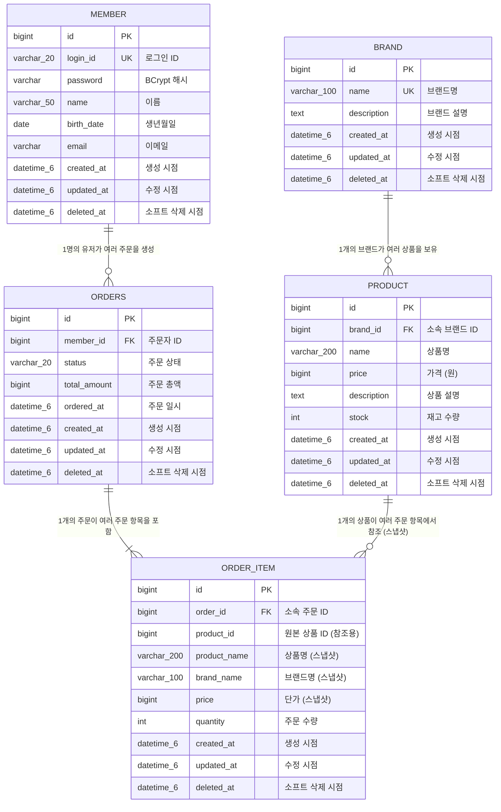

# 주문 Admin ERD

## 개요

이 문서는 주문 Admin API가 조회하는 데이터의 테이블 구조와 테이블 간 관계를 정의합니다.

주문 Admin은 기존 주문 도메인(`orders`, `order_item`)과 유저 도메인(`member`), 상품 도메인(`product`, `brand`)의 데이터를 읽기 전용으로 조회합니다. 주문 Admin 기능 자체로 새로운 테이블을 생성하지 않으며, 주문 도메인에서 정의한 테이블을 그대로 사용합니다.

**핵심 설계 원칙:**
- `order_item` 테이블은 주문 시점의 상품 정보를 **스냅샷**으로 저장합니다. 이후 상품의 이름이나 가격이 변경되어도 주문 내역에는 주문 당시의 정보가 유지됩니다.
- `order_item.product_id`는 원본 상품을 추적하기 위한 참조용 컬럼이며, `product_name`, `brand_name`, `price`는 스냅샷 데이터입니다.

---

## 1. 전체 ERD



---

## 2. 테이블 상세 명세

### 2.1 기존 테이블

#### 테이블명: `member`

회원 정보를 저장하는 테이블입니다. 주문 Admin에서는 주문 상세 조회 시 주문자 정보(loginId, name, email)를 가져오는 데 사용됩니다.

| 컬럼명 | 타입 | Nullable | 제약조건 | 설명 |
|--------|------|----------|---------|------|
| `id` | BIGINT | NOT NULL | PK, AUTO_INCREMENT | 회원 고유 식별자 |
| `login_id` | VARCHAR(20) | NOT NULL | UNIQUE | 로그인 ID (영문 소문자, 숫자, 언더스코어) |
| `password` | VARCHAR(255) | NOT NULL | | BCrypt 해시된 비밀번호 |
| `name` | VARCHAR(50) | NOT NULL | | 이름 (한글 또는 영문) |
| `birth_date` | DATE | NOT NULL | | 생년월일 |
| `email` | VARCHAR(255) | NOT NULL | | 이메일 주소 |
| `created_at` | DATETIME(6) | NOT NULL | | 생성 시점 |
| `updated_at` | DATETIME(6) | NOT NULL | | 수정 시점 |
| `deleted_at` | DATETIME(6) | NULL | | 소프트 삭제 시점 |

#### 테이블명: `brand`

브랜드 정보를 저장하는 테이블입니다. 주문 Admin에서는 직접 조회하지 않지만, 상품 등록 시 브랜드명을 스냅샷으로 `order_item`에 저장하는 원본 데이터입니다.

| 컬럼명 | 타입 | Nullable | 제약조건 | 설명 |
|--------|------|----------|---------|------|
| `id` | BIGINT | NOT NULL | PK, AUTO_INCREMENT | 브랜드 고유 식별자 |
| `name` | VARCHAR(100) | NOT NULL | UNIQUE | 브랜드명 |
| `description` | TEXT | NULL | | 브랜드 설명 |
| `created_at` | DATETIME(6) | NOT NULL | | 생성 시점 |
| `updated_at` | DATETIME(6) | NOT NULL | | 수정 시점 |
| `deleted_at` | DATETIME(6) | NULL | | 소프트 삭제 시점 |

#### 테이블명: `product`

상품 정보를 저장하는 테이블입니다. 주문 Admin에서는 직접 조회하지 않지만, 주문 생성 시 상품 정보(상품명, 가격, 브랜드명)를 스냅샷으로 `order_item`에 저장하는 원본 데이터입니다.

| 컬럼명 | 타입 | Nullable | 제약조건 | 설명 |
|--------|------|----------|---------|------|
| `id` | BIGINT | NOT NULL | PK, AUTO_INCREMENT | 상품 고유 식별자 |
| `brand_id` | BIGINT | NOT NULL | FK → `brand.id` | 소속 브랜드 ID |
| `name` | VARCHAR(200) | NOT NULL | | 상품명 |
| `price` | BIGINT | NOT NULL | | 가격 (원 단위) |
| `description` | TEXT | NULL | | 상품 설명 |
| `stock` | INT | NOT NULL | DEFAULT 0 | 재고 수량 |
| `created_at` | DATETIME(6) | NOT NULL | | 생성 시점 |
| `updated_at` | DATETIME(6) | NOT NULL | | 수정 시점 |
| `deleted_at` | DATETIME(6) | NULL | | 소프트 삭제 시점 |

### 2.2 신규 테이블

#### 테이블명: `orders`

주문 정보를 저장하는 테이블입니다. 주문 Admin 목록 조회에서 페이징/필터링/정렬의 대상이 됩니다.

> 테이블명을 `orders`(복수형)로 지정한 이유: `order`는 MySQL의 예약어(ORDER BY)이므로 충돌을 방지합니다.

| 컬럼명 | 타입 | Nullable | 제약조건 | 설명 |
|--------|------|----------|---------|------|
| `id` | BIGINT | NOT NULL | PK, AUTO_INCREMENT | 주문 고유 식별자 |
| `member_id` | BIGINT | NOT NULL | FK → `member.id` | 주문자 회원 ID |
| `status` | VARCHAR(20) | NOT NULL | DEFAULT 'ORDERED' | 주문 상태 (ORDERED, PREPARING, SHIPPING, DELIVERED, CANCELLED) |
| `total_amount` | BIGINT | NOT NULL | | 주문 총액 (모든 주문 항목의 price * quantity 합계) |
| `ordered_at` | DATETIME(6) | NOT NULL | | 주문 일시 |
| `created_at` | DATETIME(6) | NOT NULL | | 생성 시점 |
| `updated_at` | DATETIME(6) | NOT NULL | | 수정 시점 |
| `deleted_at` | DATETIME(6) | NULL | | 소프트 삭제 시점 |

**status 허용 값:**

| 값 | 설명 |
|----|------|
| `ORDERED` | 주문 완료 (초기 상태) |
| `PREPARING` | 배송 준비 중 |
| `SHIPPING` | 배송 중 |
| `DELIVERED` | 배송 완료 |
| `CANCELLED` | 주문 취소 |

#### 테이블명: `order_item`

주문 항목 정보를 저장하는 테이블입니다. 주문 시점의 상품 정보를 스냅샷으로 포함합니다.

| 컬럼명 | 타입 | Nullable | 제약조건 | 설명 |
|--------|------|----------|---------|------|
| `id` | BIGINT | NOT NULL | PK, AUTO_INCREMENT | 주문 항목 고유 식별자 |
| `order_id` | BIGINT | NOT NULL | FK → `orders.id` | 소속 주문 ID |
| `product_id` | BIGINT | NOT NULL | | 원본 상품 ID (참조용, FK 제약 없음) |
| `product_name` | VARCHAR(200) | NOT NULL | | 상품명 (주문 시점 스냅샷) |
| `brand_name` | VARCHAR(100) | NOT NULL | | 브랜드명 (주문 시점 스냅샷) |
| `price` | BIGINT | NOT NULL | | 단가 (주문 시점 스냅샷, 원 단위) |
| `quantity` | INT | NOT NULL | | 주문 수량 |
| `created_at` | DATETIME(6) | NOT NULL | | 생성 시점 |
| `updated_at` | DATETIME(6) | NOT NULL | | 수정 시점 |
| `deleted_at` | DATETIME(6) | NULL | | 소프트 삭제 시점 |

**스냅샷 컬럼 설계 근거:**

| 컬럼 | 스냅샷 여부 | 이유 |
|------|------------|------|
| `product_id` | 참조용 | 원본 상품 추적이 필요한 경우 사용 (상품 삭제 시에도 주문 내역은 유지되어야 하므로 FK 제약 없음) |
| `product_name` | 스냅샷 | 주문 후 상품명이 변경되어도 주문 내역에는 주문 당시 이름이 표시되어야 함 |
| `brand_name` | 스냅샷 | 주문 후 브랜드명이 변경되어도 주문 내역에는 주문 당시 브랜드명이 표시되어야 함 |
| `price` | 스냅샷 | 주문 후 상품 가격이 변경되어도 주문 내역에는 주문 당시 가격이 표시되어야 함 |

---

## 3. 테이블간 관계

| 관계 | 카디널리티 | 설명 |
|------|-----------|------|
| `member` → `orders` | 1:N | 한 명의 유저가 여러 건의 주문을 생성할 수 있습니다. |
| `orders` → `order_item` | 1:N | 한 건의 주문에 여러 개의 주문 항목이 포함됩니다. 주문 삭제 시 주문 항목도 함께 삭제됩니다. |
| `brand` → `product` | 1:N | 한 개의 브랜드에 여러 상품이 소속됩니다. 브랜드 삭제 시 소속 상품도 함께 삭제됩니다 (연쇄 삭제). |
| `product` → `order_item` | 1:N (참조) | 한 개의 상품이 여러 주문 항목에서 참조됩니다. 단, FK 제약을 두지 않고 `product_id`를 참조용으로만 사용합니다. 상품이 삭제되어도 기존 주문 항목의 스냅샷 데이터는 유지됩니다. |

### FK 제약 조건 정리

| 테이블 | 컬럼 | 참조 테이블 | 참조 컬럼 | ON DELETE | 설명 |
|--------|------|-----------|----------|-----------|------|
| `orders` | `member_id` | `member` | `id` | RESTRICT | 주문이 존재하는 회원은 삭제할 수 없습니다 |
| `order_item` | `order_id` | `orders` | `id` | CASCADE | 주문 삭제 시 주문 항목도 함께 삭제됩니다 |
| `product` | `brand_id` | `brand` | `id` | CASCADE | 브랜드 삭제 시 소속 상품도 함께 삭제됩니다 |
| `order_item` | `product_id` | - | - | (FK 없음) | 스냅샷 방식이므로 FK 제약을 두지 않습니다 |

---

## 4. 인덱스 설계

### 어드민 주문 조회에 필요한 인덱스

| 테이블 | 인덱스명 | 컬럼 | 타입 | 용도 |
|--------|---------|------|------|------|
| `orders` | `idx_orders_member_id` | `member_id` | INDEX | 주문자별 주문 조회 (어드민 loginId 필터 시 member와 JOIN) |
| `orders` | `idx_orders_status` | `status` | INDEX | 주문 상태별 필터링 |
| `orders` | `idx_orders_ordered_at` | `ordered_at` | INDEX | 주문 일시 기준 정렬 및 기간 필터링 |
| `orders` | `idx_orders_total_amount` | `total_amount` | INDEX | 주문 총액 기준 정렬 |
| `orders` | `idx_orders_status_ordered_at` | `status`, `ordered_at` | COMPOSITE INDEX | 상태 필터 + 주문일시 정렬 복합 조회 |
| `order_item` | `idx_order_item_order_id` | `order_id` | INDEX | 주문별 주문 항목 조회 (상세 조회 시 사용) |
| `member` | `uk_member_login_id` | `login_id` | UNIQUE | loginId 필터 시 member 테이블 조회 (기존) |

### 기존 테이블 인덱스

| 테이블 | 인덱스명 | 컬럼 | 타입 | 용도 |
|--------|---------|------|------|------|
| `product` | `idx_product_brand_id` | `brand_id` | INDEX | 브랜드별 상품 조회 |

### 복합 인덱스 설계 근거

**`idx_orders_status_ordered_at` (`status`, `ordered_at`)**:
- 어드민 주문 목록 조회에서 가장 빈번하게 사용되는 쿼리 패턴은 "특정 상태의 주문을 최신순으로 조회"입니다.
- `status` 필터와 `ordered_at` 정렬을 동시에 사용하는 쿼리에서 인덱스 커버링이 가능하도록 복합 인덱스를 설계합니다.
- 예: `SELECT * FROM orders WHERE status = 'ORDERED' ORDER BY ordered_at DESC LIMIT 20`

---

## 5. 어드민 주요 조회 쿼리 패턴

### 5.1 주문 목록 조회 (필터 + 정렬 + 페이징)

```sql
-- 필터 없이 전체 조회 (최신순)
SELECT o.id, m.login_id, o.status, o.total_amount, o.ordered_at,
       (SELECT COUNT(*) FROM order_item oi WHERE oi.order_id = o.id) AS item_count
FROM orders o
JOIN member m ON o.member_id = m.id
WHERE o.deleted_at IS NULL
ORDER BY o.ordered_at DESC
LIMIT 20 OFFSET 0;

-- 상태 + 유저 필터 (총액순)
SELECT o.id, m.login_id, o.status, o.total_amount, o.ordered_at,
       (SELECT COUNT(*) FROM order_item oi WHERE oi.order_id = o.id) AS item_count
FROM orders o
JOIN member m ON o.member_id = m.id
WHERE o.deleted_at IS NULL
  AND o.status = 'ORDERED'
  AND m.login_id = 'testuser01'
ORDER BY o.total_amount DESC
LIMIT 20 OFFSET 0;
```

### 5.2 주문 상세 조회 (주문자 정보 + 주문 항목)

```sql
-- 주문 기본 정보 + 주문자 정보
SELECT o.id, o.status, o.total_amount, o.ordered_at,
       m.login_id, m.name, m.email
FROM orders o
JOIN member m ON o.member_id = m.id
WHERE o.id = 1
  AND o.deleted_at IS NULL;

-- 주문 항목 (스냅샷 데이터)
SELECT oi.id, oi.product_id, oi.product_name, oi.brand_name,
       oi.price, oi.quantity, (oi.price * oi.quantity) AS subtotal
FROM order_item oi
WHERE oi.order_id = 1
  AND oi.deleted_at IS NULL;
```

---

## 품질 체크리스트
- [x] FK 제약 조건으로 참조 무결성이 보장되는가? (존재하지 않는 브랜드/상품/유저 참조 방지)
  - `orders.member_id` → `member.id` (RESTRICT), `order_item.order_id` → `orders.id` (CASCADE), `product.brand_id` → `brand.id` (CASCADE)
- [x] 연쇄 삭제 또는 소프트 삭제 정책이 비즈니스 규칙과 일치하는가?
  - 주문 삭제 시 주문 항목 CASCADE 삭제, 주문이 존재하는 회원은 삭제 RESTRICT, 모든 테이블에 deleted_at 소프트 삭제 컬럼 포함
- [x] UNIQUE 제약 조건으로 데이터 중복이 방지되는가?
  - `member.login_id` UNIQUE (기존), `brand.name` UNIQUE
- [x] 스냅샷 데이터와 참조 데이터가 구분되어 있는가?
  - `order_item`의 `product_name`, `brand_name`, `price`는 스냅샷 데이터, `product_id`는 참조용(FK 없음)으로 명확히 구분됨
- [x] 조회 성능을 위한 인덱스가 적절히 설계되어 있는가?
  - 어드민 목록 조회 패턴에 맞는 단일/복합 인덱스 6개 설계, 복합 인덱스 설계 근거 명시
- [x] 관련 도메인(유저, 브랜드, 상품, 좋아요, 주문) 테이블 간 관계가 모두 표현되어 있는가?
  - member, brand, product, orders, order_item 5개 테이블의 관계를 ERD와 FK 정리 테이블에 모두 표현함
