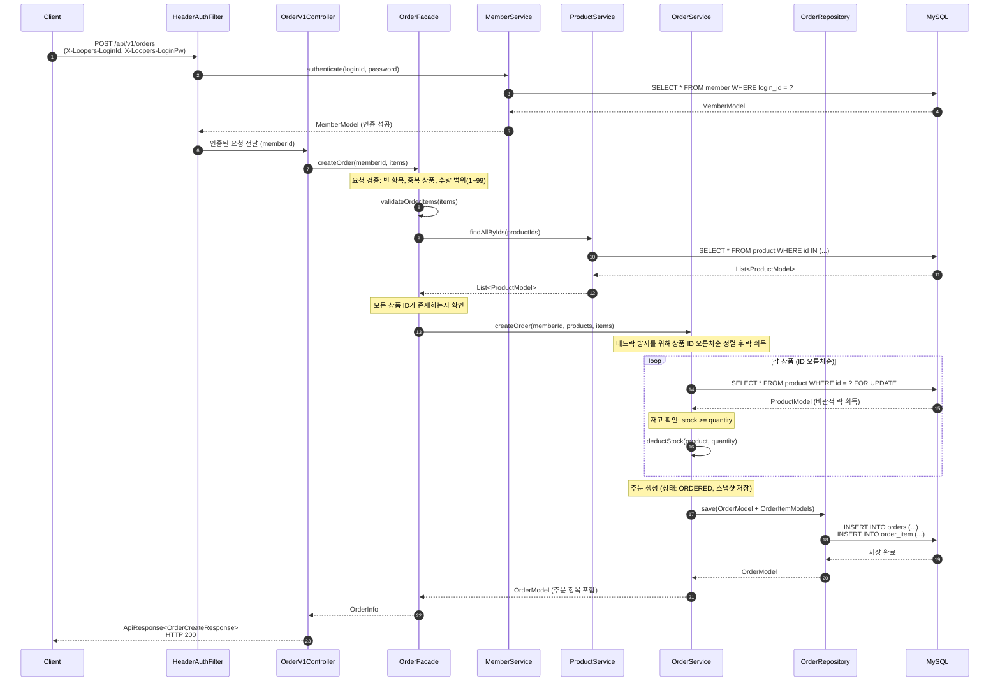
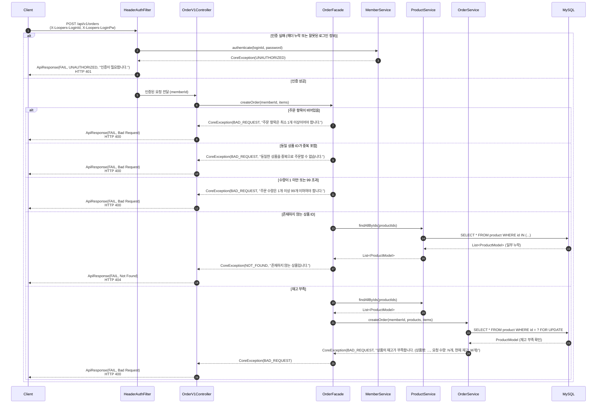
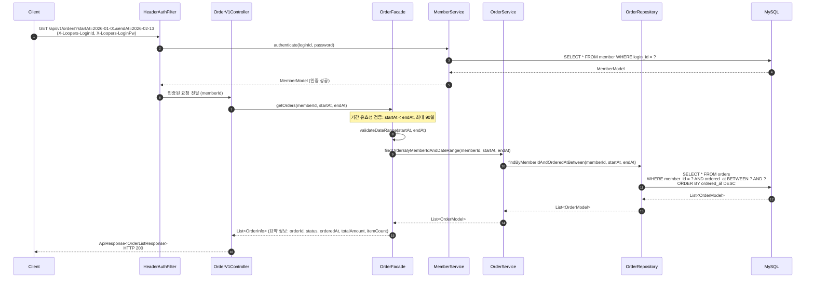
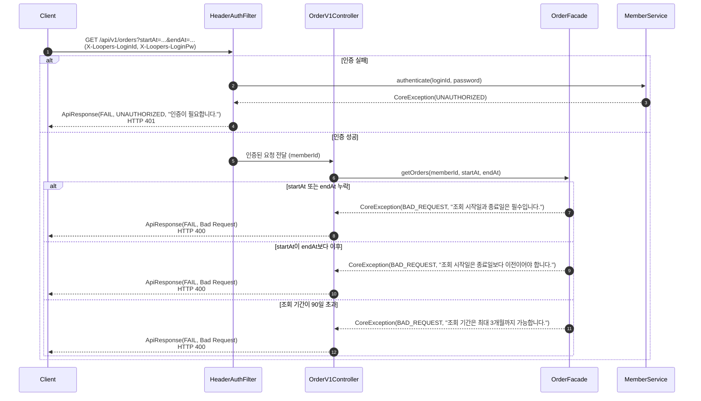
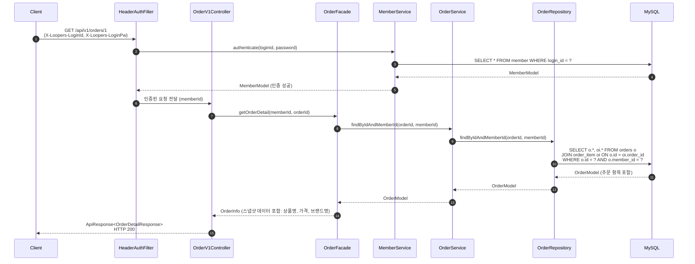
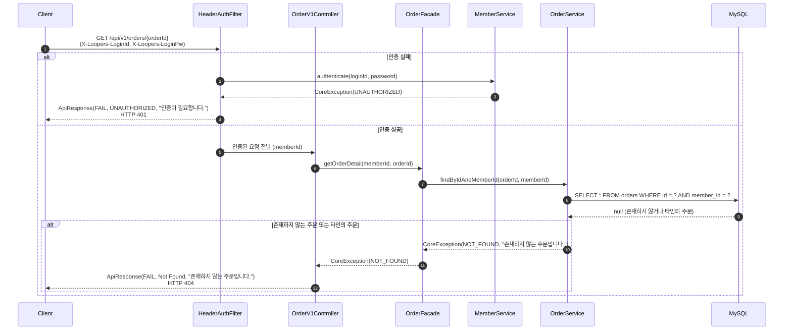

# 주문 시퀀스 다이어그램

## 개요

이 문서는 주문 기능의 3개 API 엔드포인트에 대한 시퀀스 다이어그램을 정의합니다.

| API | Method | URI | 설명 |
|-----|--------|-----|------|
| 주문 요청 | POST | `/api/v1/orders` | 여러 상품을 한 번에 주문 |
| 주문 목록 조회 | GET | `/api/v1/orders` | 기간별 본인 주문 목록 조회 |
| 주문 상세 조회 | GET | `/api/v1/orders/{orderId}` | 단일 주문 상세 조회 |

모든 API는 `X-Loopers-LoginId`, `X-Loopers-LoginPw` 헤더 기반 인증이 필수입니다.

---

## 1. 주문 요청 (POST /api/v1/orders) - 성공 흐름

### 흐름 설명

| 단계 | 책임 객체 | 수행 내용 |
|------|----------|----------|
| 1 | Client | 주문 요청 전송 (상품 ID + 수량 목록, 인증 헤더 포함) |
| 2-5 | HeaderAuthFilter | `X-Loopers-LoginId`와 `X-Loopers-LoginPw` 헤더를 추출하여 MemberService에 인증 위임 |
| 6 | HeaderAuthFilter | 인증 성공 시 memberId를 Controller에 전달 |
| 7 | Controller | 요청 DTO를 Facade에 전달 |
| 8 | Facade | 주문 항목의 유효성 검증 (빈 항목, 중복 상품 ID, 수량 범위) |
| 9-11 | Facade + ProductService | 주문 항목에 포함된 모든 상품을 한 번에 조회하여 존재 여부 확인 |
| 12 | Facade | OrderService에 주문 생성 위임 |
| 13-15 | OrderService | 상품 ID 오름차순으로 비관적 락을 획득하며 재고 확인 및 차감 (데드락 방지) |
| 16-18 | OrderService + OrderRepository | 주문 엔티티와 주문 항목 엔티티를 생성하여 저장 (스냅샷: 상품명, 가격, 브랜드명) |
| 19-21 | Facade + Controller | OrderInfo로 변환 후 ApiResponse로 응답 반환 |

---

## 2. 주문 요청 (POST /api/v1/orders) - 에러 흐름

### 에러 시나리오

| 조건 | 발생 시점 | 책임 객체 | 에러 타입 | HTTP 상태 |
|------|----------|----------|----------|----------|
| 인증 헤더 누락 또는 잘못된 로그인 정보 | HeaderAuthFilter에서 헤더 추출 및 MemberService 인증 시 | HeaderAuthFilter | UNAUTHORIZED | 401 |
| 주문 항목이 비어있음 (items가 빈 배열) | Facade에서 요청 검증 시 | OrderFacade | BAD_REQUEST | 400 |
| 동일 상품 ID가 중복으로 포함됨 | Facade에서 요청 검증 시 | OrderFacade | BAD_REQUEST | 400 |
| 수량이 1 미만 또는 99 초과 | Facade에서 요청 검증 시 | OrderFacade | BAD_REQUEST | 400 |
| 존재하지 않는 상품 ID가 포함됨 | Facade에서 상품 조회 결과 검증 시 | OrderFacade | NOT_FOUND | 404 |
| 재고가 주문 수량보다 부족함 | OrderService에서 비관적 락 획득 후 재고 확인 시 | OrderService | BAD_REQUEST | 400 |

---

## 3. 주문 목록 조회 (GET /api/v1/orders) - 성공 흐름

### 흐름 설명

| 단계 | 책임 객체 | 수행 내용 |
|------|----------|----------|
| 1-6 | HeaderAuthFilter + MemberService | 헤더 기반 인증 및 유저 식별 |
| 7 | Controller | 쿼리 파라미터(startAt, endAt)를 Facade에 전달 |
| 8 | Facade | 기간 유효성 검증 (시작일 < 종료일, 기간 90일 이내) |
| 9-13 | OrderService + OrderRepository | 해당 유저의 주문을 기간 필터로 조회 (최신순 정렬) |
| 14-15 | Facade + Controller | 주문 요약 정보(항목 수 포함)로 변환하여 응답 반환 |

---

## 4. 주문 목록 조회 (GET /api/v1/orders) - 에러 흐름

### 에러 시나리오

| 조건 | 발생 시점 | 책임 객체 | 에러 타입 | HTTP 상태 |
|------|----------|----------|----------|----------|
| 인증 헤더 누락 또는 잘못된 로그인 정보 | HeaderAuthFilter에서 헤더 추출 및 MemberService 인증 시 | HeaderAuthFilter | UNAUTHORIZED | 401 |
| startAt 또는 endAt 누락 | Facade에서 기간 검증 시 | OrderFacade | BAD_REQUEST | 400 |
| startAt이 endAt보다 이후인 경우 | Facade에서 기간 검증 시 | OrderFacade | BAD_REQUEST | 400 |
| 조회 기간이 90일을 초과 | Facade에서 기간 검증 시 | OrderFacade | BAD_REQUEST | 400 |

---

## 5. 주문 상세 조회 (GET /api/v1/orders/{orderId}) - 성공 흐름

### 흐름 설명

| 단계 | 책임 객체 | 수행 내용 |
|------|----------|----------|
| 1-6 | HeaderAuthFilter + MemberService | 헤더 기반 인증 및 유저 식별 |
| 7 | Controller | 경로 변수 orderId를 Facade에 전달 |
| 8-12 | OrderService + OrderRepository | memberId와 orderId를 조건으로 주문 조회 (본인 확인 내포) |
| 13-14 | Facade + Controller | 스냅샷 데이터를 포함한 주문 상세 정보를 응답으로 반환 |

**본인 확인 방식**: 주문을 조회할 때 `orderId`와 `memberId`를 동시에 조건으로 사용합니다. 이 방식으로 별도의 권한 검증 없이 본인 주문만 조회되도록 보장하며, 타인의 주문 ID를 입력해도 결과가 없으므로 자연스럽게 NOT_FOUND로 처리됩니다.

---

## 6. 주문 상세 조회 (GET /api/v1/orders/{orderId}) - 에러 흐름

### 에러 시나리오

| 조건 | 발생 시점 | 책임 객체 | 에러 타입 | HTTP 상태 |
|------|----------|----------|----------|----------|
| 인증 헤더 누락 또는 잘못된 로그인 정보 | HeaderAuthFilter에서 헤더 추출 및 MemberService 인증 시 | HeaderAuthFilter | UNAUTHORIZED | 401 |
| 존재하지 않는 주문 ID | OrderService에서 주문 조회 시 결과 없음 | OrderService | NOT_FOUND | 404 |
| 다른 유저의 주문을 조회하려는 경우 | OrderService에서 memberId + orderId 조건 조회 시 결과 없음 | OrderService | NOT_FOUND | 404 |

**보안 참고**: 존재하지 않는 주문과 타인의 주문 모두 동일하게 NOT_FOUND(404)를 반환합니다. 이는 주문 존재 여부를 외부에 노출하지 않기 위한 보안 설계입니다.

---

## 품질 체크리스트

- [x] 각 participant의 책임(검증, 변환, 조회, 저장 등)이 메서드명으로 명확히 드러나는가?
  - Filter: authenticate, Controller: 요청 전달, Facade: validateOrderItems/validateDateRange, Service: createOrder/findByIdAndMemberId, Repository: save/find 등 책임별 메서드명 명시
- [x] 여러 도메인이 관련된 경우, 각 도메인의 Service가 별도 participant로 분리되어 있는가?
  - 주문 요청에서 MemberService(인증), ProductService(상품 조회), OrderService(주문 생성)를 별도 participant로 분리
- [x] 인증 방식(헤더 기반)이 다이어그램에 정확히 반영되어 있는가?
  - HeaderAuthFilter에서 X-Loopers-LoginId/LoginPw 헤더를 추출하여 MemberService에 인증 위임하는 흐름 반영
- [x] 성공 흐름과 에러 흐름이 모두 포함되어 있는가?
  - 3개 API 모두 성공 흐름과 에러 흐름 다이어그램을 포함 (총 6개 다이어그램)
- [x] 에러 시나리오 테이블에 발생 시점과 책임 객체가 명시되어 있는가?
  - 모든 에러 시나리오 테이블에 조건, 발생 시점, 책임 객체, 에러 타입, HTTP 상태 명시
