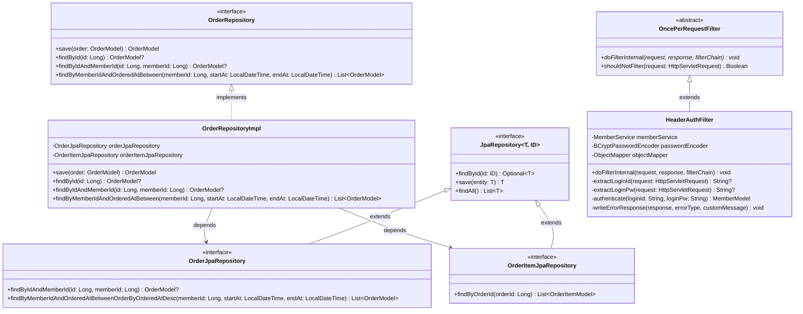

# 주문 클래스 다이어그램

## 개요

이 문서는 주문 기능의 클래스 구조를 레이어별로 정의합니다. 주문 도메인은 유저(Member), 상품(Product), 브랜드(Brand) 도메인과 연관되며, Facade 레이어에서 여러 도메인 Service를 조합하여 주문 유스케이스를 구현합니다.

---

## 1. 전체 레이어 관계


### 레이어간 의존 방향
```
Interfaces → Application → Domain ← Infrastructure
```
- **Interfaces**: API 진입점 (Controller, DTO)
- **Application**: 유스케이스 조합 (Facade가 여러 도메인 Service를 조합)
- **Domain**: 비즈니스 로직의 핵심 (Model, Service, Repository 인터페이스)
- **Infrastructure**: 기술 구현 상세 (Repository 구현체, JPA, 인증 필터)

---

## 2. Domain 레이어 상세


### 클래스 설명

| 클래스 | 역할 | 주요 메서드/필드 |
|--------|------|-----------------|
| `OrderStatus` | 주문 상태를 정의하는 열거형. 초기 구현에서는 ORDERED 단일 상태만 사용하며, 향후 결제/배송 기능 추가 시 확장 가능 | `ORDERED` |
| `OrderModel` | 주문 엔티티. 주문자(memberId), 상태, 총 금액, 주문 일시를 관리하며 주문 항목(OrderItemModel)을 포함 | `calculateTotalAmount()`: 주문 항목들의 소계 합산, `getItemCount()`: 주문 항목 수 반환 |
| `OrderItemModel` | 주문 항목 엔티티. 주문 당시의 상품 정보를 스냅샷으로 보관 (상품명, 가격, 브랜드명) | `calculateSubTotal()`: price x quantity 계산 |
| `OrderRepository` | 주문 저장/조회를 위한 인터페이스. Domain 레이어에 정의하여 Infrastructure와의 의존 역전 실현 | `findByIdAndMemberId()`: 본인 주문 조회, `findByMemberIdAndOrderedAtBetween()`: 기간별 조회 |
| `OrderService` | 주문 도메인 서비스. 주문 생성(재고 확인/차감, 스냅샷 저장)과 조회 로직 담당 | `createOrder()`: 비관적 락을 이용한 재고 차감 및 주문 생성 |

### OrderModel 필드 상세

| 필드 | 타입 | 설명 | 제약 조건 |
|------|------|------|-----------|
| `memberId` | Long | 주문자의 회원 ID | NOT NULL |
| `status` | OrderStatus | 주문 상태 | NOT NULL, 기본값 ORDERED |
| `totalAmount` | Long | 주문 총 금액 (주문 항목 소계의 합) | NOT NULL |
| `orderedAt` | LocalDateTime | 주문 일시 | NOT NULL |
| `items` | List\<OrderItemModel\> | 주문에 포함된 항목 목록 | 최소 1개 이상 |

### OrderItemModel 필드 상세

| 필드 | 타입 | 설명 | 제약 조건 |
|------|------|------|-----------|
| `orderId` | Long | 소속 주문의 ID | NOT NULL, FK |
| `productId` | Long | 원본 상품 ID (참조용) | NOT NULL |
| `productName` | String | 주문 당시 상품명 (스냅샷) | NOT NULL |
| `brandName` | String | 주문 당시 브랜드명 (스냅샷) | NOT NULL |
| `price` | Long | 주문 당시 상품 가격 (스냅샷) | NOT NULL |
| `quantity` | Int | 주문 수량 | NOT NULL, 1~99 |
| `subTotal` | Long | 소계 (price x quantity) | NOT NULL |

---

## 3. Application 레이어 상세


### 클래스 설명

| 클래스 | 역할 | 주요 메서드 |
|--------|------|-----------|
| `OrderFacade` | 주문 유스케이스의 진입점. MemberService, ProductService, OrderService 세 도메인 서비스를 조합하여 주문 생성/조회 흐름을 구성 | `createOrder()`: 요청 검증 → 상품 조회 → 재고 확인/차감 → 주문 생성, `validateDateRange()`: 기간 유효성 검증 (startAt < endAt, 최대 90일) |
| `OrderInfo` | Facade에서 Controller로 전달하는 정보 객체. Domain 모델을 API 응답에 적합한 형태로 변환 | `from()`: OrderModel을 OrderInfo로 변환하는 팩토리 메서드 |
| `OrderItemInfo` | 주문 항목의 정보 객체. 스냅샷 데이터(상품명, 가격, 브랜드명)를 포함 | `from()`: OrderItemModel을 OrderItemInfo로 변환하는 팩토리 메서드 |

### Facade 의존 관계

| 의존 대상 | 역할 | 사용 시점 |
|----------|------|----------|
| `MemberService` | 유저 존재 확인 및 인증 정보 조회 | 모든 API에서 인증된 유저의 정보를 조회할 때 |
| `ProductService` | 상품 존재 확인, 재고 조회 및 차감 | 주문 생성 시 상품 유효성 검증과 재고 처리 |
| `OrderService` | 주문 엔티티 생성 및 조회 | 주문 저장, 기간별 목록 조회, 상세 조회 |

---

## 4. Interfaces 레이어 상세


### 클래스 설명

| 클래스 | 역할 | 비고 |
|--------|------|------|
| `OrderV1ApiSpec` | OpenAPI/Swagger 문서를 위한 API 인터페이스. `@Tag`, `@Operation` 어노테이션으로 API 문서를 정의 | Controller가 이 인터페이스를 구현 |
| `OrderV1Controller` | REST API 엔드포인트. 요청을 수신하여 Facade에 위임하고 ApiResponse로 응답을 반환 | `@RestController`, `@RequestMapping("/api/v1/orders")` |
| `CreateOrderRequest` | 주문 생성 요청 DTO. 주문 항목 목록(items)을 포함 | `OrderV1Dto`의 내부 클래스 |
| `OrderItemRequest` | 주문 항목 요청 DTO. 상품 ID와 수량을 포함 | `OrderV1Dto`의 내부 클래스 |
| `OrderCreateResponse` | 주문 생성 응답 DTO. 생성된 주문의 전체 정보(스냅샷 포함)를 반환 | `from(OrderInfo)` 팩토리 메서드 |
| `OrderListResponse` | 주문 목록 응답 DTO. 주문 요약 정보의 리스트를 반환 | 주문 항목 상세는 미포함, 항목 수(itemCount)만 포함 |
| `OrderSummaryResponse` | 주문 요약 응답 DTO. 목록 조회에서 사용하는 주문 건 단위 요약 | `OrderV1Dto`의 내부 클래스 |
| `OrderDetailResponse` | 주문 상세 응답 DTO. 주문 정보와 스냅샷 항목을 포함 | `from(OrderInfo)` 팩토리 메서드 |
| `OrderItemResponse` | 주문 항목 응답 DTO. 스냅샷 데이터(상품명, 가격, 브랜드명, 수량, 소계)를 포함 | `OrderV1Dto`의 내부 클래스 |

---

## 5. Infrastructure 레이어 상세



### 클래스 설명

| 클래스 | 역할 | 비고 |
|--------|------|------|
| `OrderRepositoryImpl` | Domain의 `OrderRepository` 인터페이스를 구현하는 클래스. JpaRepository를 내부적으로 사용하여 실제 DB 접근을 수행 | `@Component`, 의존 역전 원칙(DIP) 적용 |
| `OrderJpaRepository` | Spring Data JPA가 제공하는 주문(OrderModel) 전용 인터페이스. 메서드명 기반 쿼리 자동 생성 활용 | `JpaRepository<OrderModel, Long>` 확장 |
| `OrderItemJpaRepository` | Spring Data JPA가 제공하는 주문 항목(OrderItemModel) 전용 인터페이스 | `JpaRepository<OrderItemModel, Long>` 확장 |
| `HeaderAuthFilter` | Round2 인증 필터. `X-Loopers-LoginId`, `X-Loopers-LoginPw` 헤더에서 로그인 정보를 추출하여 MemberService로 인증을 수행 | `OncePerRequestFilter` 확장, 보호 대상 경로에만 적용 |

### 비관적 락 관련 (ProductJpaRepository 참조)

주문 생성 시 재고 차감을 위해 상품 도메인의 Repository에서 비관적 락을 사용합니다:

```kotlin
// ProductJpaRepository에 추가될 메서드
@Lock(LockModeType.PESSIMISTIC_WRITE)
@Query("SELECT p FROM ProductModel p WHERE p.id = :id")
fun findByIdWithLock(id: Long): ProductModel?
```

이 메서드는 주문 도메인이 아닌 상품 도메인에 속하지만, 주문 생성 흐름에서 핵심적인 역할을 하므로 참고용으로 명시합니다.

---

## 6. 도메인 간 관계 다이어그램


### 도메인 간 참조 방식

| 참조 관계 | 참조 방식 | 설명 |
|----------|----------|------|
| OrderModel → MemberModel | `memberId` (Long) | 주문 엔티티가 주문자의 회원 ID를 직접 저장. JPA 연관 관계 대신 ID 참조를 사용하여 도메인 간 결합도를 낮춤 |
| OrderItemModel → ProductModel | `productId` (Long) + 스냅샷 필드 | 원본 상품 ID를 참조용으로 보관하되, 상품명/가격/브랜드명은 스냅샷으로 별도 저장. 상품 정보 변경과 무관하게 주문 내역 보존 |
| OrderItemModel → BrandModel | `brandName` (String) 스냅샷 | 브랜드를 직접 참조하지 않고, 주문 시점의 브랜드명을 문자열로 저장 |

---

## 품질 체크리스트

- [x] 도메인 모델(Model)에 비즈니스 로직과 검증 메서드가 포함되어 있는가?
  - OrderModel: `calculateTotalAmount()`, `getItemCount()` / OrderItemModel: `calculateSubTotal()` 비즈니스 로직 포함
- [x] 여러 도메인이 관련된 경우, 도메인 간 참조 관계가 명확히 표현되어 있는가?
  - 섹션 6에서 MemberModel, ProductModel, BrandModel과 OrderModel/OrderItemModel 간의 참조 관계와 스냅샷 방식을 명시
- [x] Facade가 조합하는 여러 Service 의존성이 모두 표현되어 있는가?
  - OrderFacade가 MemberService, ProductService, OrderService 세 Service에 의존하는 관계를 다이어그램과 표로 명시
- [x] 각 레이어(Domain, Application, Interfaces, Infrastructure)의 클래스가 모두 포함되어 있는가?
  - 4개 레이어 각각의 상세 다이어그램과 클래스 설명 테이블을 포함
- [x] 클래스 간 관계(상속, 구현, 의존, 컴포지션)가 정확히 표현되어 있는가?
  - 상속(`<|--`): BaseEntity ← OrderModel/OrderItemModel, OncePerRequestFilter ← HeaderAuthFilter
  - 구현(`<|..`): OrderRepository ← OrderRepositoryImpl, OrderV1ApiSpec ← OrderV1Controller
  - 의존(`-->`): Controller → Facade → Service → Repository
  - 컴포지션(`*--`): OrderModel *-- OrderItemModel, OrderV1Dto *-- 내부 DTO 클래스들
