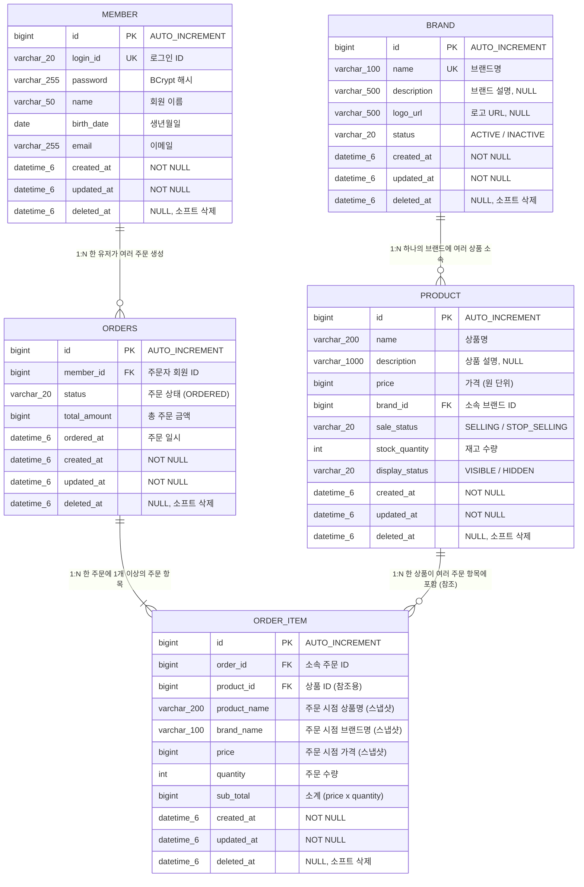

# 주문 ERD

## 개요

이 문서는 주문 기능에 필요한 데이터베이스 테이블 구조를 정의합니다.
신규 테이블 `orders`와 `order_item`의 상세 명세, 기존 `member`, `brand`, `product` 테이블과의 관계,
그리고 주문 조회 성능을 위한 인덱스 설계를 포함합니다.

**대상 테이블:**
- `orders` (신규): 주문 헤더 정보
- `order_item` (신규): 주문 항목 정보 (상품 스냅샷 포함)
- `member` (기존): 주문자 정보 (참고용)
- `product` (기존): 상품 정보 (참고용, 재고 차감 대상)
- `brand` (기존): 브랜드 정보 (참고용, 스냅샷 원본)

---

## 1. 전체 ERD



---

## 2. 테이블 상세 명세

### 2.1 기존 테이블 (참고)

#### 테이블명: `member`

주문자 정보를 제공합니다. 주문 생성 시 `X-Loopers-LoginId` 헤더로 식별된 유저의 `id`가 `orders.member_id`에 저장됩니다.

| 컬럼명 | 타입 | Nullable | 제약조건 | 설명 |
|--------|------|----------|---------|------|
| id | BIGINT | NOT NULL | PK, AUTO_INCREMENT | 회원 ID |
| login_id | VARCHAR(20) | NOT NULL | UNIQUE | 로그인 ID |
| password | VARCHAR(255) | NOT NULL | | BCrypt 해시 비밀번호 |
| name | VARCHAR(50) | NOT NULL | | 회원 이름 |
| birth_date | DATE | NOT NULL | | 생년월일 |
| email | VARCHAR(255) | NOT NULL | | 이메일 주소 |
| created_at | DATETIME(6) | NOT NULL | | 생성 시점 |
| updated_at | DATETIME(6) | NOT NULL | | 수정 시점 |
| deleted_at | DATETIME(6) | NULL | | 소프트 삭제 시점 |

---

#### 테이블명: `product`

주문 대상 상품 정보를 제공합니다. 주문 생성 시 `stock_quantity`가 비관적 락을 통해 차감되며, 상품명/가격/브랜드명은 `order_item`에 스냅샷으로 복사됩니다.

| 컬럼명 | 타입 | Nullable | 제약조건 | 설명 |
|--------|------|----------|---------|------|
| id | BIGINT | NOT NULL | PK, AUTO_INCREMENT | 상품 ID |
| name | VARCHAR(200) | NOT NULL | | 상품명 |
| description | VARCHAR(1000) | NULL | | 상품 설명 |
| price | BIGINT | NOT NULL | CHECK (price >= 0) | 상품 가격 (원 단위) |
| brand_id | BIGINT | NOT NULL | FK -> brand.id | 소속 브랜드 ID |
| sale_status | VARCHAR(20) | NOT NULL | | 판매 상태 (SELLING, STOP_SELLING) |
| stock_quantity | INT | NOT NULL | CHECK (stock_quantity >= 0) | 재고 수량 (비관적 락 대상) |
| display_status | VARCHAR(20) | NOT NULL | | 노출 상태 (VISIBLE, HIDDEN) |
| created_at | DATETIME(6) | NOT NULL | | 생성 시점 |
| updated_at | DATETIME(6) | NOT NULL | | 수정 시점 |
| deleted_at | DATETIME(6) | NULL | | 소프트 삭제 시점 |

**비관적 락 적용**: 주문 생성 시 `SELECT ... FOR UPDATE`로 행 잠금을 걸어 동시 주문 시 재고 정합성을 보장합니다.

---

### 2.2 신규 테이블

#### 테이블명: `orders`

유저의 주문 정보를 저장합니다. 하나의 주문에 여러 주문 항목(`order_item`)이 포함됩니다. 주문자는 `member_id`로 식별하며, 본인의 주문만 조회할 수 있습니다.

| 컬럼명 | 타입 | Nullable | 제약조건 | 설명 |
|--------|------|----------|---------|------|
| id | BIGINT | NOT NULL | PK, AUTO_INCREMENT | 주문 ID |
| member_id | BIGINT | NOT NULL | FK -> member.id | 주문자 회원 ID |
| status | VARCHAR(20) | NOT NULL | DEFAULT 'ORDERED' | 주문 상태 |
| total_amount | BIGINT | NOT NULL | CHECK (total_amount >= 0) | 총 주문 금액 (주문 항목 소계의 합) |
| ordered_at | DATETIME(6) | NOT NULL | | 주문 일시 |
| created_at | DATETIME(6) | NOT NULL | | 생성 시점 (BaseEntity) |
| updated_at | DATETIME(6) | NOT NULL | | 수정 시점 (BaseEntity) |
| deleted_at | DATETIME(6) | NULL | | 소프트 삭제 시점 (BaseEntity) |

**Enum 값 정의 - status:**

| 값 | 설명 |
|----|------|
| `ORDERED` | 주문 완료. 초기 구현에서 유일한 상태. 결제 기능 추가 시 확장 예정 |

**ordered_at과 created_at의 차이**: `ordered_at`은 비즈니스 관점의 주문 일시이며 기간별 조회 쿼리에 사용됩니다. `created_at`은 BaseEntity의 엔티티 생성 시점으로 감사(audit) 목적입니다. 현재는 동일한 시점이지만, 향후 주문 마이그레이션 등의 상황에서 구분이 필요할 수 있습니다.

---

#### 테이블명: `order_item`

주문에 포함된 개별 상품 항목 정보를 저장합니다. 주문 당시의 상품 정보(상품명, 가격, 브랜드명)를 스냅샷으로 보관하여, 원본 상품이 수정/삭제되더라도 주문 이력에서 원래 정보를 유지합니다.

| 컬럼명 | 타입 | Nullable | 제약조건 | 설명 |
|--------|------|----------|---------|------|
| id | BIGINT | NOT NULL | PK, AUTO_INCREMENT | 주문 항목 ID |
| order_id | BIGINT | NOT NULL | FK -> orders.id | 소속 주문 ID |
| product_id | BIGINT | NOT NULL | FK -> product.id | 원본 상품 ID (참조용) |
| product_name | VARCHAR(200) | NOT NULL | | 주문 시점 상품명 (스냅샷) |
| brand_name | VARCHAR(100) | NOT NULL | | 주문 시점 브랜드명 (스냅샷) |
| price | BIGINT | NOT NULL | CHECK (price >= 0) | 주문 시점 상품 가격 (스냅샷) |
| quantity | INT | NOT NULL | CHECK (quantity >= 1 AND quantity <= 99) | 주문 수량 (1~99) |
| sub_total | BIGINT | NOT NULL | CHECK (sub_total >= 0) | 소계 (price x quantity) |
| created_at | DATETIME(6) | NOT NULL | | 생성 시점 (BaseEntity) |
| updated_at | DATETIME(6) | NOT NULL | | 수정 시점 (BaseEntity) |
| deleted_at | DATETIME(6) | NULL | | 소프트 삭제 시점 (BaseEntity) |

**스냅샷 필드 설명:**

| 스냅샷 필드 | 원본 출처 | 설명 |
|------------|----------|------|
| `product_name` | product.name | 주문 생성 시점의 상품명. 이후 상품명이 변경되어도 주문 내역에는 원래 상품명 표시 |
| `brand_name` | brand.name (product.brand_id 경유) | 주문 생성 시점의 브랜드명. 이후 브랜드명이 변경되어도 주문 내역에는 원래 브랜드명 표시 |
| `price` | product.price | 주문 생성 시점의 상품 가격. 이후 가격이 변동되어도 주문 내역에는 결제 시점 가격 유지 |

**product_id 보존 이유**: 스냅샷으로 원본 정보를 보존하지만, 원본 상품으로의 링크가 필요한 경우(예: 재주문, 상품 페이지 이동)를 위해 `product_id`를 참조용으로 보관합니다. 단, 상품이 삭제된 경우 해당 링크는 사용할 수 없으므로 UI에서 적절히 처리해야 합니다.

---

## 3. 테이블간 관계

### 3.1 핵심 관계 (이번 구현 범위)

| 관계 | 카디널리티 | FK | 삭제 정책 | 설명 |
|------|-----------|----|---------|----|
| member -> orders | 1:N | orders.member_id -> member.id | 소프트 삭제 독립 | 한 유저가 여러 주문을 생성할 수 있습니다. 유저 삭제 시 주문 데이터는 보존됩니다. |
| orders -> order_item | 1:N | order_item.order_id -> orders.id | 연쇄 소프트 삭제 | 하나의 주문에 1개 이상의 주문 항목이 포함됩니다. 주문 소프트 삭제 시 주문 항목도 함께 소프트 삭제됩니다. |
| product -> order_item | 1:N | order_item.product_id -> product.id | 참조 유지 | 한 상품이 여러 주문 항목에 포함될 수 있습니다. 상품 삭제/수정 시 스냅샷 데이터로 원본 정보를 보존합니다. |

### 3.2 참조 관계 (기존 테이블)

| 관계 | 카디널리티 | FK | 설명 |
|------|-----------|----|----|
| brand -> product | 1:N | product.brand_id -> brand.id | 하나의 브랜드에 여러 상품이 소속됩니다. 주문 생성 시 product를 통해 brand.name을 조회하여 스냅샷에 저장합니다. |

### 3.3 변경/삭제 시 주문 데이터에 미치는 영향

| 이벤트 | 주문 데이터 영향 | 처리 방식 |
|--------|----------------|----------|
| 상품 가격 변경 | 기존 주문의 `order_item.price`는 변경되지 않음 | 스냅샷으로 주문 시점 가격 보존 |
| 상품명 변경 | 기존 주문의 `order_item.product_name`은 변경되지 않음 | 스냅샷으로 주문 시점 상품명 보존 |
| 브랜드명 변경 | 기존 주문의 `order_item.brand_name`은 변경되지 않음 | 스냅샷으로 주문 시점 브랜드명 보존 |
| 상품 소프트 삭제 | 기존 주문 데이터는 유지됨 | 스냅샷 데이터로 주문 내역 표시, `product_id` 참조는 비활성 |
| 브랜드 소프트 삭제 (상품 연쇄 삭제) | 기존 주문 데이터는 유지됨 | 스냅샷 데이터로 주문 내역 표시 |
| 유저 탈퇴 (소프트 삭제) | 기존 주문 데이터는 유지됨 | 법적 보존 의무에 따라 주문 이력 보존 |

---

## 4. 인덱스 설계

### 4.1 orders 테이블

| 인덱스명 | 컬럼 | 타입 | 용도 |
|---------|------|------|------|
| `PRIMARY` | id | PK | 기본 키 |
| `idx_orders_member_id` | member_id | INDEX | 특정 유저의 주문 목록 조회 |
| `idx_orders_member_ordered_at` | member_id, ordered_at | COMPOSITE INDEX | 유저별 기간 조회 (가장 빈번한 쿼리 패턴) |

### 4.2 order_item 테이블

| 인덱스명 | 컬럼 | 타입 | 용도 |
|---------|------|------|------|
| `PRIMARY` | id | PK | 기본 키 |
| `idx_order_item_order_id` | order_id | INDEX | 특정 주문의 항목 목록 조회 |
| `idx_order_item_product_id` | product_id | INDEX | 특정 상품의 주문 이력 조회 (어드민용) |

### 4.3 인덱스 설계 근거

| 쿼리 패턴 | 사용 인덱스 | 빈도 | 설명 |
|----------|-----------|------|------|
| 주문 목록 조회 (member_id = ? AND ordered_at BETWEEN ? AND ?) | `idx_orders_member_ordered_at` | 매우 높음 | 유저의 기간별 주문 목록 조회. 가장 빈번한 쿼리 |
| 주문 상세 조회 (id = ? AND member_id = ?) | `PRIMARY` + `idx_orders_member_id` | 높음 | PK 조회 후 member_id 조건으로 본인 확인 |
| 주문 항목 조회 (order_id = ?) | `idx_order_item_order_id` | 높음 | 주문 상세 조회 시 항목 목록 로드 |
| 상품별 주문 이력 (product_id = ?) | `idx_order_item_product_id` | 낮음 | 어드민이 특정 상품의 판매 이력 확인 시 사용 |

---

## 5. DDL 참고 (JPA 자동 생성 기준)

JPA/Hibernate가 엔티티 매핑 기반으로 DDL을 생성합니다. 아래는 참고용이며, 실제 DDL은 JPA의 `@Column`, `@Table` 어노테이션에 의해 결정됩니다.

### orders 테이블

```sql
CREATE TABLE orders (
    id            BIGINT       NOT NULL AUTO_INCREMENT,
    member_id     BIGINT       NOT NULL,
    status        VARCHAR(20)  NOT NULL DEFAULT 'ORDERED',
    total_amount  BIGINT       NOT NULL,
    ordered_at    DATETIME(6)  NOT NULL,
    created_at    DATETIME(6)  NOT NULL,
    updated_at    DATETIME(6)  NOT NULL,
    deleted_at    DATETIME(6)  NULL,
    PRIMARY KEY (id),
    CONSTRAINT fk_orders_member FOREIGN KEY (member_id) REFERENCES member(id),
    INDEX idx_orders_member_id (member_id),
    INDEX idx_orders_member_ordered_at (member_id, ordered_at)
) ENGINE=InnoDB DEFAULT CHARSET=utf8mb4;
```

### order_item 테이블

```sql
CREATE TABLE order_item (
    id            BIGINT       NOT NULL AUTO_INCREMENT,
    order_id      BIGINT       NOT NULL,
    product_id    BIGINT       NOT NULL,
    product_name  VARCHAR(200) NOT NULL,
    brand_name    VARCHAR(100) NOT NULL,
    price         BIGINT       NOT NULL,
    quantity      INT          NOT NULL,
    sub_total     BIGINT       NOT NULL,
    created_at    DATETIME(6)  NOT NULL,
    updated_at    DATETIME(6)  NOT NULL,
    deleted_at    DATETIME(6)  NULL,
    PRIMARY KEY (id),
    CONSTRAINT fk_order_item_orders FOREIGN KEY (order_id) REFERENCES orders(id),
    CONSTRAINT fk_order_item_product FOREIGN KEY (product_id) REFERENCES product(id),
    INDEX idx_order_item_order_id (order_id),
    INDEX idx_order_item_product_id (product_id)
) ENGINE=InnoDB DEFAULT CHARSET=utf8mb4;
```

---

## 6. 비관적 락 적용 쿼리

주문 생성 시 재고 정합성을 보장하기 위해 상품 테이블에 비관적 락을 적용합니다.

```sql
-- 1. 상품 조회 + 행 잠금 (상품 ID 오름차순으로 데드락 방지)
SELECT * FROM product WHERE id = ? FOR UPDATE;

-- 2. 재고 확인
-- stock_quantity >= 요청 수량인지 검증

-- 3. 재고 차감
UPDATE product SET stock_quantity = stock_quantity - ?, updated_at = NOW(6) WHERE id = ?;

-- 4. 주문 생성
INSERT INTO orders (member_id, status, total_amount, ordered_at, created_at, updated_at)
VALUES (?, 'ORDERED', ?, NOW(6), NOW(6), NOW(6));

-- 5. 주문 항목 생성 (스냅샷 저장)
INSERT INTO order_item (order_id, product_id, product_name, brand_name, price, quantity, sub_total, created_at, updated_at)
VALUES (?, ?, ?, ?, ?, ?, ?, NOW(6), NOW(6));
```

**데드락 방지 전략**: 여러 상품에 동시에 락을 걸 때, 상품 ID 오름차순으로 정렬하여 순서대로 `SELECT ... FOR UPDATE`를 실행합니다. 모든 트랜잭션이 동일한 순서로 락을 획득하므로 순환 대기(circular wait)가 발생하지 않습니다.

---

## 품질 체크리스트

- [x] FK 제약 조건으로 참조 무결성이 보장되는가?
  - orders.member_id -> member.id FK 설정
  - order_item.order_id -> orders.id FK 설정
  - order_item.product_id -> product.id FK 설정
- [x] 연쇄 삭제 또는 소프트 삭제 정책이 비즈니스 규칙과 일치하는가?
  - orders 소프트 삭제 시 order_item도 연쇄 소프트 삭제 (애플리케이션 레벨)
  - 상품/브랜드 삭제 시 주문 데이터는 보존 (스냅샷으로 원본 정보 유지)
- [x] UNIQUE 제약 조건으로 데이터 중복이 방지되는가?
  - 주문 도메인에서는 UNIQUE 제약이 필요하지 않음 (동일 유저가 동일 상품을 여러 번 주문 가능, 단 한 주문 내에서는 애플리케이션 레벨에서 중복 검증)
- [x] 스냅샷 데이터와 참조 데이터가 구분되어 있는가?
  - order_item.product_name, brand_name, price는 스냅샷 데이터 (불변)
  - order_item.product_id는 참조 데이터 (원본 상품 링크용)
  - 섹션 3.3에서 변경/삭제 시 스냅샷에 미치는 영향을 상세히 정리
- [x] 조회 성능을 위한 인덱스가 적절히 설계되어 있는가?
  - 가장 빈번한 쿼리(유저별 기간 조회)에 복합 인덱스 `idx_orders_member_ordered_at` 설계
  - 주문 항목 조회를 위한 `idx_order_item_order_id` 인덱스 설계
- [x] 관련 도메인(유저, 브랜드, 상품, 좋아요, 주문) 테이블 간 관계가 모두 표현되어 있는가?
  - ERD에 member, brand, product, orders, order_item 간 관계를 모두 표현
  - 섹션 3에서 핵심 관계와 참조 관계를 분리하여 설명
