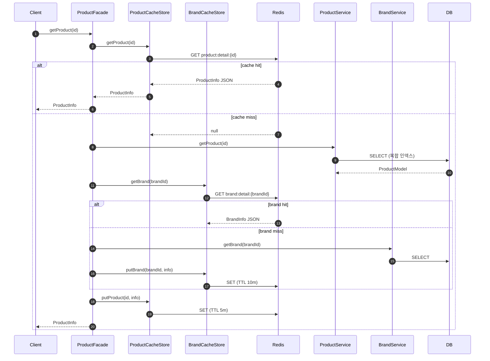
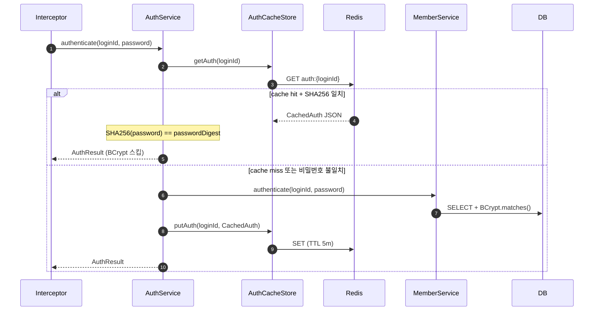
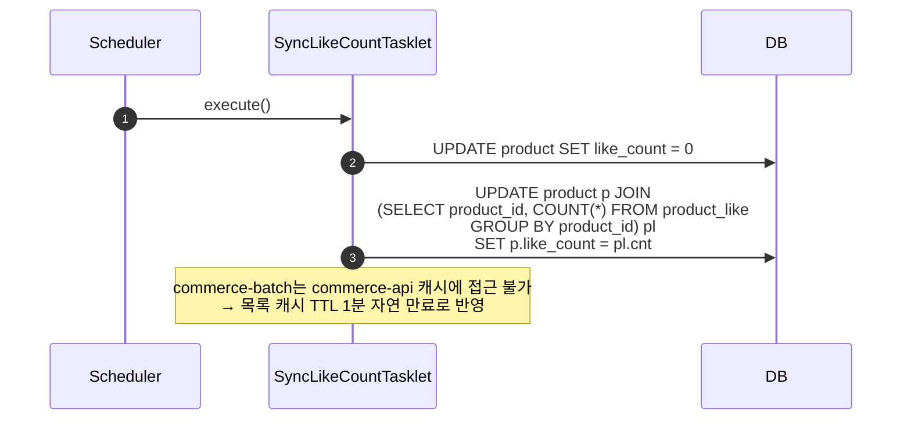

## 📌 Summary

- **배경**: 상품 조회에 캐시가 없고, 브랜드 필터 + 정렬 시 filesort가 발생하며, `like_count`가 실제 동기화되지 않는 상태
- **목표**: 복합 인덱스로 filesort 제거, `like_count` 배치 집계, Redis 캐시 도입 (상품/브랜드/인증)
- **결과**: 브랜드+가격순 쿼리 **17.6x 개선** (13.4ms → 0.76ms, 5M rows 실측), 전 도메인 Redis Cache-Aside 적용

---

## 🧭 Context & Decision

### 문제 정의

**인덱스**: 기존에 `brand_id` 단독 인덱스와 `(status, like_count DESC, id DESC)` 인덱스가 따로 있었다. 브랜드 필터 + 좋아요 순 정렬 쿼리를 실행하면 두 인덱스를 동시에 탈 수 없어서, status+like_count 인덱스를 range scan한 뒤 brand_id를 후필터링한다. 5M 데이터에서 EXPLAIN 결과가 `type=range`, `filtered=9%` — 읽은 행의 91%를 버리는 셈이다.

**like_count**: `product.like_count` 컬럼은 있는데 `DEFAULT 0`으로 고정되어 있고, 실제 `product_like` 테이블의 좋아요 수와 동기화되지 않는다. 좋아요 순 정렬이 사실상 무의미한 상태.

**캐시 부재**: 상품/브랜드 조회에 캐시가 없어서 모든 요청이 DB를 직접 친다.

**인증 캐시**: Caffeine(JVM 로컬)으로 인증 결과를 캐싱하고 있는데, JWT를 안 쓰는 아키텍처라 매 요청마다 credential이 전달된다. 인스턴스 4개로 스케일 아웃하면 동일 유저도 각 인스턴스에서 독립적으로 BCrypt를 수행하게 된다 (인스턴스 수 × 활성 유저 수만큼 BCrypt 중복 발생).

**성공 기준**:
- EXPLAIN에서 `type: range → ref`, `filtered: 9% → 100%` 전환 확인
- 배치 실행 후 `product.like_count = COUNT(product_like)` 일치
- 캐시 hit/miss 단위 테스트 + E2E 테스트 통과
- Redis 장애 시에도 DB fallback으로 정상 응답

### 선택지와 결정

#### D37: 캐시 구현 — `@Cacheable` vs RedisTemplate 직접 사용

`@Cacheable`이 간단하지만, 상세(5분)와 목록(1분)에 서로 다른 TTL을 적용해야 하고, `@Cacheable` 어노테이션이 Application 레이어에 노출되면 DIP 위반이다. RedisTemplate을 직접 써서 Port 패턴(`CacheStore` interface → `CacheStoreImpl`)으로 구성했다. 읽기는 Replica, 쓰기는 Master로 분리하고, 모든 Redis 호출을 try-catch로 감싸서 장애 시 DB fallback을 보장한다.

#### D38: 인덱스 — 단독 vs 복합

`(brand_id, status, like_count DESC, id DESC)` + `(brand_id, status, price ASC, id DESC)` 복합 인덱스를 추가했다. 브랜드 필터 + 상태 + 정렬 + 커서 페이징을 하나의 인덱스에서 커버한다. 기존 `idx_product_brand_id`는 복합 인덱스의 leftmost prefix에 포함되므로 DROP.

#### D39: 배치 집계 — Chunk vs Tasklet

10만건 수준에서 Chunk(Reader-Processor-Writer)는 과도하다. `SyncLikeCountTasklet`에서 `UPDATE product p JOIN (SELECT product_id, COUNT(*) FROM product_like GROUP BY product_id)` 단일 쿼리로 전체 갱신한다. commerce-api에 의존하지 않고 JdbcTemplate만 사용.

#### D41: 인증 캐시 — Caffeine 유지 vs Redis 전환

단일 인스턴스에서는 Caffeine이 ~150배 빠르다 (0.001ms vs 0.15ms). 하지만 JWT 없이 매 요청 credential을 보내는 구조에서, 멀티 인스턴스 시 BCrypt 절감 효과가 압도적이다. Redis로 전환하면 인스턴스 수에 관계없이 유저당 1회만 BCrypt를 수행하므로 중복이 사라진다. Caffeine/CacheManager 의존을 완전히 제거하고 `AuthCacheStore` 포트 패턴으로 통일했다.

#### D42: 브랜드 캐시

브랜드 20개 수준이라 DB 부하 자체는 미미하지만, 상품 목록 조회 시 `getCachedBrandName(brandId)`로 브랜드 N+1 조회를 방지한다. 변경 빈도가 극히 낮으므로 TTL 10분, CUD 시 즉시 evict.

**트레이드오프**:
- 복합 인덱스 2개 추가 → 쓰기 시 인덱스 유지 비용 소폭 증가 (읽기 >> 쓰기이므로 수용)
- 목록 캐시 키 조합 폭발 가능 (brandId × sort × size × cursor) → 1분 TTL + `allkeys-lfu`로 메모리 관리

---

## 🏗️ Design Overview

### 변경 범위

- **모듈**: `commerce-api` (product, brand, auth), `commerce-batch` (likecount), `docker/infra-compose.yml`
- **신규 15개** / **수정 10개** / 36 files changed, +2,075 −83

주요 신규 파일:

| 파일 | 설명 |
|------|------|
| `ProductCacheStore` / `Impl` | 상품 캐시 포트 + Redis 구현체 |
| `BrandCacheStore` / `Impl` | 브랜드 캐시 포트 + Redis 구현체 |
| `AuthCacheStore` / `Impl` | 인증 캐시 포트 + Redis 구현체 (Caffeine 대체) |
| `SyncLikeCountTasklet` | `UPDATE JOIN` 단일 쿼리로 like_count 전체 갱신 |
| `ProductSeedRunner` | `@Profile("local")` 10만건 시드 데이터 자동 생성 |
| `V5__add_product_composite_indexes.sql` | 복합 인덱스 DDL |

주요 수정:

| 파일 | 변경 |
|------|------|
| `ProductFacade` | 캐시 조회/저장 + `getCachedBrandName()` 추가 |
| `AdminProductFacade` / `AdminBrandFacade` | CUD 시 캐시 evict |
| `AuthService` | `CacheManager` → `AuthCacheStore` 전환 |
| `CacheConfig` | Caffeine 제거 → `SimpleCacheManager(emptyList())` |
| `docker/infra-compose.yml` | Redis `maxmemory 256mb` + `allkeys-lfu` |

제거된 것: Caffeine `auth-cache` 빈, `AUTH_CACHE` 상수, `idx_product_brand_id` 단독 인덱스

### 캐시 키 설계

| 대상 | 키 패턴 | TTL | 무효화 |
|------|---------|-----|--------|
| 상품 상세 | `product:detail:{id}` | 5분 | CUD 즉시 evict |
| 상품 목록 | `product:list:{brand}:{sort}:{size}:{cursor}` | 1분 | TTL 자연 만료 + `allkeys-lfu` |
| 브랜드 | `brand:detail:{brandId}` | 10분 | CUD 즉시 evict |
| 인증 | `auth:{loginId}` | 5분 | 비밀번호 변경 시 evict |

3개 `CacheStoreImpl` 모두 동일한 패턴을 따른다:
- **읽기**: `redisTemplate`(Replica) → cache miss면 `null` 반환 → 호출자가 DB fallback
- **쓰기**: `masterRedisTemplate`(Master) → 저장 실패해도 서비스 정상
- **장애 허용**: 모든 Redis 호출을 `try-catch`로 감싸서 `log.warn` 후 무시

---

## 🔁 Flow Diagram

### 상품 조회 (Cache-Aside)


### 인증 (Caffeine → Redis 전환 후)


### like_count 배치 집계


---

## 📊 EXPLAIN 성능 비교 (5M rows, MySQL 8.0)

| 쿼리 | AS-IS | TO-BE | 개선 |
|------|-------|-------|------|
| 브랜드 + 좋아요순 | 1.21ms (range, filtered 9%) | 1.03ms (ref, filtered 100%) | 구조 개선* |
| 브랜드 + 가격순 | **13.4ms** (range, filtered 9%) | **0.76ms** (ref, filtered 100%) | **17.6x** |
| 전체 + 좋아요순 | 0.03ms | 0.05ms | 변경 없음 |

> *Q1은 현재 like_count가 모두 0이라 early termination이 빠르게 일어난다. 배치 집계 후 like_count 분포가 다양해지면 AS-IS의 성능 격차가 크게 벌어질 것으로 예상.

핵심 변화: `type: range → ref` (인덱스 전체 스캔 → 복합 키 직접 lookup), `filtered: 9% → 100%` (후필터링 제거)

---

## 🧪 테스트

**단위 테스트** (Fake 기반):
- `ProductFacadeTest` — cache miss→DB+저장, cache hit→바로 반환, update/delete 후 evict (6케이스)
- `AuthServiceTest` — 첫 인증 캐싱, 재사용, 비밀번호 불일치 시 재인증, evict 후 재인증 (4케이스)
- `LikeCountSyncJobTest` — 배치 실행 후 like_count 정합성 검증

**E2E 테스트**: `ProductV1ApiE2ETest`, `AdminProductV1ApiE2ETest`에 `@AfterEach` RedisCleanUp 추가

```bash
./gradlew :apps:commerce-api:test    # BUILD SUCCESSFUL (1m 11s)
./gradlew :apps:commerce-batch:test  # BUILD SUCCESSFUL
```

---

## 📝 커밋 내역

| # | 커밋 | Decision |
|---|------|----------|
| 1 | `docs: 설계 문서에 쿠폰 도메인 + 캐시 레이어 보완` | — |
| 2 | `feat: like_count 배치 집계 구현 (REQ-2.7, D39)` | D39 |
| 3 | `feat: 상품 복합 인덱스 + 시드 데이터 + EXPLAIN 분석 (REQ-2.6, REQ-2.8, D38, D40)` | D38, D40 |
| 4 | `feat: Redis 상품 캐시 도입 (REQ-2.4, D37)` | D37 |
| 5 | `refactor: 인증 캐시 Caffeine→Redis 전환 + 브랜드 Redis 캐시 추가` | D41, D42 |
| 6 | `docs: 성능 개선 결정사항 및 요구사항 문서 갱신 (D37-D42)` | — |

---

## ☑ Phase 2 진행률

6/9 완료, 3건 보류

| 항목 | 상태 | 비고 |
|------|:----:|------|
| 인증 캐싱 (Caffeine → Redis) | ✅ | D41 |
| 브랜드 Redis 캐싱 | ✅ | D42 |
| 상품 Redis 캐싱 | ✅ | D37 |
| 복합 인덱스 최적화 | ✅ | D38 |
| 좋아요 수 배치 동기화 | ✅ | D39 |
| 성능 검증 (EXPLAIN) | ✅ | D40 |
| Lettuce 커넥션 풀링 | 보류 | 부하 테스트 후 판단 |
| DB Read/Write 분리 | 보류 | 부하 테스트 후 판단 |
| 회원 캐싱 | 보류 | 부하 테스트 후 판단 |

---

## ✅ TODO 체크리스트

### 🔖 Index

- [x] 상품 목록 API에서 brandId 기반 검색, 좋아요 순 정렬 등을 처리했다
  - `ProductV1Controller`: `GET /api/v1/products?brandId={}&sort=LIKES_DESC`
  - `ProductQueryDslRepository.findActiveProducts()`: `brandIdEq()` + `orderSpecifiers()` → `likeCount.desc(), id.desc()`
- [x] 조회 필터, 정렬 조건별 유즈케이스를 분석하여 인덱스를 적용하고 전후 성능비교를 진행했다
  - `V5__add_product_composite_indexes.sql`: 복합 인덱스 2개 추가 + 기존 단독 인덱스 DROP
  - `product-index-analysis.md`: 5M rows EXPLAIN ANALYZE 전후 비교 (Q2: **17.6x 개선**)

### ❤️ Structure

- [x] 상품 목록/상세 조회 시 좋아요 수를 조회 및 좋아요 순 정렬이 가능하도록 구조 개선을 진행했다
  - `ProductModel.likeCount` → `ProductInfo.likeCount` → `ProductResponse.likeCount` 전 레이어 전달
  - `ProductSort.LIKES_DESC` → 복합 인덱스 `(brand_id, status, like_count DESC, id DESC)`로 filesort 없이 정렬
- [x] 좋아요 적용/해제 진행 시 상품 좋아요 수 또한 정상적으로 동기화되도록 진행하였다
  - `SyncLikeCountTasklet`: `UPDATE JOIN`으로 `product_like` COUNT → `product.like_count` 전체 동기화
  - `LikeCountSyncJobTest`: 배치 실행 후 정합성 검증 통과

### ⚡ Cache

- [x] Redis 캐시를 적용하고 TTL 또는 무효화 전략을 적용했다
  - 상품 상세 5분 + CUD evict, 상품 목록 1분 + LFU 자동 퇴출, 브랜드 10분 + CUD evict, 인증 5분 + 비밀번호 변경 시 evict
- [x] 캐시 미스 상황에서도 서비스가 정상 동작하도록 처리했다
  - 3개 `CacheStoreImpl` 모두 `try-catch` → `null` 반환 → DB fallback
  - Redis `maxmemory-policy: allkeys-lfu`로 메모리 초과 시 자동 퇴출
