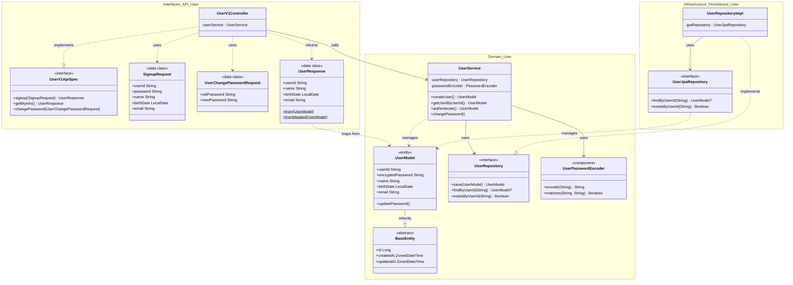
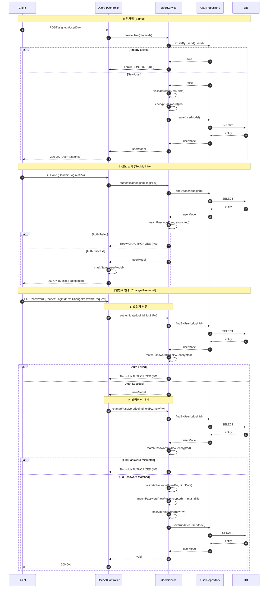

## 📌 Summary
<!--
무엇을/왜 바꿨는지 한눈에 보이게 작성한다.
- 문제(배경) / 목표 / 결과(효과) 중심으로 3~5줄 권장한다.
-->

- 배경: e-commerce 서비스 구현에 앞서 필수적인 사용자 로그인과 회원가입 구현이 필요
- 목표: 회원가입, 내 정보 조회, 비밀번호 변경 기능 및 API를 구현하고 필수 보안 정책(암호화, 유효성 검증)을 TDD 기반으로 설계/구현
- 결과: `interface(Controller) / domain(Entity/Service) / infrastructure(Repository)` 구조에 맞춰 사용자 로그인/회원가입/패스워드 변경 플로우의 최소 액션에 맞춰 스펙을 맞추고, 테스트 작성을 통해 검증을 통해 기능을 구현.

## 🧭 Context & Decision
<!--
설계 의사결정 기록을 남기는 영역이다.
"왜 이렇게 했는가"가 핵심이다.
-->

### 문제 정의
- 현재 동작/제약: 서버 구동이 가능한 상태로 코드구조가 짜여져 있으나, 회원 데이터 모델이 정의되지 않았으며, 비밀번호 등 민감 정보에 대한 보호 장치 및 기능이 없음.
- 문제(또는 리스크): 회원 데이터 정규화 및 각종 정책을 고려한 설계방향이 현재 디렉토리 구조와 맞는지 검증이 필요함. 추후 설계를 위한 boiler-plate 를 미리 설계/구현할지 혹은 요구사항에 맞춘 최소한의 코드구조를 초석으로 구현할지 결정 필요. 
- 성공 기준(완료 정의)
  - 사용자에게 성공적으로 회원가입 / 나의정보조회 / 패스워드변경 기능을 지원할 수 있는가
  - 현재 디렉토리 구조에서 최소한의 추가/변경으로 요구사항에 맞게 구현하였는가
  - 추후 리팩토링/확장 시 유연한 대응을 할 수 있는 코드로 작성하였는가

### 선택지와 결정
- 고려한 대안:
  - A: `Controller` -> `Facade` -> `Service` 계층 구조 도입
  - B: `Controller` -> `Service` 직접 호출 구조
- 최종 결정:
  - **Controller -> Service 직접 호출**: 현재 요구사항에 맞는 비즈니스 로직이 단순하기에 단일 도메인에 집중되어 있도록 불필요한 복잡도를 줄이기 위해 Facade 생략.
  - **JPA Entity = Domain Model**: 초기 개발 속도를 위해 영속성 객체와 도메인 모델을 통합(`UserModel`)하여 사용.
  - **Custom Header 인증**: Week 1 요구사항에 맞춰 복잡한 Security 설정 대신 `X-Loopers-LoginId` 헤더를 통한 명시적 인증 구현.
- 트레이드오프:
  - 구조를 단순화하여 초기 생산성을 높였으나, 추후 비즈니스 로직이 복잡해질 경우 리팩토링(Facade 도입, 모델 분리)이 필요할 수 있음.
- 추후 개선 여지:
  - 인증/인가 로직을 Interceptor 또는 Spring Security Filter로 이관하여 횡단 관심사 분리 필요.
  - 응답 객체 마스킹 로직(`UserResponse.fromMasked`)의 보안 모듈 이관 검토.

## 🏗️ Design Overview
<!--
구성 요소와 책임을 간단히 정리한다.
-->

### 변경 범위
- 영향 받는 모듈/도메인: `apps/commerce-api` 내 `User` 도메인 전반.
  - `com.loopers.config` : Spring Web Security 의 최소 보안을 위한 설정 추가
  - `com.loopers.domain.user` : 사용자 도메인 관련 Entity / Service / Repository(인터페이스)
  - `com.loopers.infrastructure.user` : 사용자 도메인 관련 Repository 구현체(JPA)
  - `com.loopers.interfaces.user` : 사용자 도메인 관련 interface 구현체 (HTTP Controller)

### 주요 컴포넌트 책임
- `UserV1Controller`: HTTP 요청 핸들링 및 DTO 변환, 마스킹 처리된 응답 반환.
- `UserService`: 트랜잭션 관리, 비즈니스 규칙 검증(중복 ID, 비밀번호 정책), 암호화 처리.
- `UserModel`: JPA Entity 정의 및 객체 생성 시점의 불변식 검증(`init` 블록).
- `UserPasswordEncoder`: `BCryptPasswordEncoder`를 캡슐화하여 비밀번호 해싱 및 일치 여부 확인.

## 🔁 Flow Diagram
<!--
가능하면 Mermaid로 작성한다. (시퀀스/플로우 중 택1)
"핵심 경로"를 먼저 그리고, 예외 흐름은 아래에 분리한다.
-->

### Main Flow

