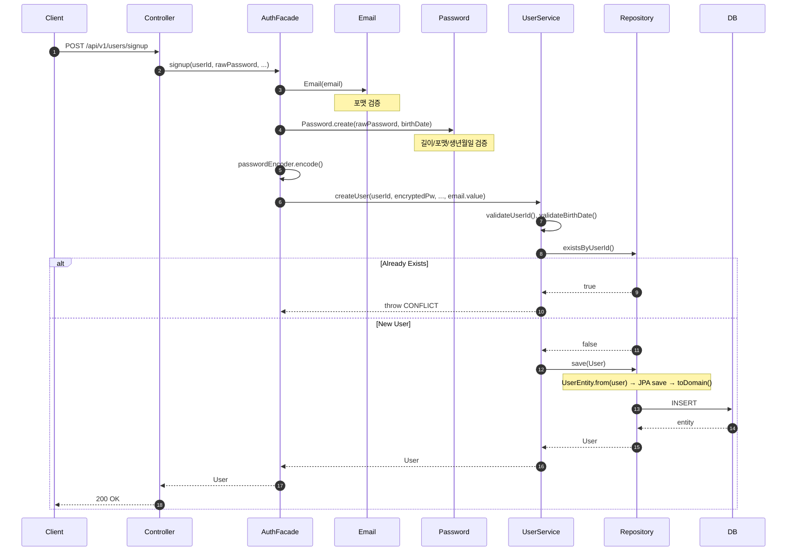
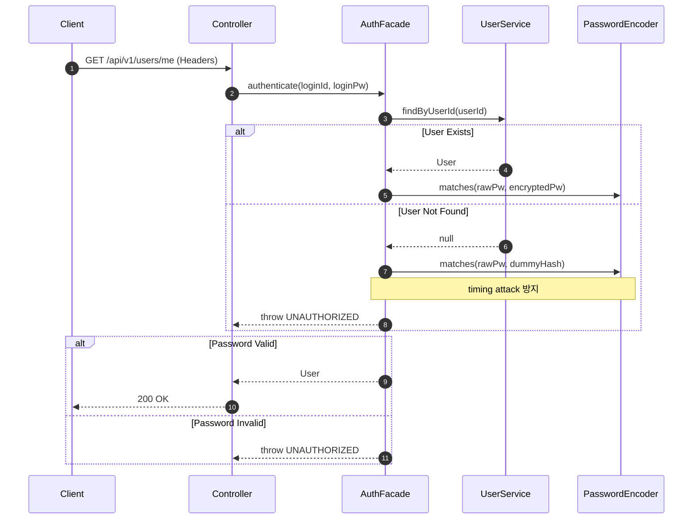
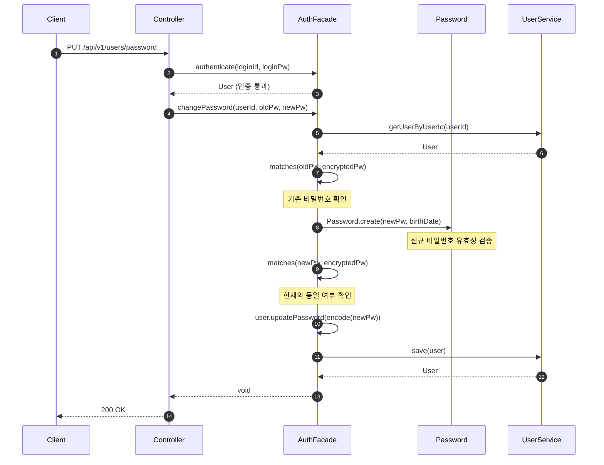

## 📌 Summary

- 배경: `UserModel`이 JPA 엔티티와 도메인 모델을 겸하고, `UserService`가 CRUD·인증·검증·암호화를 모두 담당하여 단일 책임 원칙을 위반하고 있었다.
- 목표: JPA/도메인 엔티티 분리, Value Object 도입, Application Layer(AuthFacade) 추가를 통해 각 계층의 책임을 명확히 한다.
- 결과: 91개 테스트 전체 통과. API 동작 변경 없이 내부 구조만 개선되었다.

## 🧭 Context & Decision

### 문제 정의
- 현재 동작/제약: `UserModel`이 JPA 어노테이션과 도메인 로직을 동시에 보유. `UserService`에 인증, 비밀번호 암호화/검증, 이메일 포맷 검증, CRUD가 혼재.
- 문제(또는 리스크): 테스트 시 JPA 의존성 없이 도메인 로직을 검증할 수 없고, 책임 확장 시 서비스 클래스가 비대해진다. 비밀번호/이메일 검증 로직이 재사용 불가능하다.
- 성공 기준(완료 정의): 기존 E2E 테스트 전체 통과, 각 계층이 단일 책임을 갖는 구조로 전환 완료.

### 선택지와 결정
- 고려한 대안:
  - A: `UserService` 내부에서 private 메서드로만 분리 (최소 변경)
  - B: JPA/Domain 엔티티 분리 + Value Object + Application Layer 도입 (구조적 분리)
- 최종 결정: **B안 채택**. 검증 로직을 Value Object로 캡슐화하고, 인증 흐름을 AuthFacade로 분리하여 각 계층의 책임을 명확히 했다.
- 트레이드오프: `UserEntity` ↔ `User` 간 매핑 코드가 추가되지만, 도메인 로직의 JPA 비의존성과 테스트 용이성을 확보했다.
- 추후 개선 여지: `UserRepositoryImpl.save()`에서 id 기반 분기 대신 별도 update 메서드 분리 검토. 인증 로직을 Interceptor/Filter로 분리하는 것은 별도 작업으로 진행.

## 🏗️ Design Overview

### 변경 범위
- 영향 받는 모듈/도메인: `commerce-api` (user 도메인 전체)
- 신규 추가: `Email`, `Password` (Value Object), `User` (도메인 엔티티), `UserEntity` (JPA 엔티티), `AuthFacade` (Application Layer)
- 제거/대체: `UserModel` → `User` + `UserEntity`로 대체

### 주요 컴포넌트 책임
- `Email`: 이메일 포맷 자가 검증 Value Object
- `Password`: 비밀번호 길이/포맷/생년월일 패턴 자가 검증 Value Object (팩토리 메서드)
- `User`: JPA 비의존 순수 도메인 엔티티 (기본 blank 검증 + `updatePassword`)
- `UserEntity`: JPA 영속화 전용 엔티티 (`toDomain()`/`from()` 매핑)
- `AuthFacade`: 회원가입·인증·비밀번호 변경 유스케이스 조율 (VO 검증 + 암호화 + UserService 위임)
- `UserService`: 순수 CRUD 도메인 서비스 (userId/birthDate 검증 + 중복 체크 + 저장/조회)
- `UserRepositoryImpl`: `UserEntity` ↔ `User` 매핑 및 JPA 영속화

## 🔁 Flow Diagram

### Signup Flow

### Authenticate Flow

### Change Password Flow

