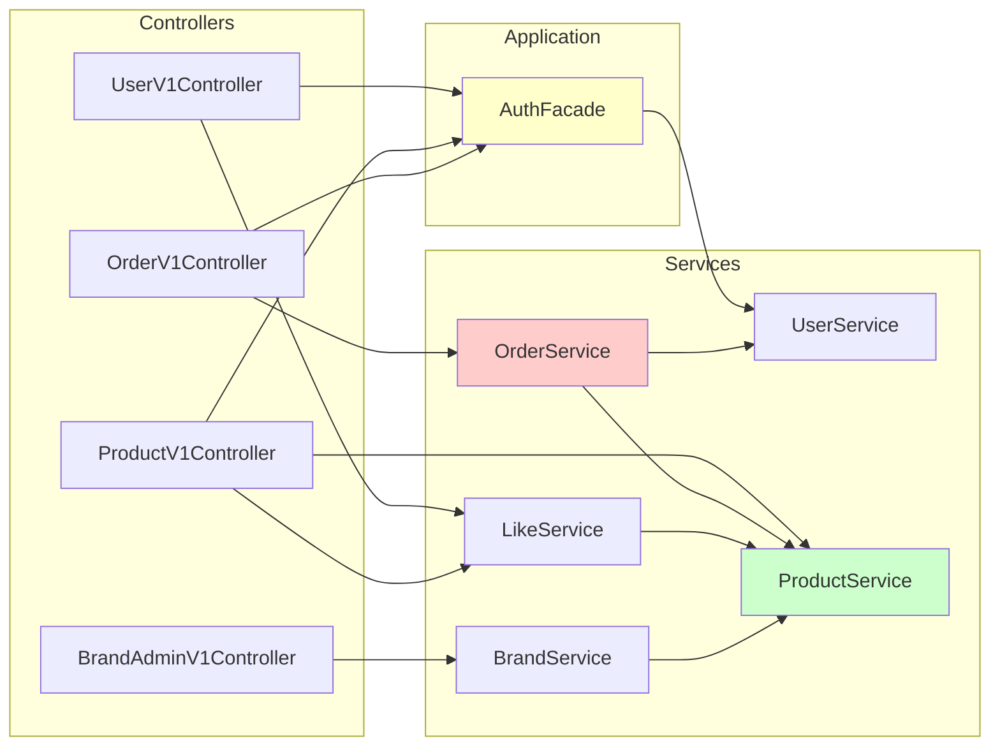
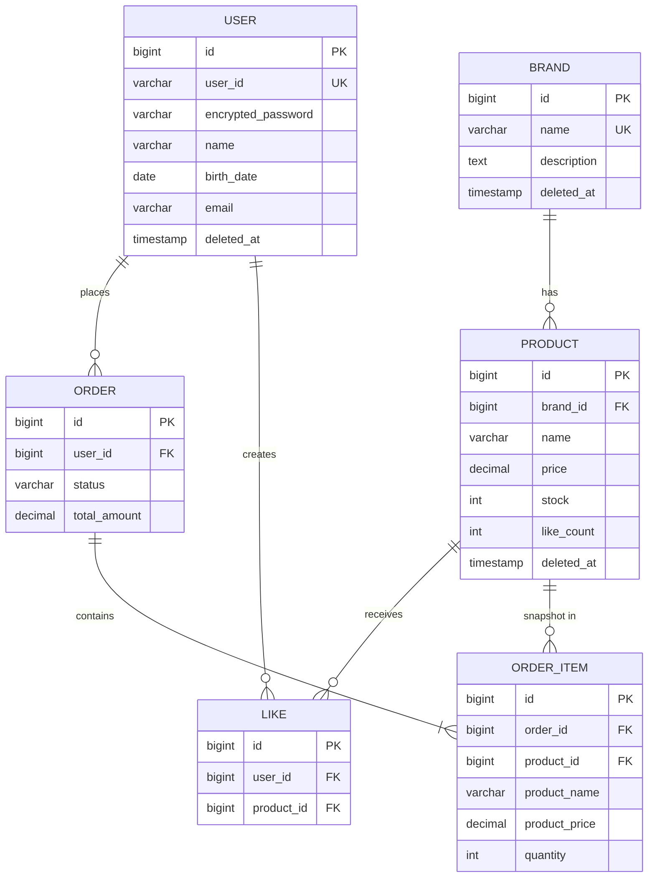
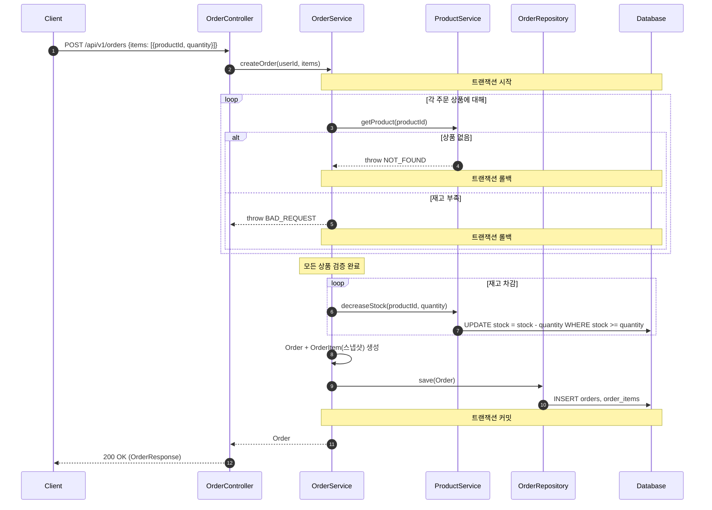

## 📌 Summary
<!--
무엇을/왜 바꿨는지 한눈에 보이게 작성한다.
- 문제(배경) / 목표 / 결과(효과) 중심으로 3~5줄 권장한다.
-->

- 배경: Week 1에서 User 도메인을 구현했으나, 나머지 도메인(Brand, Product, Like, Order)의 요구사항과 설계가 정리되지 않아 구현 방향이 불명확했다. 또한 요구사항을 체계적으로 분석하는 프로세스가 없어 설계 품질이 담당자 개인 역량에 의존하고 있었다.
- 목표: 요구사항 분석 스킬(SKILL.md)을 정의하고, 전체 도메인(User/Brand/Product/Like/Order)에 대한 설계 문서(요구사항 명세, 시퀀스 다이어그램, 클래스 다이어그램, ERD)를 작성하여 코드 작성 전 "무엇을 왜 만드는가"를 정렬한다.
- 결과: 6단계 요구사항 분석 스킬(문제 재정의 → 불명확 사항 식별 → 질문 구조화 → 개념 모델 → 다이어그램 → 리스크)을 체계화하고, 4개의 설계 산출물을 완성하여 Week 3 이후 구현을 위한 청사진을 확보했다.

## 🧭 Context & Decision
<!--
설계 의사결정 기록을 남기는 영역이다.
"왜 이렇게 했는가"가 핵심이다.
-->

### 문제 정의
- 현재 동작/제약: Week 1에서 User 도메인(회원가입/로그인/비밀번호 변경)은 구현 완료. 그러나 Brand, Product, Like, Order 도메인은 원본 요구사항(REQUIREMENTS.md)만 존재하며, 비즈니스 규칙의 경계/정책/보안 고려사항이 구체화되지 않은 상태.
- 문제(또는 리스크): 요구사항의 애매한 부분(좋아요 멱등성 정책, 부분 주문 실패 처리, 브랜드 삭제 시 상품 처리 등)을 사전에 정리하지 않으면 구현 중 방향 변경이 발생하여 재작업 비용이 증가한다. 또한 Week 1의 리팩토링(AuthFacade, Entity 분리)에서 얻은 아키텍처 패턴을 전체 도메인에 일관되게 적용할 설계 기준이 필요하다.
- 성공 기준(완료 정의):
  - 전체 도메인의 요구사항이 사용자/비즈니스/시스템 관점에서 분석되어 있는가
  - 미결정 사항이 선택지와 권장안으로 구조화되어 있는가
  - 시퀀스/클래스/ERD 다이어그램이 구현 가이드로 활용 가능한 수준인가
  - 요구사항 분석 프로세스가 재사용 가능한 형태로 정리되어 있는가

### 선택지와 결정
- 고려한 대안:
  - A: 요구사항 문서에 기술 구현 사항(아키텍처 패턴, 계층 구조, 기술 스택 등)을 함께 포함하여 하나의 통합 문서로 관리
  - B: 요구사항 문서(01-requirements)는 도메인 지식과 비즈니스 규칙에만 집중하고, 기술 구현 사항은 별도 문서(시퀀스/클래스/ERD)로 분리
- 최종 결정: **B안 채택**. 요구사항 명세에서 개발 관련 내용을 배제하여 도메인 개요, 비즈니스 규칙, 유저 시나리오, 미결정 사항 등 순수한 도메인 지식에만 집중했다. 기술적 결정(계층 구조, 의존 방향, DB 설계)은 02~04 문서에서 다룬다.
- 트레이드오프: 문서가 4개로 분리되어 전체 그림을 보려면 여러 파일을 참조해야 하지만, 요구사항 변경 시 비즈니스 문서만 수정하면 되고, 기술 문서와의 결합도가 낮아 각각 독립적으로 발전시킬 수 있다.
- 추후 개선 여지: 미결정 사항(Q1~Q4)에 대해 구현 단계에서 최종 확정 필요. 특히 like_count 동기화 방식(동기식 vs 이벤트 기반)과 email UNIQUE 제약 추가 여부는 트래픽 규모에 따라 재검토.

## 🏗️ Design Overview
<!--
구성 요소와 책임을 간단히 정리한다.
-->

### 변경 범위
- 영향 받는 모듈/도메인: 전체 (User, Brand, Product, Like, Order)
- 신규 추가:
  - `.claude/skills/requirements-to-agents-formula/SKILL.md` — 요구사항 분석 프로세스 정의
  - `.docs/design/01-requirements.md` — 요구사항 명세 (도메인 개요, 유저 시나리오, 기능/비기능 요구사항)
  - `.docs/design/02-sequence-diagrams.md` — 6개 시퀀스 다이어그램 (회원가입, 인증, 주문, 좋아요, 브랜드 삭제, 상품 조회)
  - `.docs/design/03-class-diagram.md` — 전체 아키텍처 클래스 다이어그램 (Aggregate, VO, 계층별 책임)
  - `.docs/design/04-erd.md` — ERD, 테이블 명세, 인덱스 설계
  - `REQUIREMENTS.md` — 원본 요구사항 정리
  - `STRUCTURE_ANALYSIS.md` — 기존 코드베이스 구조 분석
- 제거/대체: 없음 (설계 문서 추가만 해당)

### 주요 컴포넌트 책임

#### 요구사항 분석 스킬 (SKILL.md)
- `Phase 1 - 문제 재정의`: "무엇을 만들까" → "어떤 문제를 해결하려는가" 변환
- `Phase 2 - 불명확 사항 식별`: 정책/경계/확장/보안 4가지 유형으로 분류
- `Phase 3 - 질문 구조화`: 우선순위 + 선택지 + 트레이드오프 형태로 제시
- `Phase 4 - 개념 모델`: 액터, 핵심 도메인, 보조 시스템 정의
- `Phase 5 - 다이어그램`: Domain → Sequence → Class → ERD 순서로 작성
- `Phase 6 - 리스크`: 운영/개발/배포/비용 관점 체크리스트

#### 설계 산출물 (4개 문서)
- `01-requirements.md`: 5개 도메인의 비즈니스 규칙, 3종 액터(Guest/Member/Admin), 20+ API 엔드포인트, 4개 미결정 사항
- `02-sequence-diagrams.md`: 핵심 흐름 6개 (회원가입, 인증, 주문 생성, 좋아요 등록/취소, 브랜드 삭제, 상품 목록)
- `03-class-diagram.md`: 5개 Aggregate, Value Object(Email/Password), 계층별 책임 (Interfaces/Application/Domain/Infrastructure)
- `04-erd.md`: 6개 테이블(USER/BRAND/PRODUCT/LIKE/ORDER/ORDER_ITEM), 인덱스 설계, 논리적 FK (물리적 FK 없음)

## 🔁 Flow Diagram
<!--
가능하면 Mermaid로 작성한다. (시퀀스/플로우 중 택1)
"핵심 경로"를 먼저 그리고, 예외 흐름은 아래에 분리한다.
-->

### Main Flow — 전체 아키텍처 계층 및 의존 관계

### 핵심 도메인 관계

### 주문 생성 흐름 (가장 복잡한 핵심 경로)

### 설계 핵심 결정 사항

| 결정 | 선택 | 근거 |
|------|------|------|
| 좋아요 중복 처리 | 멱등성 보장 (200 OK) | 클라이언트 재시도 안전성 |
| 부분 주문 실패 | 전체 주문 실패 | MVP 단순성, 일관성 우선 |
| 브랜드 삭제 | Soft Delete + 상품 연쇄 | 이력 보존, 주문 스냅샷 무영향 |
| DB FK | 논리적 FK만 (물리적 제약 없음) | MSA 전환 대비, 유연한 삭제 |
| like_count | 비정규화 동기식 +1/-1 | MVP 단순성, 추후 이벤트 기반 전환 |
| Domain/JPA Entity | 분리 (Week 1 리팩토링 패턴 확장) | 프레임워크 독립성, 테스트 용이성 |
