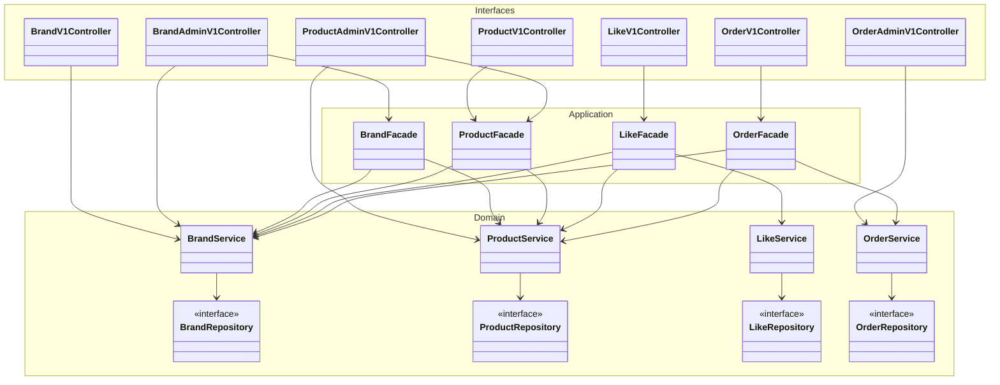
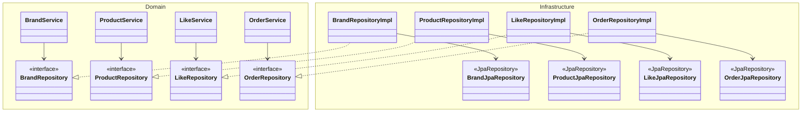
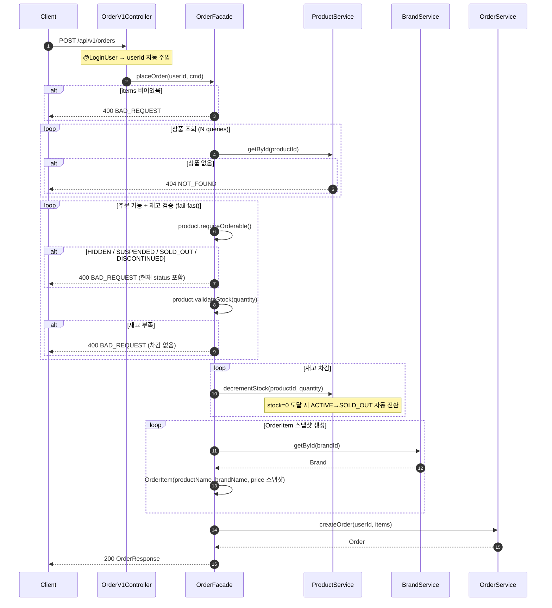
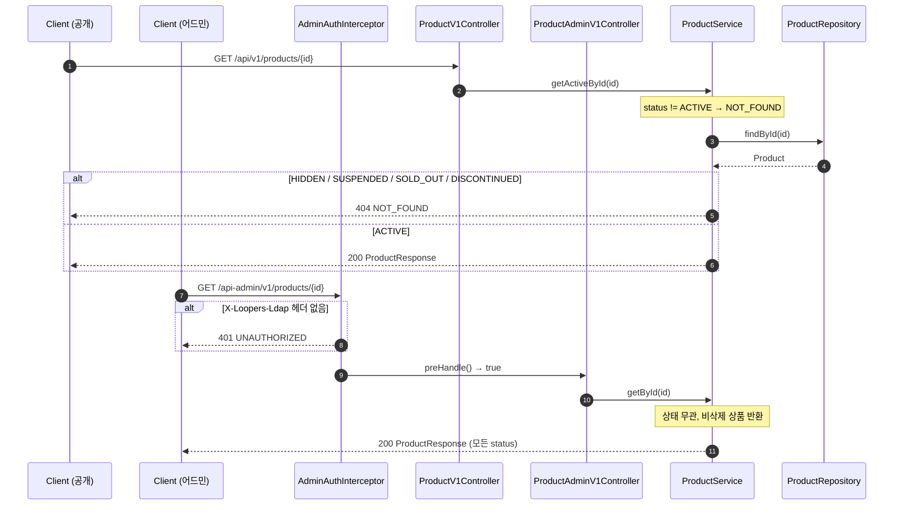
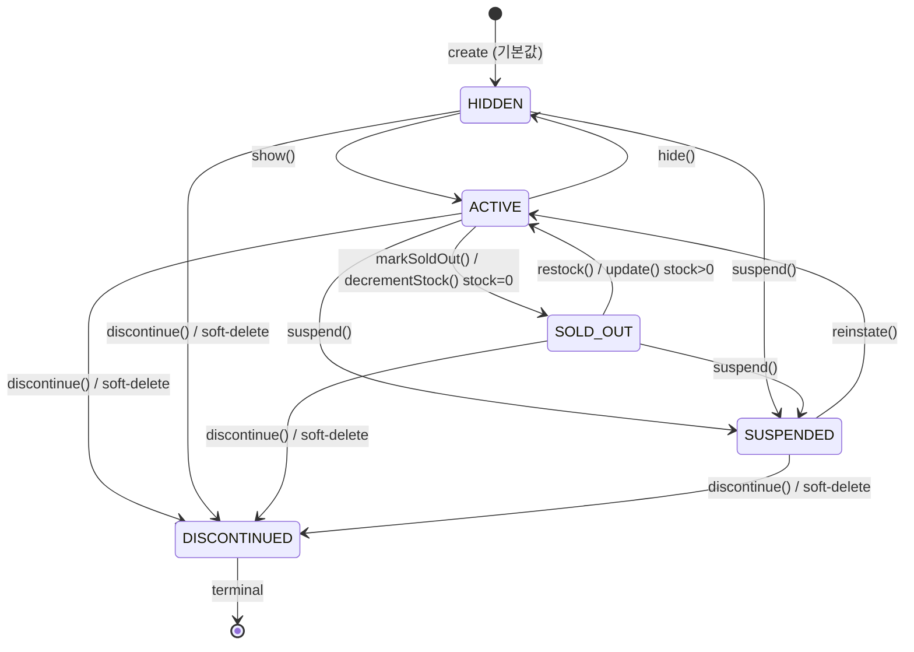

# PR: Week 3 — Brand / Product / Like / Order 도메인 구현

## 📌 Summary

- **배경**: 1주차에서 User 도메인만 구축된 상태였으며, 실제 커머스 운영에 필요한 상품/브랜드/좋아요/주문 도메인이 전무했다. 또한 JPA Entity를 도메인 모델로 직접 사용하는 구조에서 Spring/JPA 의존성이 비즈니스 로직에 침투하는 문제가 있었다.
- **목표**: Brand · Product · Like · Order 네 도메인을 `Interfaces → Application → Domain ← Infrastructure` 4-레이어 구조로 구현하고, JPA Entity와 도메인 모델을 분리한다. Brand/Product에 명시적 상태 머신(Status)을 도입해 비활성 상품이 공개 API로 노출되거나 주문되는 것을 차단한다.
- **결과**: 전 도메인에 걸쳐 DIP를 준수하는 구조로 구현하고, 공개/어드민 접근 경로가 코드 레벨에서 분리됐다. 도메인 모델이 상태 전이 규칙을 직접 소유하며, 재고 차감 시 자동 SOLD_OUT 전환 등 상태관리를 처리한다.

## 🧭 Context & Decision

### 문제 정의
- **현재 동작/제약**: 상품·브랜드가 JPA Entity 그 자체로 비즈니스 로직을 포함하고 있어, 영속성 관심사와 도메인 규칙이 결합되어 있었다. 상품 상태 개념이 없어 삭제된 상품이나 숨김 처리된 상품이 공개 API에 노출될 수 있었다.
- **문제(또는 리스크)**:
  - HIDDEN/SUSPENDED 상품이 `GET /api/v1/products/{id}` 로 조회됨
  - 주문 시 SUSPENDED 상품도 재고만 있으면 주문 가능
  - Facade가 Repository를 직접 주입받아 Service 레이어를 우회하는 케이스 존재
  - 소프트 딜리트 후에도 `status = ACTIVE` 레코드가 남아 쿼리 결과 오염 가능
- **성공 기준(완료 정의)**:
  - 공개 API는 `status = ACTIVE` 상품/브랜드만 반환한다
  - 비활성 상품 주문 시 BAD_REQUEST, 존재하지 않는 상품은 NOT_FOUND
  - 소프트 딜리트된 레코드는 반드시 `status = DISCONTINUED`
  - Facade는 Repository를 직접 주입받지 않는다

---

### 선택지와 결정

#### (1) JPA Entity / 도메인 모델 분리

- **A — Entity = 도메인 모델**: 변환 코드 불필요, 파일 수 적음. 단, Spring/JPA 애노테이션이 도메인 로직과 섞이고 테스트 시 Spring 컨텍스트가 필요해진다.
- **B — Entity / 도메인 모델 분리**: Infrastructure에 `*Entity`, Domain에 순수 Kotlin 클래스를 두고 `toDomain()` / `from()`으로 변환. 변환 보일러플레이트가 생기지만 도메인 모델이 프레임워크 독립적이 된다.
- **최종 결정**: **B**. 도메인 모델을 Spring/JPA에서 완전 분리해 단위 테스트에서 Spring 컨텍스트 없이 비즈니스 로직을 검증할 수 있도록 했다.
- **트레이드오프**: `toDomain()` / `from()` 변환 코드가 추가되지만, 영속성 스키마 변경이 도메인 로직에 파급되지 않는 이점이 더 크다.
> **추가 배경**: 본인은 JVM 계열의 JPA 와 Python/Django 혹은 Ruby/Rails 와 같은 환경에서 도메인영역과 ORM이 강결합된 구조의 코드를 많이 접해왔다. 그 과정에서 영속성 스키마 변경이 도메인 로직에 파급되는 문제와 의존성 분리의 어려움으로 기능 고도화/테스트 세팅의 어려움 등 불편함 경험을 바탕으로 이번 과제에서 도메인 영역과 영속성 영역을 완전히 분리하는 구조를 선택했다.

#### (2) Product Status 기본값

- **A — stock 기반 파생**: `if (stock > 0) ACTIVE else SOLD_OUT`. 직관적이지만 프로모션 예정 상품처럼 stock이 있어도 숨겨야 하는 경우를 처리할 수 없다.
- **B — `HIDDEN` 고정**: 생성은 항상 비공개, 셀러가 명시적으로 `show()`를 호출해 공개. 프로모션/사전 준비 시나리오를 모두 수용한다.
- **최종 결정**: **B**. 상품 생성과 공개를 분리하는 것이 실무 커머스(Shopify draft, Musinsa 상품 검수)에 더 가깝다.
- **트레이드오프**: 생성 직후 바로 판매하려면 `show()` 호출이 하나 더 필요하지만, 잘못된 상품이 즉시 노출되는 리스크가 제거된다.

#### (3) 공개 API 비활성 상품 처리

- **A — 서비스 레이어 분리**: `getById()`(어드민용, 모든 상태) / `getActiveById()`(공개용, ACTIVE만). 비활성이면 NOT_FOUND — 상품 존재 여부를 외부에 노출하지 않는다.
- **B — Repository 필터**: `findById`에 `status = ACTIVE` 조건 추가. 어드민이 비활성 상품을 관리할 때도 NOT_FOUND가 되어 어드민 CRUD가 깨진다.
- **최종 결정**: **A**. 어드민은 `getById()`, 공개 API는 `getActiveById()`를 호출하도록 분리. NOT_FOUND 응답으로 상품 존재 여부를 노출하지 않는다.
- **트레이드오프**: 서비스 메서드가 두 개가 되지만, 어드민/공개 경계를 코드 레벨에서 명시적으로 분리할 수 있다.

#### (4) 어드민 인증 처리 방식

- **A — Controller 인라인 검증**: 각 어드민 Controller에서 LDAP 헤더를 직접 확인. 구현은 단순하지만 모든 어드민 엔드포인트(특히 GET)에 빠짐없이 적용해야 하고, 누락 시 인증 우회 가능.
- **B — `HandlerInterceptor` 일원화**: `AdminAuthInterceptor`가 `/api-admin/**` 패턴 전체를 가로채 검증. Controller는 인증 코드를 전혀 갖지 않는다.
- **최종 결정**: **B**. 인증 로직을 한 곳에서 관리해 누락 위험을 없애고, Controller가 비즈니스 로직에만 집중하도록 했다. GET 엔드포인트도 추가 코드 없이 자동 보호된다.
- **트레이드오프**: Interceptor 등록(`WebMvcConfig`) 설정이 하나 추가되지만, 어드민 엔드포인트가 늘어날수록 중복 제거 효과가 커진다.

#### (5) 사용자 인증 파라미터 처리 방식

- **A — Controller 직접 주입**: 각 Controller에서 `authFacade.authenticate(userId)` 를 호출해 `User` 객체를 얻음. 흐름이 명시적이지만 모든 인증 필요 메서드에 보일러플레이트가 반복된다.
- **B — `HandlerMethodArgumentResolver`**: `@LoginUser` 애노테이션을 마커로 두고, `LoginUserArgumentResolver`가 헤더에서 userId를 추출해 `User` 도메인 객체로 자동 변환. Controller 파라미터에 `@LoginUser user: User`만 선언하면 된다.
- **최종 결정**: **B**. Controller 메서드 시그니처에서 인증 관심사를 완전히 제거했다. 인증 로직 변경 시 Resolver 한 곳만 수정하면 된다.
- **트레이드오프**: `ArgumentResolver` + `WebMvcConfig` 등록 + `SpringDocConfig`(OpenAPI 파라미터 노출 방지) 세 파일이 추가되지만, Controller 코드가 선언적이고 깔끔해진다.

#### (6) 주문 시 비활성 상품 오류 타입

- **A — NOT_FOUND**: 공개 API와 일관성. 단, 사용자 입장에서 "왜 안 되는지" 알 수 없다.
- **B — BAD_REQUEST**: 상품은 존재하지만 현재 주문 불가 상태임을 알림. 상품 상세 페이지에서 이미 확인한 상품을 주문하는 흐름이므로 이유를 알려주는 것이 UX상 맞다.
- **최종 결정**: **B**. `requireOrderable()` 은 `BAD_REQUEST`로 현재 상태를 메시지에 포함한다.
- **트레이드오프**: 비활성 상품의 존재가 일부 노출되지만, 사용자가 장바구니에 이미 담은 상품이라는 전제 하에 이는 허용 범위다.

- **추후 개선 여지**: 재고 N+1 쿼리 — `placeOrder` 시 상품 수만큼 `SELECT`가 발생한다. 주문 상품 수가 많아지면 `findAllByIds(ids)` 배치 조회로 전환 필요.

## 🏗️ Design Overview

### 변경 범위
- **영향 받는 모듈/도메인**: `domain/catalog/brand`, `domain/catalog/product`, `domain/like`, `domain/order`, `application/catalog`, `application/like`, `application/order`, `infrastructure/catalog`, `infrastructure/like`, `infrastructure/order`, `interfaces/api`
- **신규 추가**: Brand · Product · Like · Order 전 레이어 (Domain / Infrastructure / Application / Interface), `BrandStatus` · `ProductStatus` enum, `AdminAuthInterceptor`, `@LoginUser` + `LoginUserArgumentResolver`, `ProductService.getActiveById()`
- **제거/대체**: Facade의 Repository 직접 주입 → Domain Service 경유로 일원화

### 주요 컴포넌트 책임

- **`Brand` / `Product` (domain model)**: 상태 전이 규칙 소유. `hide()`, `suspend()`, `requireOrderable()` 등 명시적 메서드로만 status 변경 가능. 직접 필드 대입 불가 (`private set`).
- **`ProductService.getActiveById()`**: 공개 API 전용 조회. 비활성 상품(`!= ACTIVE`)은 NOT_FOUND로 응답해 존재 여부를 외부에 노출하지 않는다.
- **`ProductRepositoryImpl.deleteById()` / `deleteAllByBrandId()`**: 소프트 딜리트 전 `status = DISCONTINUED` 강제 설정. 삭제된 레코드가 ACTIVE 상태로 남지 않도록 보장.
- **`BrandJpaRepository` / `ProductJpaRepository`**: 공개 목록 조회 쿼리에 `status = :status` 파라미터 적용. 항상 `ACTIVE`를 전달해 비활성 항목 노출 차단.
- **`OrderFacade.placeOrder()`**: `requireOrderable()` → `validateStock()` → `decrementStock()` 순서를 강제. 비활성 상품 주문과 재고 부족을 차감 전에 전량 검증(fail-fast).
- **`AdminAuthInterceptor`**: `/api-admin/**` 경로 전체(GET 포함)에 LDAP 헤더 검증 적용. Controller별 인증 코드 제거.
- **`BrandFacade.deleteBrand()`**: `deleteAllByBrandId()` → `delete()` 순서로 Product cascade 삭제 후 Brand 삭제. 두 도메인에 걸친 오케스트레이션은 Facade만 담당.

## 🗂️ Class Diagram

### Interfaces / Application / Domain Layer

### Domain / Infrastructure Layer

## 🔁 Flow Diagram

### Main Flow: placeOrder

### Sub Flow: 공개 상품 조회 vs 어드민 상품 조회

### Sub Flow: ProductStatus 전이

