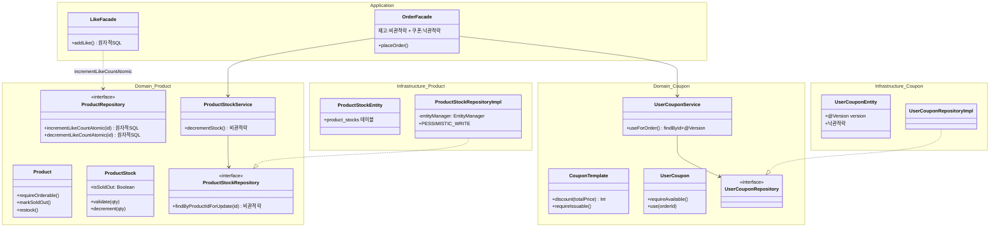
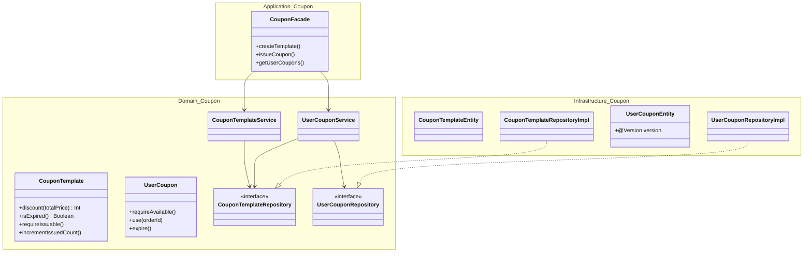
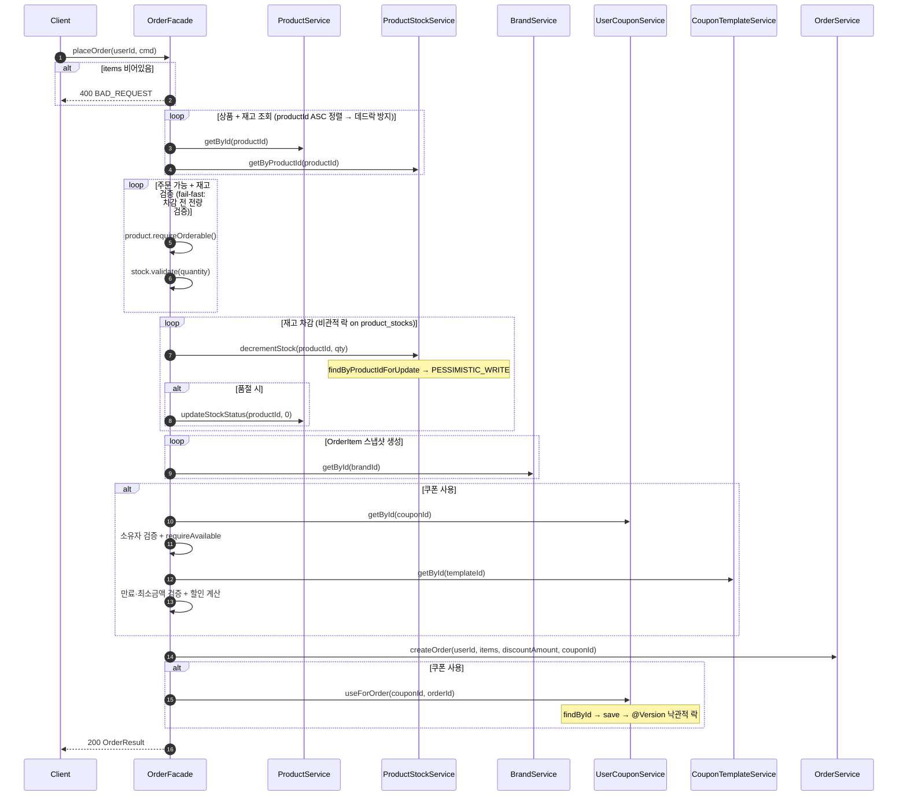
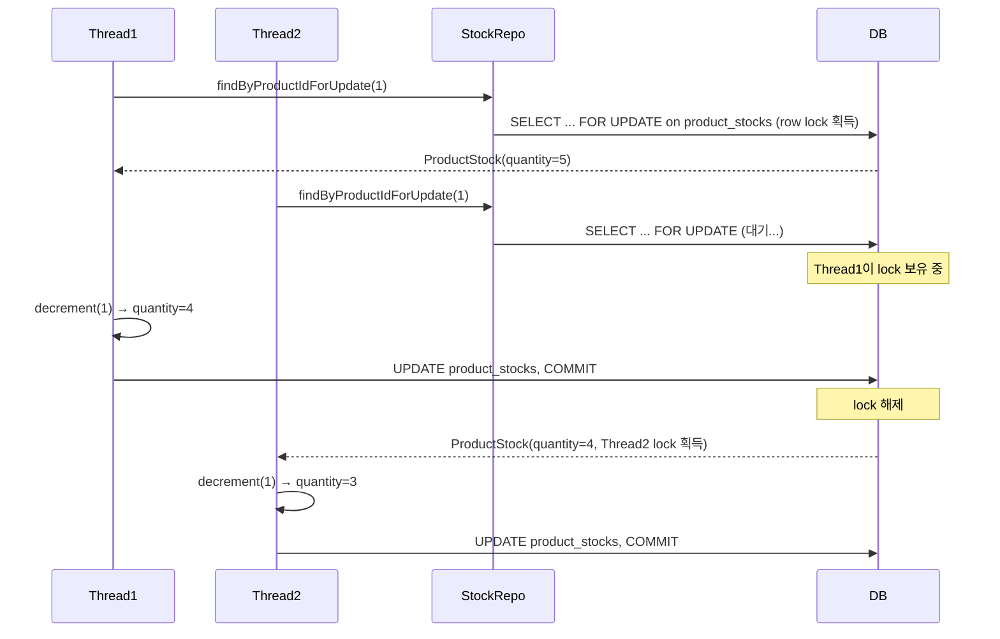
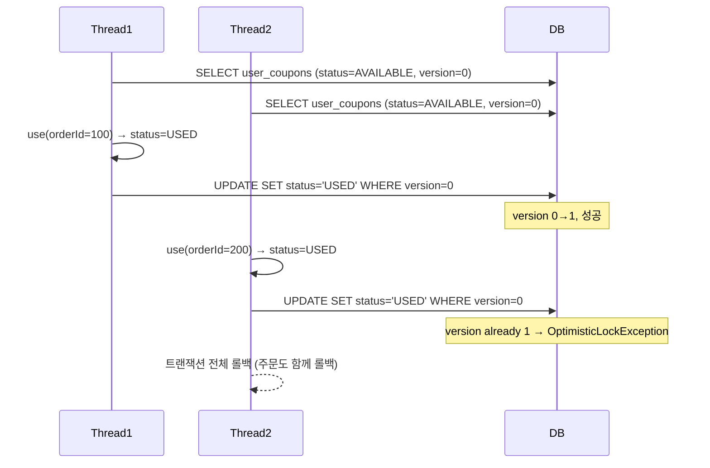
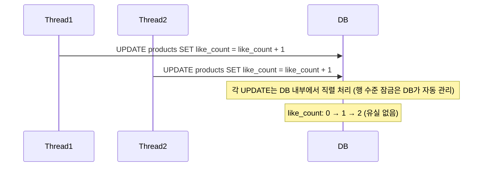
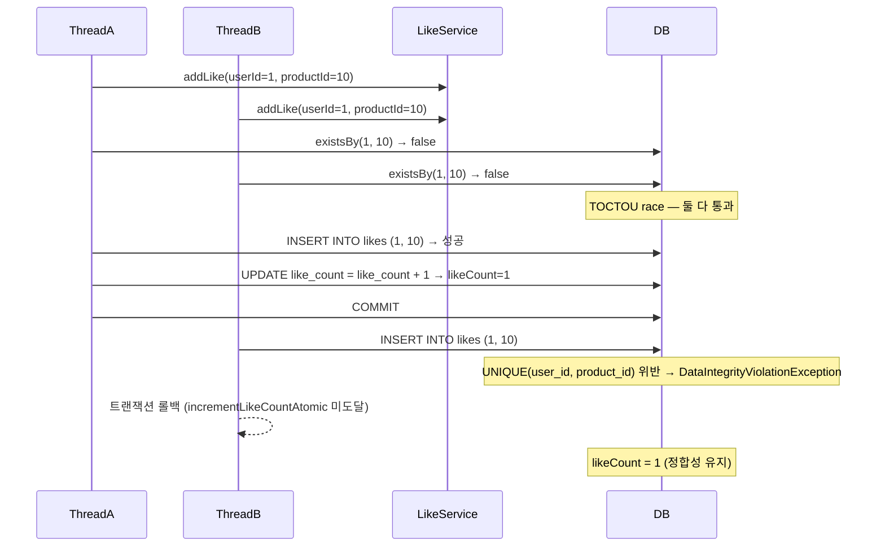

# PR: Week 4 — 동시성 제어 + 쿠폰 도메인 + Product/Stock 분리

## 📌 Summary

- **배경**: 3주차에서 구현한 재고 차감·좋아요 카운트에 동시성 버그(Lost Update)가 존재했고, 쿠폰 도메인이 전무했다. 또한 `Product`에 `stock` 필드가 포함되어 재고 차감 시 상품 행 전체를 잠가야 하는 구조적 문제가 있었다.
- **목표**: 도메인별 경합 특성에 맞는 동시성 전략(비관적 락 / 낙관적 락 / 원자적 SQL)을 적용하고, 쿠폰 도메인을 4-layer로 구현하며, Product와 Stock을 분리해 비관적 락 범위를 축소한다.
- **결과**: 재고(비관적 락), 쿠폰(낙관적 락), 좋아요(원자적 SQL) 세 전략이 도메인 특성에 맞게 적용됐다. `product_stocks` 테이블 분리로 재고 락이 좋아요·상태 변경과 독립적으로 동작하며, 동시성 테스트 4종이 정합성을 검증한다.


## 🧭 Context & Decision

### 문제 정의
- **현재 동작/제약**: 재고 차감이 `read → modify → write` 패턴으로 구현되어 동시 요청 시 Lost Update 발생. 좋아요 카운트도 동일 문제. 쿠폰 도메인 부재.
- **문제(또는 리스크)**:
  - 재고 5개인 상품에 10명이 동시 주문 시 재고가 음수로 떨어짐
  - 50명이 동시 좋아요 시 likeCount < 50 (일부 업데이트 유실)
  - 쿠폰 없이는 할인 적용 주문 불가
  - `Product` 행에 비관적 락 적용 시 좋아요·상태 변경까지 블로킹됨
- **성공 기준(완료 정의)**:
  - 재고 10 threads × stock 5 → success 5, fail 5, stock = 0
  - 좋아요 50 threads → likeCount = 50 (유실 없음)
  - 같은 유저가 동시 좋아요 10 threads → success 1, likeCount = 1
  - 쿠폰 동시 사용 5 threads → success 1, fail 4
  - 재고 락이 좋아요 연산을 블로킹하지 않음

---

### 선택지와 결정

#### (1) 재고 차감 — 비관적 락

- **A — 낙관적 락 (`@Version`)**: 충돌 시 재시도 또는 실패. 높은 경합(인기 상품, 다수 유저)에서 대부분 실패 → 처리량 저하.
- **B — 비관적 락 (`SELECT ... FOR UPDATE`)**: 행 잠금으로 직렬화. 대기 시간이 있지만 재시도 없이 확실한 차감 보장.
- **C — 원자적 SQL (`UPDATE SET quantity = quantity - :qty WHERE quantity >= :qty`)**: `@Modifying` native query는 Spring `@Transactional` 안에서 실행되므로 DB 트랜잭션에는 참여한다(롤백도 가능). Product/Stock 분리(loose coupling) 덕분에 `product_stocks`는 단일 컬럼 테이블이라 원자적 SQL이 기술적으로 가능하다. 단, 비즈니스 룰(`validate`, `decrement`, `isSoldOut`)이 SQL로 이동하여 도메인 모델의 단위 테스트가 불가능해지고, 향후 재고 관련 로직 확장 시 항상 SQL 레벨에서 구현해야 하는 제약이 생긴다.
- **최종 결정**: **B**. 재고는 "검증 → 차감 → 주문 생성"이 하나의 트랜잭션으로 묶여야 하며, 비즈니스 룰을 도메인 모델(`ProductStock.validate()`, `decrement()`)에 유지하여 단위 테스트 가능성과 확장성을 확보한다. 비관적 락이 이 요구를 가장 단순하게 충족한다.
- **트레이드오프**: 동시 요청이 직렬화되어 처리량이 제한되지만, 소-중규모 커머스에서는 충분하다. 대규모(플래시 세일)에서는 Redis 선차감 등으로 확장 가능.
- **참고 — 원자적 SQL도 유효한 선택지**: Product/Stock 분리로 `product_stocks`가 독립 테이블이 되었기 때문에, 원자적 SQL(`affected rows = 0 → 품절`)은 기술적으로 동작한다. 비관적 락 대비 처리량이 높고 데드락 위험이 없지만, 비즈니스 룰이 SQL에 분산되는 것을 감수해야 한다. 현 단계에서는 도메인 모델 중심 설계를 우선했으나, 성능 병목 발생 시 전환 비용이 낮다(Stock 도메인만 변경).

#### (2) 좋아요 — 원자적 SQL

- **A — 비관적 락**: 모든 좋아요 요청을 직렬화. 좋아요는 항상 성공해야 하므로 불필요한 대기만 발생.
- **B — 원자적 SQL (`UPDATE SET like_count = like_count + 1`)**: DB가 단일 SQL 문 내에서 원자적으로 처리. 잠금 없이 최고 처리량.
- **최종 결정**: **B**. 좋아요 카운트는 단순 `+1`/`-1` 산술이며, 모든 요청이 성공해야 하고, 실패 시 롤백할 대상도 없다. 중복 방지는 `likes` 테이블의 `(userId, productId)` UNIQUE 제약이 담당하며, UNIQUE 위반 시 트랜잭션 전체가 롤백되어 `incrementLikeCountAtomic`이 실행되지 않으므로 likeCount 정합성이 보장된다.
- **트레이드오프**: JPA 영속성 컨텍스트를 우회(native query)하므로 `clearAutomatically = true` 필요.

#### (3) 쿠폰 — 비관적 락 → 낙관적 락 전환

- **A — 비관적 락**: 초기 구현에서 적용. 동작은 하지만 쿠폰은 단일 유저 소유이므로 높은 경합이 발생할 수 없다. 불필요한 행 잠금과 `EntityManager` 의존이 발생.
- **B — 낙관적 락 (`@Version`)**: 충돌 시 `ObjectOptimisticLockingFailureException` → 트랜잭션 전체 롤백(주문 포함). 재시도 불필요 — 충돌 = 이미 다른 요청이 사용 완료.
- **C — 원자적 SQL**: 단독으로는 동작하지만, 쿠폰 사용은 주문 생성과 같은 `@Transactional` 안에 있어 JPA 트랜잭션 관리를 우회하게 됨. 주문 실패 시 쿠폰 롤백 불가. 다중 쿠폰 적용 시 부분 롤백도 불가.
- **최종 결정**: **B**. 쿠폰 동시 사용은 더블클릭/DDOS 수준의 극히 드문 시나리오. 낙관적 락으로 행 잠금 없이 정합성을 보장하며, 충돌 시 트랜잭션 롤백으로 주문과 함께 원자적으로 실패한다.
- **트레이드오프**: 비관적 락 대비 코드가 단순해지고(`EntityManager`, `findByIdForUpdate` 제거) 성능이 향상되지만, 극히 드문 충돌 시 사용자에게 "다시 시도" 요청이 갈 수 있다(실제로는 "이미 사용된 쿠폰"이므로 재시도 자체가 불필요).

#### (4) Product/Stock 분리

- **A — Product에 stock 유지**: 변경 최소화. 단, 재고 차감 시 `products` 행 전체를 `FOR UPDATE`로 잠가야 하므로 좋아요(atomic SQL)·상태 변경·조회까지 블로킹됨.
- **B — ProductStock 별도 도메인**: `product_stocks` 테이블 분리. 비관적 락 범위가 `product_stocks` 행으로 축소되어 `products` 행 연산과 독립.
- **최종 결정**: **B**. 락 범위 축소가 핵심 동기. 재고는 빈번한 쓰기(주문), 좋아요는 빈번한 쓰기(사용자 인터랙션) — 두 관심사가 같은 행을 잠그면 불필요한 경합이 발생한다.
- **트레이드오프**: `ProductStock` 도메인 + `ProductStockEntity` + `ProductStockRepository` 등 6개 파일 추가. Facade에서 Product와 Stock을 각각 조회·조합하는 오케스트레이션 코드가 필요. 하지만 각 도메인의 동시성 제어가 독립적이 되는 이점이 더 크다.
- **추후 개선 여지**: 대규모 트래픽에서 비관적 락 병목 시 Redis 기반 선차감 + DB 후기록 패턴으로 확장 가능.

#### 전략 비교표

| | 비관적 락 (Pessimistic) | 낙관적 락 (Optimistic) | 원자적 SQL (Atomic) |
|---|---|---|---|
| **잠금 방식** | DB 행 잠금 (`FOR UPDATE`) | `@Version` 컬럼 비교 | 잠금 없음, DB 원자적 `UPDATE` |
| **블로킹** | Yes — 다른 트랜잭션 대기 | No | No |
| **충돌 시** | 대기 후 진행 | Exception → 실패/재시도 | 충돌 불가 |
| **트랜잭션 참여** | Yes | Yes | Yes (DB 트랜잭션 참여, JPA 영속성 컨텍스트만 우회) |
| **데드락 위험** | Yes (다중 행) → 정렬로 해결 | No | No |
| **적합한 상황** | 높은 경합 + 트랜잭션 내 롤백 필요 | 낮은 경합 + 트랜잭션 내 일관성 | 단순 산술 + 항상 성공 |
| **적용 대상** | 재고 차감 (`product_stocks`) | 쿠폰 사용 (`user_coupons`) | 좋아요 카운트 (`products`) |

#### 전략 선택 기준

```
Q1. 비즈니스 룰 없이 단일 컬럼 증감만으로 완결되는가?
├─ Yes → ✅ Atomic SQL (좋아요: count+1, 끝)
└─ No  → Q2. 경합 빈도는?
         ├─ 높음 → ✅ 비관적 락 (재고: 검증→차감→품절전이, 다수 유저 동시)
         └─ 낮음 → ✅ 낙관적 락 (쿠폰: 상태전이, 단일 유저)
```

| Domain | Q1 | Q2 | Result |
|---|---|---|---|
| 상품 좋아요 | Yes (count+1, 끝) | — | Atomic SQL |
| 주문 + 재고 | No (validate→decrement→isSoldOut) | 높음 | 비관적 락 |
| 쿠폰 | No (requireAvailable→use 상태전이) | 낮음 | 낙관적 락 |

---


## 🏗️ Design Overview

### 변경 범위
- **영향 받는 모듈/도메인**: `domain/catalog/product`, `domain/coupon`, `domain/order`, `application/catalog/product`, `application/order`, `application/coupon`, `infrastructure/catalog/product`, `infrastructure/coupon`, `interfaces/api/coupon`
- **신규 추가**:
  - `ProductStock` 도메인 모델 + `ProductStockRepository` + `ProductStockService` (domain)
  - `ProductStockEntity` + `ProductStockJpaRepository` + `ProductStockRepositoryImpl` (infrastructure)
  - `CouponTemplate` + `UserCoupon` 전 레이어 (Domain / Infrastructure / Application / Interface)
  - `UserCouponEntity.@Version` (낙관적 락)
  - 동시성 테스트 4종
- **제거/대체**:
  - `Product.stock`, `Product.validateStock()`, `Product.decrementStock()` → `ProductStock`으로 이관
  - `ProductRepository.findByIdForUpdate()` → `ProductStockRepository.findByProductIdForUpdate()`
  - `ProductRepositoryImpl`의 `EntityManager` 의존 제거
  - `UserCouponRepository.findByIdForUpdate()` + `UserCouponRepositoryImpl.EntityManager` → `@Version` 대체
  - `UserCouponJpaRepository.findByIdWithLock()` 제거

### 주요 컴포넌트 책임

- **`ProductStock` (domain model)**: 재고 검증(`validate`), 차감(`decrement`), 수정(`update`), 품절 여부(`isSoldOut`) 소유. `Product`와 독립적인 생명주기.
- **`ProductStockService`**: `decrementStock()`에서 `findByProductIdForUpdate()`로 비관적 락 획득 후 차감. NOT_FOUND 가드 포함.
- **`ProductStockRepositoryImpl`**: `EntityManager.refresh(entity, PESSIMISTIC_WRITE)`로 `product_stocks` 행에 `FOR UPDATE` 락 획득.
- **`ProductService.updateStockStatus()`**: Stock 변경 후 Facade가 호출. `stock = 0 && ACTIVE → markSoldOut()`, `stock > 0 && SOLD_OUT → restock()` 상태 전이 오케스트레이션.
- **`UserCouponEntity.@Version`**: JPA `@Version` 컬럼으로 낙관적 락. `UPDATE ... WHERE version = N` 실패 시 `ObjectOptimisticLockingFailureException`.
- **`OrderFacade.placeOrder()`**: 상품·재고 조회(`productId ASC` 정렬) → 주문 가능 검증 → 재고 차감(비관적 락) → 쿠폰 검증·할인 계산 → 주문 생성 → 쿠폰 사용(낙관적 락). 전체가 하나의 `@Transactional`.
- **`ProductJpaRepository.incrementLikeCountAtomic()`**: `UPDATE SET like_count = like_count + 1` native query. JPA 우회, 잠금 없는 원자적 연산.
- **`CouponFacade`**: 쿠폰 템플릿 CRUD + 사용자 쿠폰 발급·조회 오케스트레이션.


## 🗂️ Class Diagram

### 동시성 전략 전체 구조



### 쿠폰 도메인




## 🔁 Flow Diagram

### Main Flow: placeOrder (Stock 분리 + 쿠폰 적용)



### Concurrency Flow: 비관적 락 (재고 차감)



### Concurrency Flow: 낙관적 락 (쿠폰 사용)



### Concurrency Flow: 원자적 SQL (좋아요)



### Sub Flow: 같은 유저 중복 좋아요 방지



