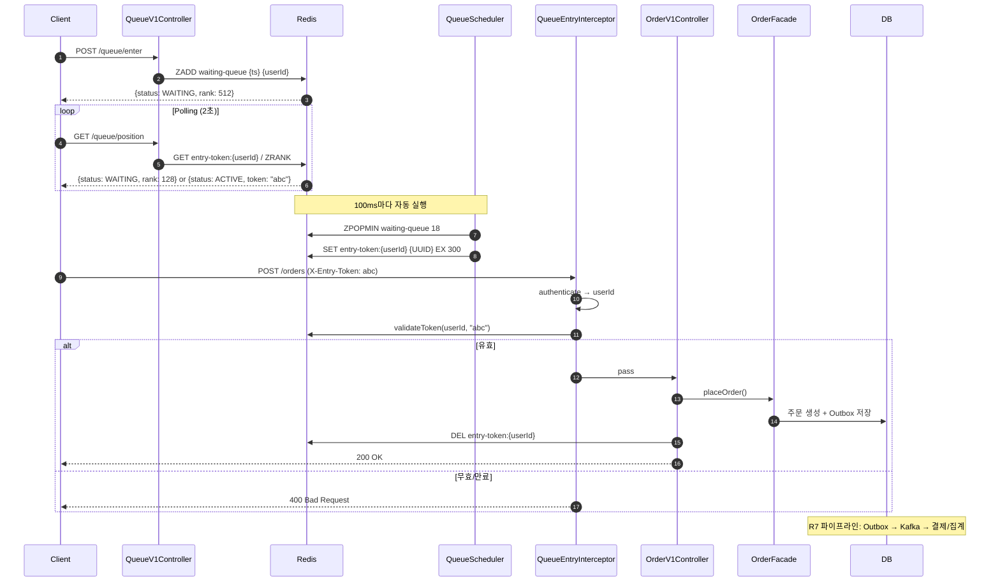
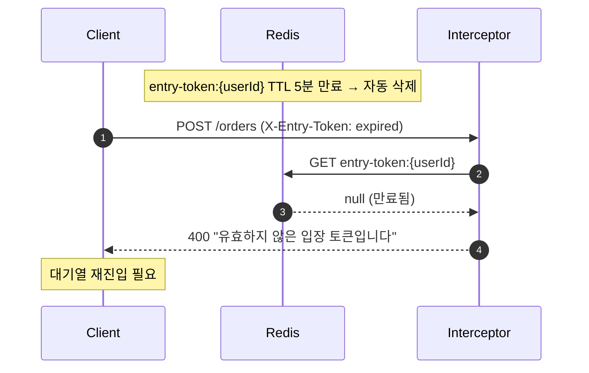

## 📌 Summary

- 배경: 블랙 프라이데이 트래픽 폭증(초당 10,000건) 시 DB 커넥션 고갈, 응답 타임아웃, 재시도 폭풍으로 시스템 전체 장애 위험. 유저는 성공/실패를 알 수 없어 이탈.
- 목표: Redis 기반 대기열로 처리량을 제어(Back-pressure)하고, 입장 토큰과 실시간 순번 조회로 유저에게 공정한 대기 경험을 제공한다.
- 결과: Sorted Set 대기열 + 100ms 마이크로 배칭 스케줄러(175 TPS) + Interceptor 기반 Active Zone 관문 구현. 주문 이후 흐름은 R7 Outbox → Kafka 파이프라인 그대로 활용.

## 🧭 Context & Decision

### 문제 정의
- 현재 동작/제약: 주문 API가 트래픽을 직접 수용. DB 커넥션 풀(50)과 PG 처리량에 의한 물리적 한계 존재. 트래픽 스파이크 시 전체 서비스 장애로 이어짐.
- 문제(또는 리스크):
  - 초당 10,000건 → DB 커넥션 풀 고갈 → 전체 시스템 멈춤
  - 응답 없이 로딩 → 타임아웃 → 유저 재시도 → 트래픽 더 악화
  - 누가 먼저 요청했는지와 관계없이 운 좋은 사람만 성공 (공정성 부재)
- 성공 기준(완료 정의):
  - 대기열이 처리량(175 TPS)에 맞춰 유입을 조절
  - 유저는 순번과 예상 대기 시간을 실시간 확인 가능
  - 토큰 없이는 주문 API에 진입 불가 (관문 100% 차단)
  - 기존 주문 이후 흐름(Outbox → Kafka)은 변경 없음

### 선택지와 결정

#### ① 트래픽 제어 전략: Rate Limiting vs Queuing

- 고려한 대안:
    - A: Rate Limiting — 초과 요청 즉시 거부 (429 Too Many Requests)
    - B: Queuing — 초과 요청을 대기열에 보관, 순서대로 처리
- 최종 결정: **B (Queuing)**
- 트레이드오프: Rate Limiting은 구현이 간단하지만 블랙 프라이데이에 "나중에 다시 시도하세요"를 반환하면 유저 이탈 + 재시도 폭풍 유발. 대기열은 유저가 기다릴 의사가 있는 시나리오에 적합.
- 추후 개선 여지: 대기열 앞단에 Rate Limiting을 두어 봇/비정상 요청을 먼저 걸러내는 이중 방어 가능.

#### ② 대기열 자료구조: Redis Sorted Set

- 고려한 대안:
    - A: Kafka Topic — 메시지 순서 보장, but 순번 조회(ZRANK) 불가
    - B: Redis List (LPUSH/RPOP) — FIFO 보장, but 순번 조회 시 O(N)
    - C: Redis Sorted Set — 순서 보장 + O(log N) 순번 조회 + 중복 방지
- 최종 결정: **C**
- 이유: 유저가 "내 순번"을 실시간으로 알아야 하므로 ZRANK O(log N)이 핵심. List는 LPOS로 순번 조회 시 O(N)이고 Kafka는 offset 기반이라 "내가 몇 번째"를 알 수 없음.

#### ③ 스케줄러 배칭 전략: Thundering Herd 완화

- 고려한 대안:
    - A: 1초마다 175명 한번에 발급
    - B: 100ms마다 ~18명씩 분산 발급
- 최종 결정: **B (100ms 마이크로 배칭)**
- 처리량 산정 근거: DB Pool 50 / 평균 200ms = 250 TPS → 70% 안전 마진 = 175 TPS → 100ms당 18명
- 이유: A는 175명이 동시에 POST /orders를 호출하여 DB 커넥션 175개 동시 점유 (Thundering Herd). B는 피크를 10배 평탄화.

#### ④ 토큰 검증 위치: Interceptor vs Controller

- 고려한 대안:
    - A: Controller에서 검증 (userId 확정 후 Redis 조회)
    - B: Interceptor에서 인증 + 검증 (Active Zone 관문)
- 최종 결정: **B**
- 이유: Interceptor가 관문 역할을 해야 Controller에 도달하기 전에 차단 가능. A는 토큰 없는 요청도 Controller까지 도달하여 불필요한 리소스 소비.
- 구현: Interceptor에서 AuthFacade.authenticate()로 userId 확보 → queueService.validateToken() → 실패 시 즉시 400.

## 🏗️ Design Overview

### 변경 범위
- 영향 받는 모듈/도메인: Order (주문 API에 토큰 검증 추가), Queue (신규)
- 신규 추가:
  - `domain/queue/` — QueueEntry, QueueStatus, QueueService (Port)
  - `infrastructure/queue/` — RedisQueueService (Adapter)
  - `application/queue/` — QueueFacade, QueueScheduler
  - `interfaces/api/queue/` — QueueV1Controller, QueueV1Dto
  - `interfaces/api/security/` — QueueEntryInterceptor
  - `k6/` — queue-benchmark.js, queue-token-ttl-test.js, queue-throughput-test.js
- 제거/대체:
  - OrderV1Controller.placeOrder()에서 토큰 검증 로직 제거 (Interceptor로 이동)

### 주요 컴포넌트 책임
- `QueueService (Port)`: 대기열 진입/조회/pop/토큰 발급·검증·소비 인터페이스
- `RedisQueueService (Adapter)`: Redis Sorted Set + String 기반 구현
- `QueueScheduler`: 100ms 주기로 ZPOPMIN(18) → issueToken. ConditionalOnProperty로 테스트 시 비활성화
- `QueueEntryInterceptor`: POST /api/v1/orders 관문 — 인증 → 토큰 검증 → 실패 시 즉시 거부
- `QueueFacade`: 대기열 진입/조회/토큰 소비 오케스트레이션
- `QueueV1Controller`: POST /queue/enter, GET /queue/position API

## 🔁 Flow Diagram

### Main Flow — 대기열 진입 → 토큰 발급 → 주문

### Error Flow — 토큰 만료

## ⚡ Performance & Data Integrity Notes

### 처리량 설계 기준

| 항목 | 값 | 근거 |
|------|-----|------|
| DB 커넥션 풀 | 50 | HikariCP 기본 설정 |
| 주문 1건 평균 처리 시간 | 200ms | 재고 차감 + 쿠폰 검증 + 주문 저장 + Outbox |
| 이론적 최대 TPS | 250 | 50 / 0.2 |
| 안전 마진 | 70% | 피크 부하 + GC pause 고려 |
| 목표 TPS | 175 | 250 × 0.7 |
| 스케줄러 주기 | 100ms | Thundering Herd 완화 (1초 → 10분할) |
| 배치 크기 | 18 | 175 / 10 ≈ 18 |

### Redis 연산 복잡도

| 연산 | 명령 | 복잡도 | 용도 |
|------|------|--------|------|
| 대기열 진입 | ZADD (NX) | O(log N) | 중복 방지 + 순서 보장 |
| 순번 조회 | ZRANK | O(log N) | 내 위치 확인 |
| 대기 인원 | ZCARD | O(1) | 전체 대기 인원 |
| 배치 pop | ZPOPMIN | O(log N × M) | 앞에서 M명 꺼내기 |
| 토큰 발급 | SET EX | O(1) | UUID + 5분 TTL |
| 토큰 검증 | GET | O(1) | 값 비교 |
| 토큰 삭제 | DEL | O(1) | 주문 후 정리 |

### R7과의 연결점

| R7 구성 요소 | R8 활용 |
|-------------|---------|
| Outbox Pattern | 주문 이벤트 저장 (OrderFacade.placeOrder → outboxEventService.save) |
| Kafka 파이프라인 | 주문 완료 → ORDER_PLACED → 결제/집계 Consumer |
| PaymentRecoveryFacade | 결제 상태 복구 (대기열과 무관하게 동작) |

## 🧪 Test Coverage

### Unit Tests (6 cases)
- `QueueSchedulerUnitTest` — 배치 처리, 빈 큐, 개별 실패 시 나머지 계속 처리
- `QueueFacadeUnitTest` — 진입/순번 조회/토큰 소비 위임

### Integration Tests (10 cases)
- `RedisQueueServiceTest` — 순차 rank, 중복 방지, 동시 100명, NOT_IN_QUEUE, ACTIVE, FIFO pop, 빈 큐 pop, 토큰 발급·검증·소비, 예상 대기 시간, 전체 플로우

### k6 Load Tests (3 scripts)
- `queue-benchmark.js` — 1000 VUs 폭증 + 200 VUs Polling + 50 VUs 주문 (~2분)
- `queue-token-ttl-test.js` — 신선 토큰 성공 + 만료 토큰 거부 (~6분)
- `queue-throughput-test.js` — 2000 VUs 폭주 + 관문 차단 + 처리량 측정 (~1분 30초)
