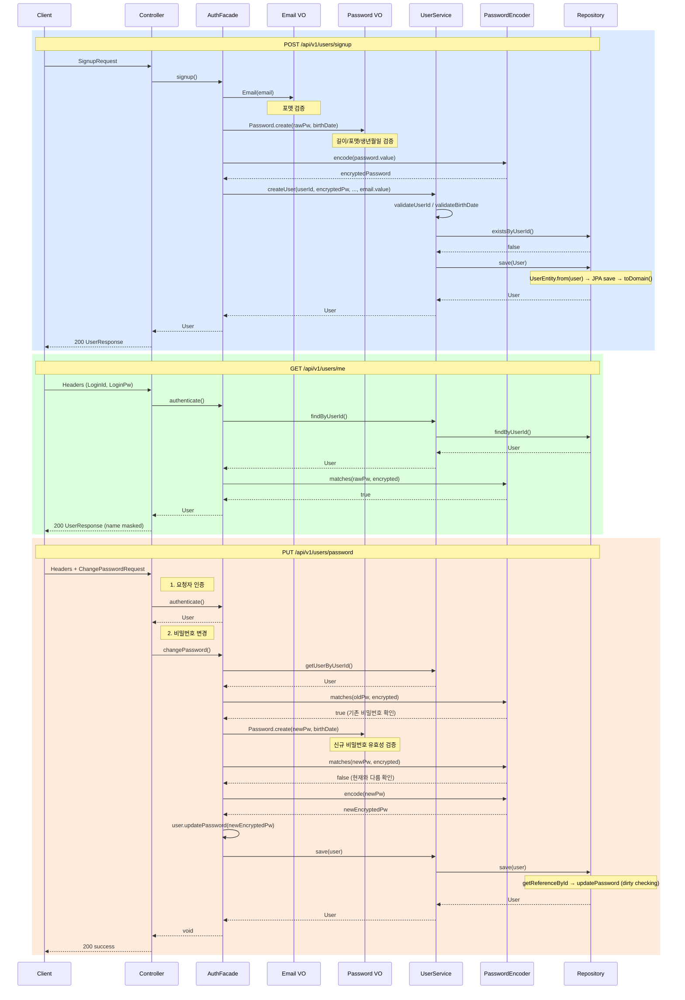

# Week 1 — 회원가입 / 내 정보 조회 / 비밀번호 수정

---

## 요구사항 체크리스트

### 회원가입

- [x] 필요 정보 : { 로그인 ID, 비밀번호, 이름, 생년월일, 이메일 }
- [x] 이미 가입된 로그인 ID 로는 가입이 불가능함 → `CONFLICT (409)`
- [x] 각 정보 포맷 검증
  - 이름 : blank 체크 (`User` init)
  - 이메일 : `xx@yy` regex (`Email` Value Object)
  - 생년월일 : 미래일 불가 (`UserService.validateBirthDate`), 형식 오류 시 Jackson 역직렬화 단계에서 `400`
- [x] 비밀번호 암호화 저장 → BCrypt (`PasswordEncoder.encode`)
- [x] 비밀번호 RULE
  - 8~16자, 영문 대소문자 / 숫자 / 특수문자만 → regex + length (`Password` Value Object)
  - 생년월일 포함 불가 → yyyyMMdd / yyMMdd / MMdd 패턴 체크 (`Password.validateNoBirthDatePattern`)

### 내 정보 조회

- [x] 반환 정보 : { 로그인 ID, 이름, 생년월일, 이메일 }
- [x] 로그인 ID 는 영문과 숫자만 허용 → `^[A-Za-z0-9]+$` (`UserService.validateUserId`)
- [x] 이름은 마지막 글자를 `*` 로 마스킹 → `UserV1Dto.UserResponse.fromMasked()`

### 비밀번호 수정

- [x] 필요 정보 : { 기존 비밀번호, 새 비밀번호 }
- [x] 비밀번호 RULE 동일 적용 → `Password.create()`
- [x] 현재 비밀번호 재사용 불가 → `passwordEncoder.matches` 비교

---

## 구현 구조

```
application/auth/
  AuthFacade.kt               — 인증 유스케이스 조율 (signup, authenticate, changePassword)

domain/user/
  User.kt                     — 도메인 엔티티 (JPA 비의존, blank 검증 + updatePassword)
  Email.kt                    — 이메일 Value Object (포맷 자가 검증)
  Password.kt                 — 비밀번호 Value Object (길이/포맷/생년월일 패턴 검증)
  UserService.kt              — CRUD 도메인 서비스 (userId/birthDate 검증, 중복 체크)
  UserRepository.kt           — 도메인 Repository 인터페이스 (User 기준)
  UserPasswordEncoder.kt      — @Component, BCryptPasswordEncoder 래퍼

infrastructure/user/
  UserEntity.kt               — JPA @Entity (toDomain/from 매핑)
  UserJpaRepository.kt        — JpaRepository<UserEntity, Long>
  UserRepositoryImpl.kt       — Repository 구현체 (UserEntity ↔ User 매핑)

interfaces/api/user/
  UserV1ApiSpec.kt            — OpenAPI 스펙 인터페이스
  UserV1Controller.kt         — REST 컨트롤러 (AuthFacade 호출)
  UserV1Dto.kt                — SignupRequest / UserChangePasswordRequest / UserResponse

interfaces/api/security/
  AuthHeader.kt               — 로그인 헤더 상수 정의 (HEADER_LOGIN_ID, HEADER_LOGIN_PW)
```

### 클래스 관계 다이어그램

```mermaid
classDiagram
    direction TB

    namespace Interfaces_API_User {
        class UserV1ApiSpec {
            <<interface>>
            +signup(SignupRequest) UserResponse
            +getMyInfo() UserResponse
            +changePassword(UserChangePasswordRequest)
        }
        class UserV1Controller {
            -authFacade : AuthFacade
        }
        class SignupRequest {
            <<data class>>
            +userId String
            +password String
            +name String
            +birthDate LocalDate
            +email String
        }
        class UserChangePasswordRequest {
            <<data class>>
            +oldPassword String
            +newPassword String
        }
        class UserResponse {
            <<data class>>
            +userId String
            +name String
            +birthDate LocalDate
            +email String
            +from(User)$
            +fromMasked(User)$
        }
    }

    namespace Application_Auth {
        class AuthFacade {
            -userService : UserService
            -passwordEncoder : PasswordEncoder
            +signup() User
            +authenticate() User
            +changePassword()
        }
    }

    namespace Domain_User {
        class UserService {
            -userRepository : UserRepository
            +createUser() User
            +getUserByUserId() User
            +findByUserId() User?
            +save() User
        }
        class User {
            +id Long
            +userId String
            +encryptedPassword String
            +name String
            +birthDate LocalDate
            +email String
            +updatePassword()
        }
        class Email {
            <<value object>>
            +value String
        }
        class Password {
            <<value object>>
            +value String
            +create(rawPassword, birthDate)$ Password
        }
        class UserRepository {
            <<interface>>
            +save(User) User
            +findByUserId(String) User?
            +existsByUserId(String) Boolean
        }
        class UserPasswordEncoder {
            <<component>>
            +encode(String) String
            +matches(String, String) Boolean
        }
    }

    namespace Infrastructure_User {
        class UserEntity {
            <<entity>>
            +userId String
            +encryptedPassword String
            +name String
            +birthDate LocalDate
            +email String
            +toDomain() User
            +from(User)$ UserEntity
            +updatePassword()
        }
        class BaseEntity {
            <<abstract>>
            +id Long
            +createdAt ZonedDateTime
            +updatedAt ZonedDateTime
        }
        class UserRepositoryImpl {
            -jpaRepository : UserJpaRepository
        }
        class UserJpaRepository {
            <<interface>>
            +findByUserId(String) UserEntity?
            +existsByUserId(String) Boolean
        }
    }

    %% Interfaces → Application
    UserV1Controller ..|> UserV1ApiSpec : implements
    UserV1Controller --> AuthFacade : calls
    UserV1Controller ..> SignupRequest : uses
    UserV1Controller ..> UserChangePasswordRequest : uses
    UserV1Controller ..> UserResponse : returns
    UserResponse ..> User : maps from

    %% Application → Domain
    AuthFacade --> UserService : delegates CRUD
    AuthFacade --> UserPasswordEncoder : encrypt/verify
    AuthFacade ..> Email : validates
    AuthFacade ..> Password : validates

    %% Domain
    UserService --> UserRepository : uses
    UserService ..> User : manages

    %% Infrastructure
    UserEntity --|> BaseEntity : inherits
    UserEntity ..> User : toDomain/from
    UserRepositoryImpl ..|> UserRepository : implements
    UserRepositoryImpl --> UserJpaRepository : uses
    UserJpaRepository ..> UserEntity : manages
```



### 요청 플로우



### 핵심 설계 결정

- **AuthFacade 도입** : Controller → AuthFacade → UserService 구조. 인증/검증 흐름을 Application Layer에서 조율하고, UserService는 순수 CRUD만 담당
- **JPA Entity ↔ Domain Entity 분리** : `UserEntity`(JPA) + `User`(도메인). Repository 구현체에서 `toDomain()`/`from()`으로 매핑
- **Value Object** : `Email`, `Password`가 생성 시점에 자가 검증. 유효하지 않은 상태의 인스턴스가 존재할 수 없음
- **PasswordEncoder** : Bean이 아닌 `@Component`로 관리 (`domain/user/UserPasswordEncoder`)
- **인증** : Spring Security 필터 아닌 커스텀 헤더 (`X-Loopers-LoginId / Pw`) → AuthFacade에서 처리
- **Timing attack 방지** : 사용자 미존재 시에도 BCrypt 연산을 수행하여 응답 시간 차이를 제거
- **마스킹** : `String.mask()` private extension function in `UserResponse` companion. 추후 security 모듈로 이동 예정

---

## 테스트 커버리스트

### 단위 테스트 — `PasswordUnitTest`

| 영역 | 테스트 케이스 |
|---|---|
| 길이 검증 | 8자 미만 실패, 18자 초과 실패, 정확히 8자 성공, 정확히 16자 성공 |
| 포맷 검증 | 한글 포함 실패, 특수문자 포함 성공 |
| 생년월일 검증 | yyyyMMdd 포함 실패, yyMMdd 포함 실패, MMdd 포함 실패, 미포함 성공 |

### 단위 테스트 — `EmailUnitTest`

| 영역 | 테스트 케이스 |
|---|---|
| 포맷 검증 | 유효 이메일 성공, 특수문자(+/./\_) 성공, @ 미포함 실패, 도메인 없음 실패, 로컬파트 없음 실패 |

### 단위 테스트 — `UserTest`

- 정상 생성, blank 파라미터 실패
- updatePassword: blank 실패, 유효한 값 성공

### 단위 테스트 — `UserServiceUnitTest` (MockK)

| 영역 | 테스트 케이스 |
|---|---|
| createUser — userId | 특수문자 포함 실패, 한글 포함 실패, 영숫자만 성공 |
| createUser — birthDate | 미래 실패, 오늘 성공, 과거 성공 |
| createUser — duplicate | 중복 userId → CONFLICT |
| createUser — success | 유효 데이터로 생성 성공 |
| getUserByUserId | 존재하지 않는 ID → NOT_FOUND |
| findByUserId | null 반환, 존재 시 반환 |
| save | repository 위임 확인 |

### 단위 테스트 — `AuthFacadeUnitTest` (MockK + SpyK)

| 영역 | 테스트 케이스 |
|---|---|
| signup | 정상 생성, 이메일 형식 실패, 비밀번호 too short/long, birthDate 포함 실패, 유효 이메일 성공, 8자/16자 경계값 성공 |
| authenticate | 정상 인증, 틀린 비밀번호 UNAUTHORIZED (Spy), 미존재 유저 UNAUTHORIZED, timing attack 방지 검증 (Spy) |
| changePassword | 성공(Mock verify), 기존 비밀번호 불일치, 새 비밀번호 too short, birthDate 포함, 현재와 동일 |

### 통합 테스트 — `AuthFacadeTest`

- signup: 정상 저장, 암호화 검증, 이메일 형식 실패, 비밀번호 too short, birthDate 포함 실패
- authenticate: 정상 인증, 미존재 ID 실패, 틀린 비밀번호 실패
- changePassword: 정상 변경 + 새 비밀번호로 인증, 기존 비밀번호 불일치, 현재와 동일, too short
- 경계값: 8자/16자 비밀번호 성공

### 통합 테스트 — `UserServiceTest`

- createUser: 정상 저장, 중복 ID 실패, 특수문자 userId 실패, 미래 birthDate 실패
- getUserByUserId: 조회 성공, NOT_FOUND
- findByUserId: null 반환
- save: 비밀번호 변경 후 저장 확인

### 통합 테스트 — `UserRepositoryTest`

- findByUserId (존재 / 존재하지 않음 → null)
- existsByUserId (존재 시 true / 미존재 시 false)

### E2E 테스트 — `UserV1ApiE2ETest`

| 엔드포인트 | 테스트 케이스 |
|---|---|
| POST /signup | 정상 200, 중복 ID 409, 특수문자 userId 400, 이메일 형식 400, 비밀번호 too short 400, birthDate 포함 비밀번호 400, 생년월일 형식 오류 400, 필수 값 누락 400 |
| GET /me | 정상 200 (이름 마스킹), 존재하지 않는 ID 401, 틀린 비밀번호 401 |
| PUT /password | 정상 200, 현재와 동일 400, birthDate 포함 400 |
