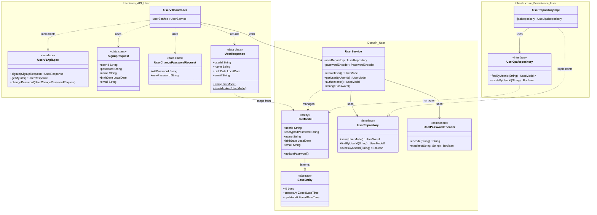

# Week 1 — 회원가입 / 내 정보 조회 / 비밀번호 수정

---

## 요구사항 체크리스트

### 회원가입

- [x] 필요 정보 : { 로그인 ID, 비밀번호, 이름, 생년월일, 이메일 }
- [x] 이미 가입된 로그인 ID 로는 가입이 불가능함 → `CONFLICT (409)`
- [x] 각 정보 포맷 검증
  - 이름 : blank 체크 (`UserModel` init)
  - 이메일 : `xx@yy` regex (`UserService.validateEmail`)
  - 생년월일 : 미래일 불가 (`UserModel` init), 형식 오류 시 Jackson 역직렬화 단계에서 `400`
- [x] 비밀번호 암호화 저장 → BCrypt (`PasswordEncoder.encode`)
- [x] 비밀번호 RULE
  - 8~16자, 영문 대소문자 / 숫자 / 특수문자만 → regex + length (`UserService.validatePassword`)
  - 생년월일 포함 불가 → yyyyMMdd / yyMMdd / MMdd 패턴 체크

### 내 정보 조회

- [x] 반환 정보 : { 로그인 ID, 이름, 생년월일, 이메일 }
- [x] 로그인 ID 는 영문과 숫자만 허용 → `^[A-Za-z0-9]+$` (`UserService.validateUserId`)
- [x] 이름은 마지막 글자를 `*` 로 마스킹 → `UserV1Dto.UserResponse.fromMasked()`

### 비밀번호 수정

- [x] 필요 정보 : { 기존 비밀번호, 새 비밀번호 }
- [x] 비밀번호 RULE 동일 적용 → `validatePassword`
- [x] 현재 비밀번호 재사용 불가 → `passwordEncoder.matches` 비교

---

## 구현 구조

```
domain/user/
  UserModel.kt              — JPA @Entity, init 검증 (blank, 미래일)
  UserService.kt            — 비즈로직, 유효성 검증, 암호화
  UserRepository.kt         — 도메인 Repository 인터페이스
  UserPasswordEncoder.kt    — @Component, BCryptPasswordEncoder 래퍼

infrastructure/user/
  UserJpaRepository.kt      — JpaRepository
  UserRepositoryImpl.kt     — Repository 구현체

interfaces/api/user/
  UserV1ApiSpec.kt          — OpenAPI 스펙 인터페이스
  UserV1Controller.kt       — REST 컨트롤러 (Service 직접 호출, Facade 없음)
  UserV1Dto.kt              — SignupRequest / UserChangePasswordRequest / UserResponse

interfaces/api/security/
  AuthHeader.kt             — 로그인 헤더 상수 정의 (HEADER_LOGIN_ID, HEADER_LOGIN_PW)
```

### 클래스 관계 다이어그램



### 핵심 설계 결정

- **Facade 없음** : Week 1은 단일 Service 호출이므로 Controller → Service 직접 연결
- **JPA Entity = Domain Model** : `UserModel`이 하나로 통합. 복잡도가 올라오면 분리 검토
- **PasswordEncoder** : Bean이 아닌 `@Component`로 관리 (`domain/user/UserPasswordEncoder`)
- **인증** : Spring Security 필터 아닌 커스턴 헤더 (`X-Loopers-LoginId / Pw`) → Controller에서 수동 처리
- **마스킹** : `String.mask()` private extension function in `UserResponse` companion. 추후 security 모듈로 이동 예정

---

## 테스트 커버리스트

### 단위 테스트 — `UserServiceUnitTest` (MockK)

| 영역 | 테스트 케이스 |
|---|---|
| createUser — userId | 특수문자 포함 실패, 한글 포함 실패, 영숫자만 성공 |
| createUser — password | 8자 미만, 16자 초과, 정확히 8자, 정확히 16자, birthDate(yyyyMMdd/yyMMdd/MMdd) 포함 실패, birthDate 미포함 성공 |
| createUser — email | 형식 오류 실패, 유효 형식 성공 |
| createUser — duplicate | 중복 userId → CONFLICT |
| getUserByUserId | 존재하지 않는 ID → NOT_FOUND |
| authenticate | 존재하지 않는 유저 → UNAUTHORIZED, 틀린 비밀번호 → UNAUTHORIZED (Spy) |
| changePassword | 성공(Mock verify), 기존 비밀번호 불일치, 새 비밀번호 too short, birthDate 포함, 현재와 동일 |

### 단위 테스트 — `UserModelTest`

- 정상 생성, blank 파라미터 실패

### 통합 테스트 — `UserServiceTest` (SpyBean)

- createUser 정상 저장, 암호화 검증, save() spy 검증, 중복 ID 실패
- getUserByUserId 조회
- authenticate 정상 인증
- changePassword + 새 비밀번호로 인증

### 통합 테스트 — `UserRepositoryTest`

- findByUserId (존재 / 존재하지 않음 → null)
- existsByUserId (존재 시 true)

### E2E 테스트 — `UserV1ApiE2ETest`

| 엔드포인트 | 테스트 케이스 |
|---|---|
| POST /signup | 정상 200, 중복 ID 409, 특수문자 userId 400, 이메일 형식 400, 비밀번호 too short 400, birthDate 포함 비밀번호 400, 생년월일 형식 오류 400, 필수 값 누락 400 |
| GET /me | 정상 200 (이름 마스킹), 존재하지 않는 ID 401, 틀린 비밀번호 401 |
| PUT /password | 정상 200, 현재와 동일 400, birthDate 포함 400 |
