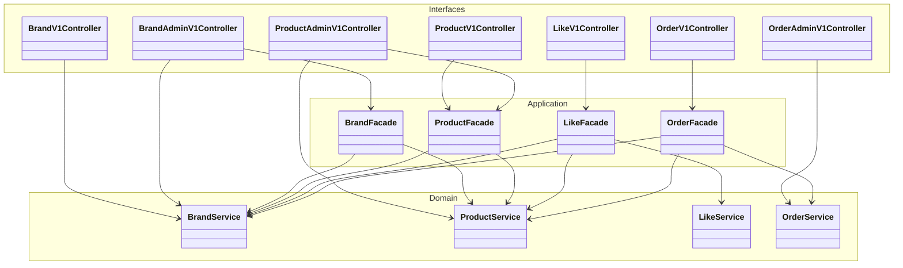
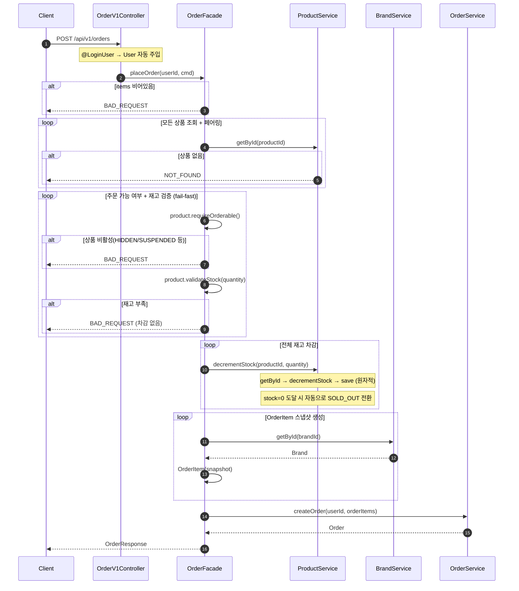
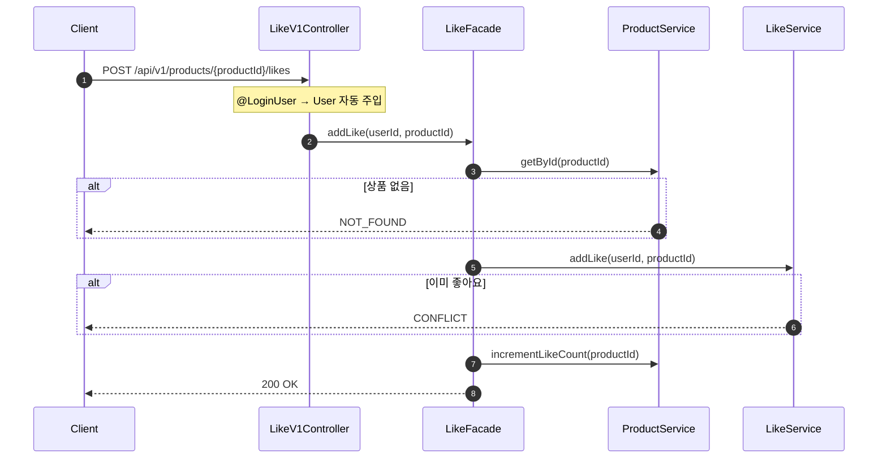
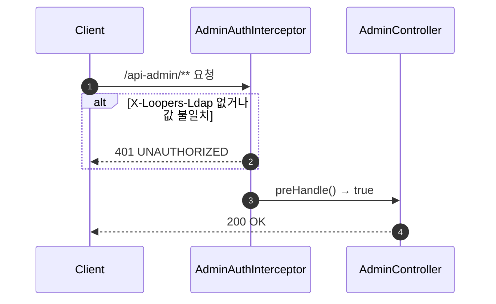
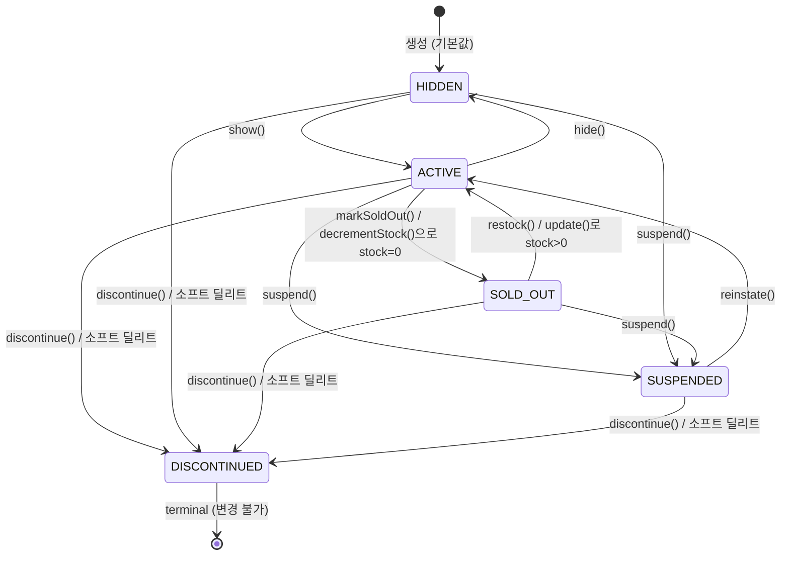
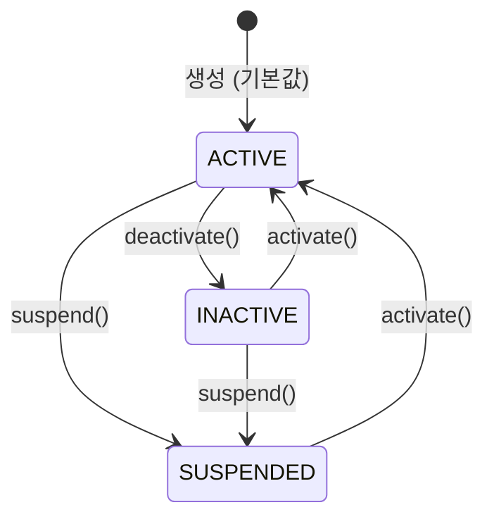

# Week 3 Implementation Notes

## ✅ Implementation Quest Checklist

### 🏷 Product / Brand 도메인
- [x] 상품 정보 객체는 브랜드 정보, 좋아요 수를 포함한다
- [x] 상품의 정렬 조건(`latest`, `price_asc`, `likes_desc`)을 고려한 조회 기능을 설계했다
- [x] 상품은 재고를 가지고 있고, 주문 시 차감할 수 있어야 한다
- [x] 재고의 음수 방지 처리는 도메인 레벨에서 처리된다
- [x] Brand / Product 모두 상태(status)를 가지며, 명시적 전이 메서드로만 변경 가능하다
- [x] 소프트 딜리트 시 Product는 자동으로 `DISCONTINUED` 상태로 전환된다
- [x] 공개 API는 `ACTIVE` 상태인 Brand / Product 만 조회된다

### 👍 Like 도메인
- [x] 좋아요는 유저와 상품 간의 관계로 별도 도메인으로 분리했다
- [x] 상품의 좋아요 수는 상품 상세/목록 조회에서 함께 제공된다
- [x] 단위 테스트에서 좋아요 등록/취소 흐름을 검증했다

### 🛒 Order 도메인
- [x] 주문은 여러 상품을 포함할 수 있으며, 각 상품의 수량을 명시한다
- [x] 주문 시 상품의 주문 가능 여부(`requireOrderable`)를 먼저 검증한다
- [x] 주문 시 상품의 재고 차감을 수행한다
- [x] 재고 부족 예외 흐름을 고려해 설계되었다
- [x] 단위 테스트에서 정상 주문 / 예외 주문 흐름을 모두 검증했다

### 🧩 도메인 서비스
- [x] 도메인 내부 규칙은 Domain Service에 위치시켰다
- [x] 상품 상세 조회 시 Product + Brand 정보 조합은 Application Layer에서 처리했다
- [x] 복합 유스케이스는 Application Layer에 존재하고, 도메인 로직은 위임되었다
- [x] 도메인 서비스는 상태 없이, 동일한 도메인 경계 내의 도메인 객체의 협력 중심으로 설계되었다

### 🔐 인증 & 보안
- [x] `@LoginUser` + `LoginUserArgumentResolver`로 사용자 인증 헤더를 User 도메인 객체로 자동 변환
- [x] `AdminAuthInterceptor`로 `/api-admin/**` LDAP 인증을 일원화 (GET 포함 모든 어드민 엔드포인트)
- [x] Controller에서 인증 관련 보일러플레이트 제거

### 🧱 소프트웨어 아키텍처 & 설계
- [x] 전체 프로젝트의 구성은 `Application → Domain ← Infrastructure` 기반으로 구성되었다
- [x] Application Layer는 도메인 객체를 조합해 흐름을 orchestration 했다
- [x] 핵심 비즈니스 로직은 Entity, VO, Domain Service에 위치한다
- [x] Repository Interface는 Domain Layer에 정의되고, 구현체는 Infra에 위치한다
- [x] Facade는 Repository를 직접 주입받지 않는다 — 모든 데이터 접근은 Domain Service를 통해서만
- [x] 패키지는 계층 + 도메인 기준으로 구성되었다 (`/domain/catalog/brand`, `/application/like` 등)
- [x] 테스트는 외부 의존성을 분리하고, MockK를 사용해 단위 테스트가 가능하게 구성되었다

---

## 📁 File Structure

### Domain Layer
```
domain/catalog/brand/
  Brand.kt                   — 브랜드 도메인 모델 (update, activate, deactivate, suspend)
  BrandStatus.kt             — 브랜드 상태 enum (ACTIVE, INACTIVE, SUSPENDED)
  BrandRepository.kt         — 영속성 인터페이스
  BrandService.kt            — createBrand, getById(NOT_FOUND guard), update,
                               delete, findAll

domain/catalog/product/
  Product.kt                 — 상품 도메인 모델 (update, validateStock, decrementStock,
                               incrementLike, decrementLike, hide, show, markSoldOut,
                               restock, suspend, reinstate, discontinue, requireOrderable)
  ProductStatus.kt           — 상품 상태 enum (ACTIVE, HIDDEN, SOLD_OUT, SUSPENDED, DISCONTINUED)
  ProductSort.kt             — 정렬 enum (LATEST, PRICE_ASC, LIKES_DESC)
  ProductSearchCondition.kt  — 검색 조건 VO (brandId?, sort, page, size)
  ProductRepository.kt       — 영속성 인터페이스
  ProductService.kt          — createProduct, getById(NOT_FOUND guard),
                               getActiveById(ACTIVE 상태 공개 전용),
                               update, decrementStock, incrementLikeCount,
                               decrementLikeCount, delete, deleteAllByBrandId, findAll

domain/like/
  Like.kt                    — 좋아요 도메인 모델 (userId, productId 연관 레코드)
  LikeRepository.kt          — 영속성 인터페이스
  LikeService.kt             — addLike(CONFLICT guard), removeLike(NOT_FOUND guard),
                               getLikedByUser

domain/order/
  OrderItem.kt               — 주문 항목 도메인 모델 (스냅샷, subtotal())
  Order.kt                   — 주문 Aggregate Root (create 팩토리 메서드, totalPrice)
  OrderRepository.kt         — 영속성 인터페이스
  OrderService.kt            — createOrder, getById(NOT_FOUND guard),
                               getOrders(날짜 범위 검증), findAll
```

### Infrastructure Layer
```
infrastructure/catalog/brand/
  BrandEntity.kt             — status: BrandStatus 컬럼 포함, updateStatus()
  BrandJpaRepository.kt      — findAllByStatus(status, pageable)
  BrandRepositoryImpl.kt     — save 시 status 동기화

infrastructure/catalog/product/
  ProductEntity.kt           — status: ProductStatus 컬럼 포함, update(+status), updateStatus()
  ProductJpaRepository.kt    — findAllByStatus*(status, brandId?, pageable) — 공개 조회는 ACTIVE 전달
  ProductRepositoryImpl.kt   — save 시 status 동기화; deleteById/deleteAllByBrandId 시 DISCONTINUED 전환 후 soft-delete

infrastructure/like/
  LikeEntity.kt, LikeJpaRepository.kt, LikeRepositoryImpl.kt

infrastructure/order/
  OrderEntity.kt, OrderItemEntity.kt, OrderJpaRepository.kt, OrderRepositoryImpl.kt
```

### Application Layer
```
application/catalog/brand/
  BrandResult.kt             — BrandResult (id, name, description, status)
  BrandFacade.kt             — deleteBrand (cross-domain: product cascade 후 brand 삭제)

application/catalog/product/
  ProductCommand.kt          — CreateProductCommand, UpdateProductCommand
  ProductResult.kt           — ProductDetailResult, ProductSummaryResult
  ProductFacade.kt           — createProduct, getProductDetail(getActiveById),
                               updateProduct, findProducts

application/like/
  LikeResult.kt              — LikedProductResult (product + brand 정보 조합)
  LikeFacade.kt              — addLike, removeLike, getLikedProducts

application/order/
  OrderCommand.kt            — PlaceOrderCommand, OrderItemCommand
  OrderResult.kt             — OrderResult, OrderItemResult
  OrderFacade.kt             — placeOrder (requireOrderable → validateStock → decrementStock)
```

### Interface Layer
```
interfaces/api/security/
  LoginUser.kt               — @LoginUser 파라미터 마커 애노테이션
  LoginUserArgumentResolver.kt — @LoginUser → User 도메인 객체 변환
  AdminAuthInterceptor.kt    — /api-admin/** LDAP 인증 인터셉터
  AuthHeader.kt, AdminHeader.kt — 헤더 상수

interfaces/api/catalog/brand/
  BrandV1ApiSpec.kt, BrandV1Dto.kt, BrandV1Controller.kt
  BrandAdminV1ApiSpec.kt, BrandAdminV1Dto.kt, BrandAdminV1Controller.kt

interfaces/api/catalog/product/
  ProductV1ApiSpec.kt, ProductV1Dto.kt, ProductV1Controller.kt
  ProductAdminV1ApiSpec.kt, ProductAdminV1Dto.kt, ProductAdminV1Controller.kt

interfaces/api/like/
  LikeV1ApiSpec.kt, LikeV1Dto.kt, LikeV1Controller.kt

interfaces/api/order/
  OrderV1ApiSpec.kt, OrderV1Dto.kt, OrderV1Controller.kt
  OrderAdminV1ApiSpec.kt, OrderAdminV1Controller.kt

interfaces/api/user/
  UserV1ApiSpec.kt, UserV1Dto.kt, UserV1Controller.kt

config/
  WebMvcConfig.kt            — ArgumentResolver + Interceptor 등록
  SpringDocConfig.kt         — @LoginUser 파라미터 OpenAPI 스펙에서 제외
```

---

## 🏗️ Class Diagram

### Application/Domain Layer

```mermaid
classDiagram
    namespace Domain_Catalog_Brand {
        class Brand {
            +id: Long
            +name: String
            +description: String
            +status: BrandStatus
            +update(name, description)
            +activate()
            +deactivate()
            +suspend()
        }
        class BrandStatus {
            <<enum>>
            ACTIVE
            INACTIVE
            SUSPENDED
        }
        class BrandService {
            +createBrand(name, description) Brand
            +getById(id) Brand
            +update(id, name, description) Brand
            +delete(id)
            +findAll(page, size) List~Brand~
        }
        class BrandRepository
    }

    namespace Domain_Catalog_Product {
        class Product {
            +id: Long
            +brandId: Long
            +name: String
            +price: Int
            +stock: Int
            +likeCount: Int
            +status: ProductStatus
            +update(name, description, price, stock)
            +validateStock(quantity)
            +decrementStock(quantity)
            +incrementLike()
            +decrementLike()
            +hide()
            +show()
            +markSoldOut()
            +restock()
            +suspend()
            +reinstate()
            +discontinue()
            +requireOrderable()
        }
        class ProductStatus {
            <<enum>>
            ACTIVE
            HIDDEN
            SOLD_OUT
            SUSPENDED
            DISCONTINUED
        }
        class ProductSort {
            <<enum>>
            LATEST
            PRICE_ASC
            LIKES_DESC
        }
        class ProductSearchCondition {
            +brandId: Long?
            +sort: ProductSort
            +page: Int
            +size: Int
        }
        class ProductService {
            +createProduct(...) Product
            +getById(id) Product
            +getActiveById(id) Product
            +update(...) Product
            +decrementStock(productId, quantity) Product
            +incrementLikeCount(productId) Product
            +decrementLikeCount(productId) Product
            +delete(id)
            +deleteAllByBrandId(brandId)
            +findAll(condition) List~Product~
        }
        class ProductRepository
    }

    namespace Domain_Like {
        class Like {
            +id: Long
            +userId: Long
            +productId: Long
        }
        class LikeService {
            +addLike(userId, productId) Like
            +removeLike(userId, productId)
            +getLikedByUser(userId) List~Like~
        }
        class LikeRepository
    }

    namespace Domain_Order {
        class OrderItem {
            +orderId: Long
            +productId: Long
            +productName: String
            +brandId: Long
            +brandName: String
            +price: Int
            +quantity: Int
            +subtotal() Int
        }
        class Order {
            +id: Long
            +userId: Long
            +items: List~OrderItem~
            +totalPrice: Int
            +create(userId, items)$ Order
        }
        class OrderService {
            +createOrder(userId, items) Order
            +getById(id) Order
            +getOrders(userId, startAt?, endAt?) List~Order~
            +findAll(page, size) List~Order~
        }
        class OrderRepository
    }

    namespace Application_Catalog {
        class BrandFacade {
            +deleteBrand(brandId)
        }
        class ProductFacade {
            +createProduct(cmd) ProductDetailResult
            +getProductDetail(productId) ProductDetailResult
            +updateProduct(productId, cmd) ProductDetailResult
            +findProducts(condition) List~ProductSummaryResult~
        }
    }

    namespace Application_Like {
        class LikeFacade {
            +addLike(userId, productId)
            +removeLike(userId, productId)
            +getLikedProducts(userId) List~LikedProductResult~
        }
    }

    namespace Application_Order {
        class OrderFacade {
            +placeOrder(userId, cmd) OrderResult
        }
    }

    namespace Interfaces_Security {
        class LoginUserArgumentResolver {
            +supportsParameter(param) Boolean
            +resolveArgument(...) User
        }
        class AdminAuthInterceptor {
            +preHandle(req, res, handler) Boolean
        }
    }

    BrandFacade --> BrandService
    BrandFacade --> ProductService
    ProductFacade --> ProductService
    ProductFacade --> BrandService
    LikeFacade --> LikeService
    LikeFacade --> ProductService
    LikeFacade --> BrandService
    OrderFacade --> OrderService
    OrderFacade --> ProductService
    OrderFacade --> BrandService
    BrandService --> BrandRepository
    ProductService --> ProductRepository
    LikeService --> LikeRepository
    OrderService --> OrderRepository
    Order *-- OrderItem
```


### Interfaces/Application/Domain Layer



### Domain/Infrastructure Layer

```mermaid
classDiagram
    namespace Domain {
        class BrandRepository {
            <<interface>>
        }
        class ProductRepository {
            <<interface>>
        }
        class LikeRepository {
            <<interface>>
        }
        class OrderRepository {
            <<interface>>
        }
        class BrandService
        class ProductService
        class LikeService
        class OrderService
    }

    namespace Infrastructure {
        class BrandRepositoryImpl
        class BrandJpaRepository {
            <<JpaRepository>>
        }
        class ProductRepositoryImpl
        class ProductJpaRepository {
            <<JpaRepository>>
        }
        class LikeRepositoryImpl
        class LikeJpaRepository {
            <<JpaRepository>>
        }
        class OrderRepositoryImpl
        class OrderJpaRepository {
            <<JpaRepository>>
        }
    }

    BrandService --> BrandRepository
    ProductService --> ProductRepository
    LikeService --> LikeRepository
    OrderService --> OrderRepository
    BrandRepositoryImpl ..|> BrandRepository
    ProductRepositoryImpl ..|> ProductRepository
    LikeRepositoryImpl ..|> LikeRepository
    OrderRepositoryImpl ..|> OrderRepository
    BrandRepositoryImpl --> BrandJpaRepository
    ProductRepositoryImpl --> ProductJpaRepository
    LikeRepositoryImpl --> LikeJpaRepository
    OrderRepositoryImpl --> OrderJpaRepository
```



---

## 🔁 Sequence Diagram: placeOrder



## 🔁 Sequence Diagram: addLike / removeLike



## 🔁 Sequence Diagram: Admin Auth (Interceptor)



---

## 📊 State Diagram: ProductStatus



## 📊 State Diagram: BrandStatus



---

## 🎯 Design Decisions

### Bounded Context: catalog 패키지
Brand와 Product는 생명주기가 결합되어 있다 (Product는 Brand 없이 존재 불가, 쿼리도 항상 join). 두 도메인을 `catalog` 서브패키지로 묶어 경계를 명시했다.

### Service 메서드 존재 기준
Service 메서드 존재 여부를 명확한 기준으로 결정했다:
1. **NOT_FOUND guard**: `getById()` — 없을 때 예외를 던지는 계약이 도메인 규칙
2. **도메인 상태 변경 + 저장**: `decrementStock()`, `incrementLikeCount()` 등 — 모델 뮤테이션과 저장을 하나의 원자적 연산으로 캡슐화
3. **도메인 계약 검증 + 저장**: `addLike(CONFLICT)`, `removeLike(NOT_FOUND)` 등
4. **명시적 도메인 의도**: `delete()`, `findAll()`, `deleteAllByBrandId()` 등 — 단순 위임이지만 호출자가 Repository 인터페이스를 알 필요 없도록 도메인 언어로 명명

**원칙: Facade는 Repository를 직접 주입받지 않는다.** 모든 데이터 접근은 Domain Service를 경유한다. 이로 인해 Application Layer는 순수하게 orchestration에만 집중하고, 데이터 접근 경로가 단일화된다.

### Facade 존재 기준
Facade는 **cross-domain orchestration**에만 존재한다:
- `BrandFacade.deleteBrand`: Brand 삭제 전 Product cascade 삭제 (2 도메인)
- `ProductFacade`: Product 생성/조회 시 Brand 존재 확인 + 브랜드명 enrichment (2 도메인)
- `LikeFacade`: 좋아요 등록 시 Product 존재 확인 + likeCount 동기화 (2 도메인)
- `OrderFacade`: 주문 시 Product 재고 차감 + Brand 스냅샷 + Order 생성 (3 도메인)

단일 도메인 단순 조회는 Controller가 Service를 직접 호출한다 (e.g., `BrandAdminV1Controller → brandService.findAll()`).

### 인증 아키텍처: ArgumentResolver + Interceptor
- **`@LoginUser` + `LoginUserArgumentResolver`**: 사용자 인증 헤더를 User 도메인 객체로 자동 변환. Controller 메서드에서 `authFacade.authenticate()` 보일러플레이트 제거.
- **`AdminAuthInterceptor`**: `/api-admin/**` 경로의 LDAP 헤더 검증을 인터셉터로 일원화. Controller에서 인라인 if-check 제거 + 이전에 누락됐던 GET 엔드포인트 보호 자동 적용.
- **`SpringDocConfig`**: `@LoginUser` 파라미터가 OpenAPI 스펙에 쿼리 파라미터로 노출되지 않도록 처리.

### likeCount 비정규화
Product에 `likeCount` 필드를 두어 별도 집계 쿼리 없이 조회. `LikeFacade`가 트랜잭션 내에서 `likeService.addLike()` → `productService.incrementLikeCount()` 순서로 호출하여 일관성 유지.

### 재고 처리: Validate ALL → Decrement ALL
주문 시 모든 상품 재고를 먼저 검증한 후 일괄 차감. 하나라도 부족하면 전체 실패하고 차감 없음. `@Transactional`로 DB 롤백 보장.
`productService.decrementStock(productId, quantity)` — getById + domain mutation + save를 단일 서비스 메서드로 캡슐화.

### OrderItem 스냅샷
주문 생성 시 상품명/브랜드명/가격을 스냅샷으로 저장. 이후 상품 정보 변경 시에도 주문 내역 보존. `OrderService`는 pre-built `OrderItem` 목록을 받아 저장만 담당하고, 스냅샷 생성은 `OrderFacade` 책임.

### OrderService.getOrders 날짜 범위 검증
`startAt`과 `endAt`은 둘 다 있거나 둘 다 없어야 한다. 하나만 있으면 BAD_REQUEST. 이 검증 규칙은 Service에 위치 — Controller는 단순 위임.

### 브랜드 삭제 Cascade
`BrandFacade.deleteBrand()`: `productService.deleteAllByBrandId()` 먼저 호출 후 `brandService.delete()`. 도메인 서비스는 독립적이고 오케스트레이션은 Facade에서만.

### Product Status 설계

**기본값: `HIDDEN`**
상품 생성은 항상 비공개 상태로 시작한다. stock > 0이어도 `HIDDEN`이 기본이다 — 재고가 있어도 프로모션 예정이거나 아직 준비 중일 수 있기 때문. 셀러가 준비가 됐을 때 명시적으로 `show()` 를 호출해 `ACTIVE`로 전환한다.

**자동 전이 규칙** (도메인 모델 내부에서 처리):
- `decrementStock()` → stock이 0이 되면 `ACTIVE → SOLD_OUT` 자동 전환
- `update()` → stock을 0에서 양수로 변경 시 `SOLD_OUT → ACTIVE` 자동 전환 / stock을 0으로 변경 시 `ACTIVE → SOLD_OUT` 자동 전환

**소프트 딜리트와 status 동기화**:
`ProductRepositoryImpl.deleteById()` / `deleteAllByBrandId()` 는 `deletedAt` 설정 전에 `status = DISCONTINUED`로 먼저 전환한다. 소프트 딜리트된 레코드가 `ACTIVE`인 상태로 남지 않도록 보장.

**공개 vs 어드민 조회 분리**:
- `ProductService.getActiveById()`: 공개 API 전용. 비활성 상품은 `NOT_FOUND`로 응답 (존재 여부 노출 방지)
- `ProductService.getById()`: 어드민/내부 전용. 상태 무관하게 비삭제 상품 반환
- 공개 목록 조회: JPA 쿼리에서 `status = ACTIVE` 필터링

**주문 가능 여부**:
`OrderFacade.placeOrder()` 에서 `product.requireOrderable()` 을 `validateStock()` 이전에 호출한다. 비활성 상품 주문 시 `BAD_REQUEST` (NOT_FOUND가 아닌 이유: 사용자는 상품을 알고 있고, 주문 불가 *이유*를 알아야 하기 때문).

---

## 🧪 Test Coverage

### Domain Unit Tests (순수 Kotlin, MockK, Spring 컨텍스트 없음)

| Test File | 검증 항목 |
|---|---|
| `BrandServiceUnitTest` | createBrand 성공/빈 이름, getById NOT_FOUND, update 성공/NOT_FOUND, delete 호출 확인, findAll 페이징 |
| `ProductUnitTest` | decrementStock 경계값/음수/초과, validateStock 경계, incrementLike/decrementLike, init 검증 |
| `ProductServiceUnitTest` | createProduct, getById NOT_FOUND, incrementLikeCount, decrementLikeCount, decrementStock(성공/재고부족/NOT_FOUND), deleteAllByBrandId, findAll |
| `LikeServiceUnitTest` | addLike 성공/CONFLICT, removeLike 성공/NOT_FOUND, getLikedByUser(목록/빈 목록) |
| `OrderServiceUnitTest` | createOrder 성공/빈 항목, getById NOT_FOUND, getOrders(날짜 없음/날짜 범위/한쪽만 → BAD_REQUEST), findAll |

### Application Facade Unit Tests (MockK)

| Test File | 검증 항목 |
|---|---|
| `BrandFacadeUnitTest` | deleteBrand 성공(호출 순서: getById → deleteAllByBrandId → delete) / NOT_FOUND시 cascade 미실행 |
| `ProductFacadeUnitTest` | createProduct(브랜드 검증 포함), getProductDetail(getActiveById 사용), findProducts, updateProduct 성공/NOT_FOUND |
| `LikeFacadeUnitTest` | addLike 순서 검증(getById → addLike → incrementLikeCount) / 상품 NOT_FOUND, removeLike 순서 검증 / NOT_FOUND, getLikedProducts |
| `OrderFacadeUnitTest` | placeOrder 성공 / 비활성 상품(requireOrderable → BAD_REQUEST) / 재고 부족(decrementStock 미호출 검증) / 상품 NOT_FOUND / 빈 항목 |

### E2E Tests (SpringBootTest + TestRestTemplate)

| Test File | 엔드포인트 |
|---|---|
| `UserV1ApiE2ETest` | POST /api/v1/users, GET /api/v1/users/me, PUT /api/v1/users/password |
| `BrandV1ApiE2ETest` | GET /api/v1/brands/{brandId} |
| `BrandAdminV1ApiE2ETest` | GET/POST/PUT/DELETE /api-admin/v1/brands (어드민 헤더 필수, GET 포함) |
| `ProductV1ApiE2ETest` | GET /api/v1/products, GET /api/v1/products/{productId} |
| `ProductAdminV1ApiE2ETest` | GET/POST/PUT/DELETE /api-admin/v1/products (어드민 헤더 필수, GET 포함) |
| `LikeV1ApiE2ETest` | POST/DELETE /api/v1/products/{productId}/likes, GET /api/v1/users/{userId}/likes |
