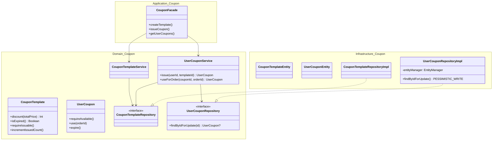
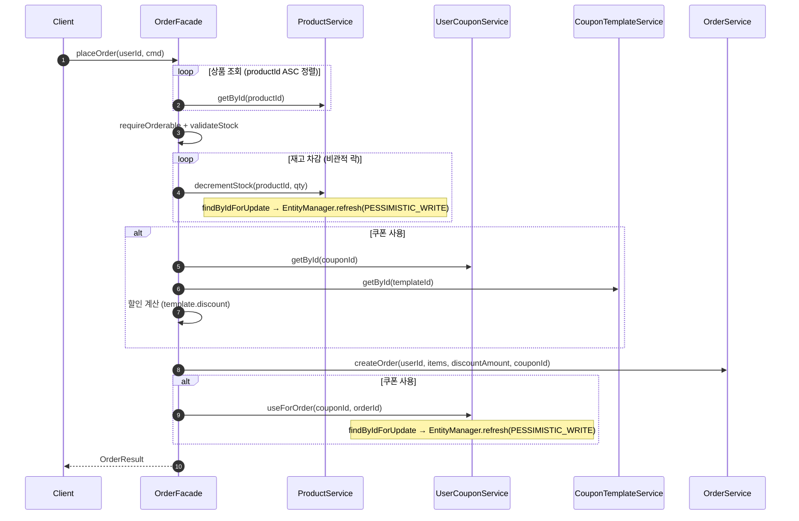
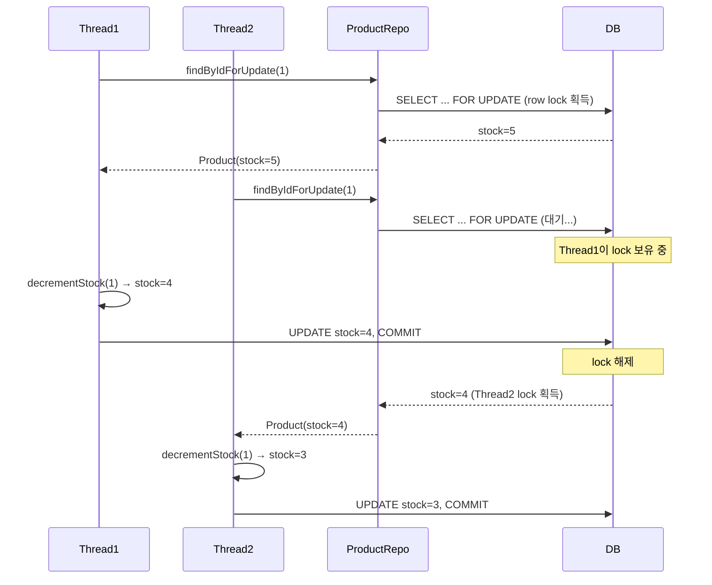

# Week 4 Implementation Notes

## ✅ Requirements Checklist
- [x] 동시성 버그 증명 (Lost Update on stock / likeCount)
- [x] 비관적 락 (SELECT FOR UPDATE) — 재고 차감
- [x] 원자적 SQL (UPDATE SET col = col + 1) — 좋아요 카운트
- [x] 쿠폰 도메인 4-layer 구현 (CouponTemplate, UserCoupon)
- [x] 쿠폰 적용 주문 (Order에 할인 필드 추가)
- [x] 쿠폰 동시 사용 방지 (비관적 락)
- [x] 동시성 테스트 3종 (재고, 좋아요, 쿠폰)

## 📁 File Structure

### 동시성 락
- `ProductRepository.kt` — `findByIdForUpdate`, `incrementLikeCountAtomic`, `decrementLikeCountAtomic` 추가
- `ProductRepositoryImpl.kt` — `EntityManager.refresh(PESSIMISTIC_WRITE)` + atomic SQL 구현
- `ProductJpaRepository.kt` — `@Modifying` native queries
- `ProductService.kt` — `decrementStock`에 `findByIdForUpdate`, like methods → `Unit` 반환
- `OrderFacade.kt` — `productId ASC` 정렬 (데드락 방지)

### 쿠폰 도메인
- `domain/coupon/` — CouponType, UserCouponStatus, CouponTemplate, UserCoupon, Repository interfaces, Services
- `infrastructure/coupon/` — Entities, JPA repositories, Repository implementations
- `application/coupon/` — CouponCommand, CouponResult, CouponFacade
- `interfaces/api/coupon/` — Admin/User controllers, DTOs, API specs

### Order 쿠폰 적용
- `Order.kt` — `originalTotalPrice`, `discountAmount`, `totalPrice`(computed), `userCouponId`
- `OrderEntity.kt` — 할인 필드 3개 + `userCouponId` 추가
- `OrderFacade.kt` — 쿠폰 유효성 검증 → 할인 계산 → 주문 → 쿠폰 사용 처리

## 🏗️ Class Diagram

## 🔁 Sequence Diagram — 쿠폰 적용 주문

## 🔁 Sequence Diagram — 동시 재고 차감 (비관적 락)

## 🎯 Design Decisions

### 1. JPA 1차 캐시 우회 — `EntityManager.refresh(PESSIMISTIC_WRITE)`
- **문제**: `@Lock` JPQL 쿼리는 DB에서 `FOR UPDATE`를 실행하지만, 같은 트랜잭션 내에서 이미 로드된 엔티티는 JPA 1차 캐시에서 반환됨 → stale data
- **해결**: `entityManager.refresh(entity, LockModeType.PESSIMISTIC_WRITE)` — DB에서 최신 데이터를 다시 읽으면서 행 잠금 획득
- **적용 위치**: `ProductRepositoryImpl.findByIdForUpdate()`, `UserCouponRepositoryImpl.findByIdForUpdate()`

### 2. 재고: 비관적 락 vs 원자적 SQL
- **재고 차감** → 비관적 락: 차감 실패 시 주문 전체를 롤백해야 하므로, 차감 전에 행을 잠가서 확실히 차감 가능 여부를 판단
- **좋아요 카운트** → 원자적 SQL: 모든 동시 요청이 성공해야 하며, 실패할 이유가 없음. DB가 원자적으로 처리하므로 잠금 불필요

### 3. 데드락 방지 — productId 오름차순 정렬
- 여러 상품을 동시에 주문할 때, 트랜잭션 A가 상품 1→2 순서로, 트랜잭션 B가 상품 2→1 순서로 잠그면 데드락 발생
- `cmd.items.sortedBy { it.productId }` — 모든 트랜잭션이 동일한 순서로 잠금 → 데드락 방지

### 4. 쿠폰 단일 사용 보장 — 비관적 락
- `UserCouponRepository.findByIdForUpdate()` → 같은 쿠폰에 대해 동시 `useForOrder()` 호출 시, 먼저 잠금을 획득한 스레드만 성공
- 후속 스레드는 잠금 대기 후 DB에서 최신 상태(USED) 읽음 → `requireAvailable()` 실패

### 5. 쿠폰 할인 모델
- `Order`에 `originalTotalPrice`, `discountAmount`, `totalPrice`(computed) 분리
- 할인 전/후 금액을 모두 기록하여 감사 추적(audit trail) 가능
- `CouponTemplate.discount(totalPrice)` — FIXED는 정액 할인(totalPrice 초과 방지), RATE는 비율 할인

## 🧪 Test Coverage

### Unit Tests
- `CouponTemplateDomainTest`: FIXED/RATE 할인 계산, 만료, 발급 수량, init 검증 (6)
- `CouponTemplateServiceUnitTest`: CRUD 서비스 (5)
- `UserCouponServiceUnitTest`: issue, useForOrder, 중복 발급, 만료, 수량 초과, 이미 사용 (8)
- `ProductServiceUnitTest`: decrementStock(findByIdForUpdate), incrementLikeCount(atomic), decrementLikeCount(atomic) (10)
- `LikeFacadeUnitTest`: addLike, removeLike with Unit return (5)
- `OrderFacadeUnitTest`: placeOrder with coupon params (5)
- `OrderServiceUnitTest`: createOrder with discount params (8)

### E2E Tests
- `CouponAdminV1ApiE2ETest`: 생성, 목록 조회, 삭제 (4)
- `CouponV1ApiE2ETest`: 발급, 중복 발급, 수량 초과, 인증 실패, 보유 목록 조회 (6)

### Concurrency Tests
- `OrderFacadeConcurrencyTest`: 10 threads × stock 5 → success 5, fail 5, stock 0
- `LikeFacadeConcurrencyTest`: 50 threads → likeCount = 50
- `CouponFacadeConcurrencyTest`: 5 threads × 같은 쿠폰 → success 1, fail 4

## 전략 비교표

| | 비관적 락 (Pessimistic) | 원자적 SQL (Atomic) |
|---|---|---|
| **잠금 방식** | DB 행 잠금 (FOR UPDATE) | 잠금 없음, DB 원자적 UPDATE |
| **블로킹** | Yes — 다른 트랜잭션 대기 | No |
| **재시도 필요** | No | No |
| **데드락 위험** | Yes (다중 상품) → 정렬로 해결 | No |
| **도메인 모델 변경** | None | None |
| **적용 대상** | 재고 차감, 쿠폰 사용 | 좋아요 카운트 |
| **적합한 상황** | 높은 경합 + 실패 시 롤백 필요 | 모든 요청 성공 + 높은 처리량 |
