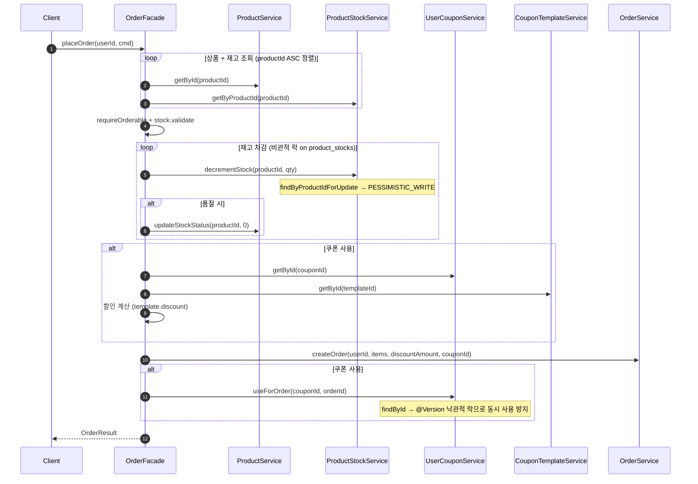
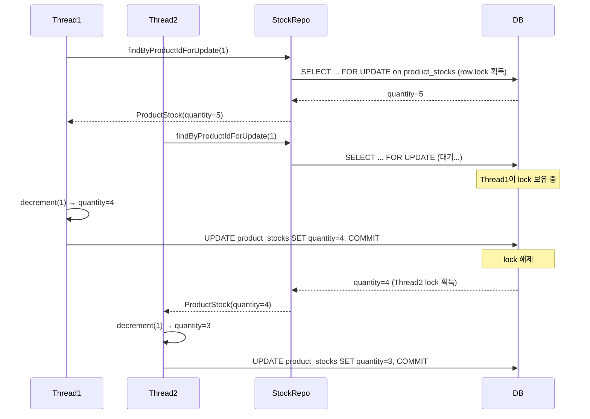
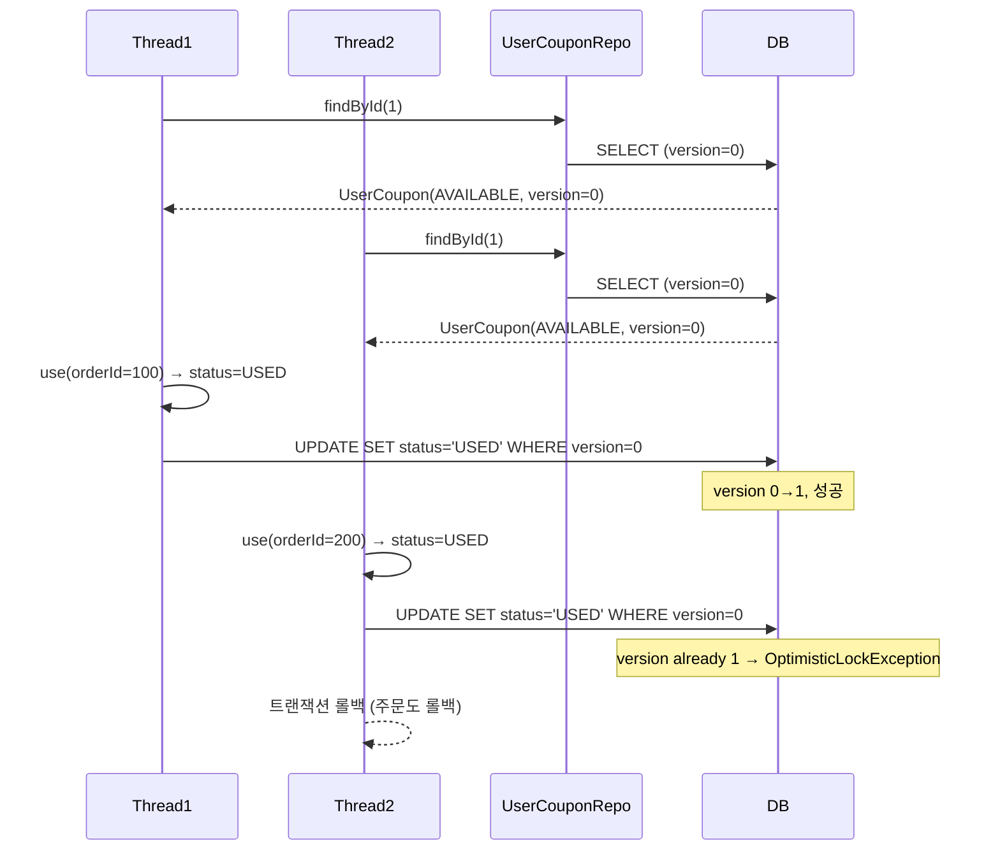

# Week 4 Implementation Notes

## ✅ Requirements Checklist
- [x] 동시성 버그 증명 (Lost Update on stock / likeCount)
- [x] 비관적 락 (SELECT FOR UPDATE) — 재고 차감
- [x] 원자적 SQL (UPDATE SET col = col + 1) — 좋아요 카운트
- [x] 쿠폰 도메인 4-layer 구현 (CouponTemplate, UserCoupon)
- [x] 쿠폰 적용 주문 (Order에 할인 필드 추가)
- [x] 쿠폰 동시 사용 방지 (낙관적 락 @Version)
- [x] 동시성 테스트 4종 (재고, 좋아요 다수 유저, 좋아요 단일 유저, 쿠폰)
- [x] Product/Stock 분리 — 비관적 락 범위 축소 (products → product_stocks)

## 📁 File Structure

### Product/Stock 분리
- `domain/catalog/product/ProductStock.kt` — 재고 도메인 모델 (validate, decrement, update, isSoldOut)
- `domain/catalog/product/ProductStockRepository.kt` — findByProductId, findByProductIdForUpdate
- `domain/catalog/product/ProductStockService.kt` — getByProductId, createStock, decrementStock(비관적 락), updateStock
- `infrastructure/catalog/product/ProductStockEntity.kt` — product_stocks 테이블, product_id(unique), quantity
- `infrastructure/catalog/product/ProductStockJpaRepository.kt` — Spring Data JPA
- `infrastructure/catalog/product/ProductStockRepositoryImpl.kt` — EntityManager.refresh(PESSIMISTIC_WRITE)

### 동시성 락
- `ProductStockRepository.kt` — `findByProductIdForUpdate` (비관적 락, 재고 전용)
- `ProductJpaRepository.kt` — `incrementLikeCountAtomic`, `decrementLikeCountAtomic` (원자적 SQL)
- `UserCouponEntity.kt` — `@Version` (낙관적 락)
- `OrderFacade.kt` — `productId ASC` 정렬 (데드락 방지)

### 쿠폰 도메인
- `domain/coupon/` — CouponType, UserCouponStatus, CouponTemplate, UserCoupon, Repository interfaces, Services
- `infrastructure/coupon/` — Entities, JPA repositories, Repository implementations
- `application/coupon/` — CouponCommand, CouponResult, CouponFacade
- `interfaces/api/coupon/` — Admin/User controllers, DTOs, API specs

### Order 쿠폰 적용
- `Order.kt` — `originalTotalPrice`, `discountAmount`, `totalPrice`(computed), `userCouponId`
- `OrderEntity.kt` — 할인 필드 3개 + `userCouponId` 추가
- `OrderFacade.kt` — 쿠폰 유효성 검증 → 할인 계산 → 주문 → 쿠폰 사용 처리

## 🏗️ Class Diagram

```mermaid
classDiagram
    namespace Domain_Product {
        class Product {
            +update(name, description, price)
            +requireOrderable()
            +markSoldOut()
            +restock()
        }
        class ProductStock {
            +validate(qty)
            +decrement(qty)
            +update(qty)
            +isSoldOut: Boolean
        }
        class ProductStockRepository {
            <<interface>>
            +findByProductIdForUpdate(productId) ProductStock?
        }
        class ProductStockService {
            +decrementStock(productId, qty) ProductStock
        }
    }

    namespace Domain_Coupon {
        class CouponTemplate {
            +discount(totalPrice) Int
            +isExpired() Boolean
            +requireIssuable()
            +incrementIssuedCount()
        }
        class UserCoupon {
            +requireAvailable()
            +use(orderId)
            +expire()
        }
        class UserCouponRepository {
            <<interface>>
        }
        class UserCouponService {
            +issue(userId, templateId) UserCoupon
            +useForOrder(couponId, orderId) UserCoupon
        }
    }

    namespace Infrastructure_Product {
        class ProductStockEntity {
            +@Table product_stocks
        }
        class ProductStockRepositoryImpl {
            -entityManager: EntityManager
            +findByProductIdForUpdate() PESSIMISTIC_WRITE
        }
    }

    namespace Infrastructure_Coupon {
        class UserCouponEntity {
            +@Version version
        }
        class UserCouponRepositoryImpl
    }

    namespace Application_Order {
        class OrderFacade {
            +placeOrder() 재고비관적락 + 쿠폰낙관적락
        }
    }

    ProductStockService --> ProductStockRepository
    ProductStockRepositoryImpl ..|> ProductStockRepository
    UserCouponService --> UserCouponRepository
    UserCouponRepositoryImpl ..|> UserCouponRepository
    OrderFacade --> ProductStockService
    OrderFacade --> UserCouponService
```



## 🔁 Sequence Diagram — 쿠폰 적용 주문 (Stock 분리 후)



## 🔁 Sequence Diagram — 동시 재고 차감 (비관적 락, product_stocks)



## 🔁 Sequence Diagram — 쿠폰 동시 사용 (낙관적 락)



## 🎯 Design Decisions

### 1. Product/Stock 분리 — 비관적 락 범위 축소
- **문제**: Product에 stock이 있으면 재고 차감 시 `products` 행 전체를 잠금 → 좋아요, 상태 변경 등 다른 작업도 블로킹
- **해결**: `ProductStock`을 별도 도메인으로 분리, `product_stocks` 테이블에 비관적 락 적용
- **효과**: 재고 락이 좋아요(atomic SQL on `products`)와 독립적으로 동작

### 2. JPA 1차 캐시 우회 — `EntityManager.refresh(PESSIMISTIC_WRITE)`
- **문제**: `@Lock` JPQL 쿼리는 DB에서 `FOR UPDATE`를 실행하지만, 같은 트랜잭션 내에서 이미 로드된 엔티티는 JPA 1차 캐시에서 반환됨 → stale data
- **해결**: `entityManager.refresh(entity, LockModeType.PESSIMISTIC_WRITE)` — DB에서 최신 데이터를 다시 읽으면서 행 잠금 획득
- **적용 위치**: `ProductStockRepositoryImpl.findByProductIdForUpdate()`

### 3. 쿠폰: 비관적 락 → 낙관적 락 전환
- **이유**: 쿠폰은 단일 사용자 소유 → 동시 경합은 더블클릭/DDOS 같은 극히 드문 상황
- **방법**: `UserCouponEntity`에 `@Version` 추가, `findByIdForUpdate()` 제거
- **충돌 시**: `ObjectOptimisticLockingFailureException` → 트랜잭션 전체 롤백 (주문도 함께 롤백)
- **재시도 불필요**: 충돌 = 이미 다른 요청이 사용 완료 → 실패가 올바른 결과

### 4. 왜 재고에 원자적 SQL을 쓰지 않는가?
- `UPDATE product_stocks SET quantity = quantity - :qty WHERE product_id = :productId AND quantity >= :qty` → `affected rows = 0`이면 재고 부족으로 예외 발생
- **기술적으로는 동작한다**: native `@Modifying` 쿼리도 Spring `@Transactional` 내에서 실행되므로 롤백 시 함께 롤백됨. 원자적 SQL이 "트랜잭션에 참여하지 않는다"는 것은 JPA 엔티티 상태 관리(1차 캐시, dirty checking)를 우회한다는 의미이지, DB 트랜잭션 자체를 우회하는 것은 아님
- **그럼에도 비관적 락을 선택한 이유**: 재고 비즈니스 룰이 SQL로 이동함. 현재는 `quantity >= :qty` 하나지만, 예약 재고(reserved stock), 사용자별 구매 제한, 번들 재고 등 요구사항이 추가되면 모든 룰이 SQL에서 관리되어야 함. 도메인 모델(`ProductStock.decrement()`)에 룰을 두면 단위 테스트만으로 검증 가능하지만, SQL에 두면 항상 DB 연동 통합 테스트가 필요
- **Product/Stock 분리가 원자적 SQL을 선택지로 만들었다**: 분리 전에는 `products` 행에 stock이 있어 원자적 SQL로 재고만 차감해도 좋아요 카운트 등 다른 컬럼과 동일 행에서 충돌 가능. 분리 후 `product_stocks`는 `quantity` 하나만 관리하므로 원자적 SQL이 기술적으로 깔끔하게 적용 가능. 즉, **느슨한 결합이 전략 선택의 자유도를 높인 사례**
- **결론**: 현재 요구사항만 보면 원자적 SQL도 충분하지만, 재고 도메인의 확장 가능성을 고려해 비즈니스 룰을 도메인 모델에 유지하는 비관적 락을 선택

### 5. 왜 쿠폰에 원자적 SQL을 쓰지 않는가?
- 쿠폰 사용은 주문 생성과 같은 `@Transactional` 안에서 JPA 엔티티 상태로 관리되어야 함
- 원자적 SQL은 JPA 엔티티 상태를 우회하므로, 같은 트랜잭션 내 다른 JPA 엔티티 연산과 일관성 보장이 어려움
- 다중 쿠폰 적용 시 JPA dirty checking 기반 부분 롤백이 불가능
- **결론**: 다른 엔티티와 함께 JPA 영속성 컨텍스트 안에서 관리되어야 하는 경우 → 낙관적 락이 적합

### 6. 전략 비교표

| | 비관적 락 (Pessimistic) | 낙관적 락 (Optimistic) | 원자적 SQL (Atomic) |
|---|---|---|---|
| **잠금 방식** | DB 행 잠금 (FOR UPDATE) | @Version 컬럼 비교 | 잠금 없음, DB 원자적 UPDATE |
| **블로킹** | Yes — 다른 트랜잭션 대기 | No | No |
| **충돌 시** | 대기 후 진행 | Exception → 실패/재시도 | 충돌 불가 |
| **트랜잭션 참여** | Yes | Yes | Yes (DB 트랜잭션 참여, JPA 영속성 컨텍스트만 우회) |
| **데드락 위험** | Yes (다중 행) → 정렬로 해결 | No | No |
| **적합한 상황** | 높은 경합 + 롤백 필요 | 낮은 경합 + 트랜잭션 내 일관성 | 단순 산술 + 항상 성공 |
| **적용 대상** | 재고 차감 (product_stocks) | 쿠폰 사용 (user_coupons) | 좋아요 카운트 (products) |

### 7. 전략 선택 기준

```
Q1. 비즈니스 룰 없이 단일 컬럼 증감만으로 완결되는가?
├─ Yes → ✅ Atomic SQL (좋아요: count+1, 끝)
└─ No  → Q2. 경합 빈도는?
         ├─ 높음 → ✅ 비관적 락 (재고: 검증→차감→품절전이, 다수 유저 동시)
         └─ 낮음 → ✅ 낙관적 락 (쿠폰: 상태전이, 단일 유저)
```

| Domain  | Q1 | Q2 | Result |
|---------|---|---|---|
| 상품 좋아요  | Yes (count+1, 끝) | — | Atomic SQL |
| 주문 + 재고 | No (validate→decrement→isSoldOut) | 높음 | 비관적 락 |
| 쿠폰      | No (requireAvailable→use 상태전이) | 낮음 | 낙관적 락 |

### 8. 데드락 방지 — productId 오름차순 정렬
- 여러 상품을 동시에 주문할 때, 트랜잭션 A가 상품 1→2 순서로, 트랜잭션 B가 상품 2→1 순서로 잠그면 데드락 발생
- `cmd.items.sortedBy { it.productId }` — 모든 트랜잭션이 동일한 순서로 잠금 → 데드락 방지

### 9. 좋아요 동시성 — UNIQUE 제약 + 트랜잭션 롤백
- `likes` 테이블의 `(userId, productId)` UNIQUE 제약이 중복 방지의 최후 방어선
- `LikeService.existsBy` 체크는 TOCTOU race 있으나, UNIQUE 제약이 보장
- 같은 유저가 동시에 좋아요 시: 1개만 INSERT 성공, 나머지는 UNIQUE 위반 → 트랜잭션 롤백 → `incrementLikeCountAtomic` 미도달
- **결과**: likeCount 정합성 보장, 별도 락 불필요

### 10. 쿠폰 할인 모델
- `Order`에 `originalTotalPrice`, `discountAmount`, `totalPrice`(computed) 분리
- 할인 전/후 금액을 모두 기록하여 감사 추적(audit trail) 가능
- `CouponTemplate.discount(totalPrice)` — FIXED는 정액 할인(totalPrice 초과 방지), RATE는 비율 할인

## 🧪 Test Coverage

### Unit Tests
- `ProductUnitTest`: init 검증, update, incrementLike/decrementLike (7)
- `ProductStockUnitTest`: init, isSoldOut, validate, decrement, update 경계값 (12)
- `ProductServiceUnitTest`: createProduct(no stock), updateStockStatus(ACTIVE↔SOLD_OUT), like atomic (10)
- `ProductStockServiceUnitTest`: getByProductId, createStock, decrementStock, updateStock (7)
- `ProductFacadeUnitTest`: createProduct+stock, getDetail+stock, updateProduct+stock (6)
- `CouponTemplateDomainTest`: FIXED/RATE 할인 계산, 만료, 발급 수량, init 검증 (6)
- `CouponTemplateServiceUnitTest`: CRUD 서비스 (5)
- `UserCouponServiceUnitTest`: issue, useForOrder(findById), 중복 발급, 만료, 수량 초과, 이미 사용 (8)
- `OrderFacadeUnitTest`: placeOrder with ProductStockService + coupon params (5)
- `OrderServiceUnitTest`: createOrder with discount params (8)

### E2E Tests
- `CouponAdminV1ApiE2ETest`: 생성, 목록 조회, 삭제 (4)
- `CouponV1ApiE2ETest`: 발급, 중복 발급, 수량 초과, 인증 실패, 보유 목록 조회 (6)

### Concurrency Tests
- `OrderFacadeConcurrencyTest`: 10 threads × stock 5 → success 5, fail 5, stock 0 (비관적 락 on product_stocks)
- `LikeFacadeConcurrencyTest`: 50명 각자 좋아요 → likeCount = 50 (원자적 SQL)
- `LikeFacadeConcurrencyTest`: 10 threads × 같은 유저 같은 상품 → success 1, fail 9, likeCount = 1 (UNIQUE 제약)
- `CouponFacadeConcurrencyTest`: 5 threads × 같은 쿠폰 → success 1, fail 4 (낙관적 락 @Version)

