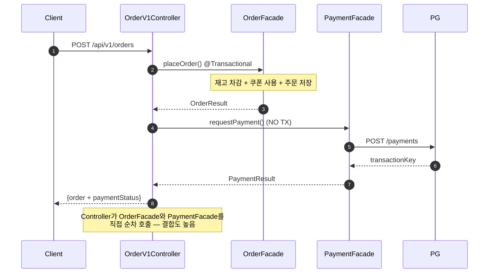
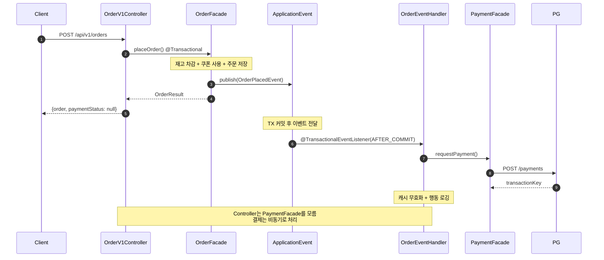
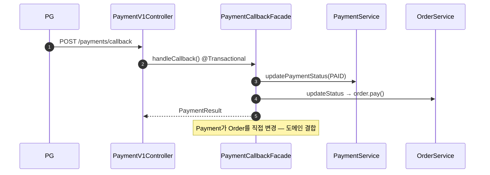
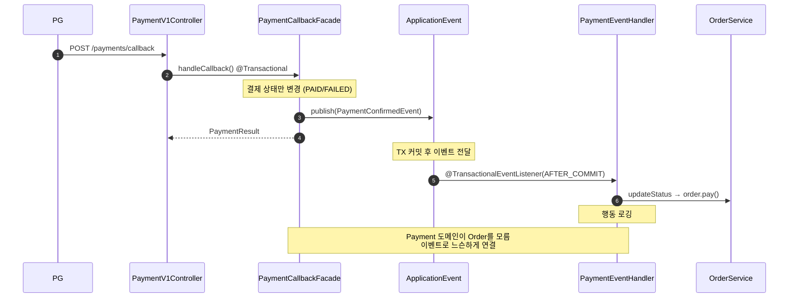
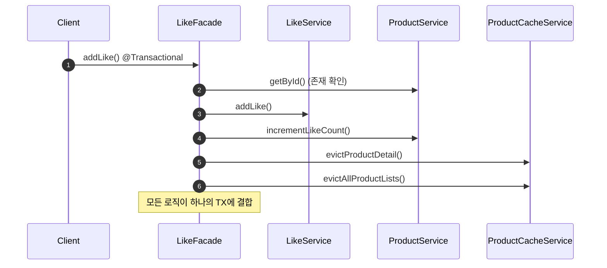
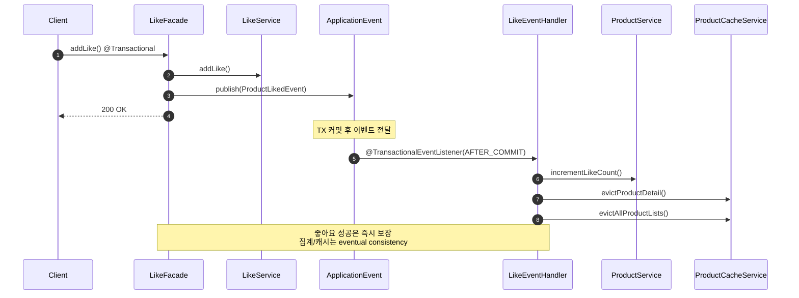

# Week 7 Implementation Notes: Event-Driven Architecture with Kafka

## ✅ Requirements Checklist

### Step 1 — ApplicationEvent로 경계 나누기
- [ ] 주문–결제 플로우에서 부가 로직을 이벤트 기반으로 분리
- [ ] 좋아요 처리와 집계를 이벤트 기반으로 분리 (집계 실패와 무관하게 좋아요는 성공)
- [ ] 유저 행동(조회, 좋아요, 주문 등)에 대한 서버 레벨 로깅을 이벤트로 처리
- [ ] 동작의 주체를 적절하게 분리하고, 트랜잭션 간의 연관관계를 고민

### Step 2 — Kafka Producer / Consumer
- [ ] ApplicationEvent 중 시스템 간 전파가 필요한 이벤트를 Kafka로 발행
- [ ] `acks=all`, `idempotence=true` 설정
- [ ] Transactional Outbox Pattern 구현
- [ ] PartitionKey 기반 이벤트 순서 보장
- [ ] Consumer가 Metrics 집계 처리 (product_metrics upsert)
- [ ] `event_handled` 테이블을 통한 멱등 처리 구현
- [ ] manual Ack + `version`/`updated_at` 기준 최신 이벤트만 반영

### Step 3 — 선착순 쿠폰 발급
- [ ] 쿠폰 발급 요청 API → Kafka 발행 (비동기 처리)
- [ ] Consumer에서 선착순 수량 제한 + 중복 발급 방지 구현
- [ ] 발급 완료/실패 결과를 유저가 확인할 수 있는 구조 설계
- [ ] 동시성 테스트 — 수량 초과 발급이 발생하지 않는지 검증

---

## 🎯 이벤트 경계 분석 — 핵심 vs 부가 로직

### 판단 기준

> "이 로직이 실패하면 사용자 요청 자체가 실패해야 하는가?"
> - **Yes** → 핵심 TX에 유지 (커밋 보장)
> - **No** → 부가 로직, 이벤트로 분리 가능 (AFTER_COMMIT)

### 1. 주문 생성 플로우

```
OrderFacade.placeOrder() — 현재 단일 @Transactional
├── [핵심] 재고 검증 & 차감        ← 주문 성립의 전제조건
├── [핵심] 쿠폰 검증 & 할인 계산    ← 금액 결정에 필수
├── [핵심] 쿠폰 상태 변경 (USED)    ← 돈과 직결, 원자적 처리 필수
├── [핵심] 주문 생성 & 저장         ← 핵심 비즈니스 결과물
│
├── [부가] 결제 요청 (PG 호출)      ← 이미 TX 밖. 이벤트로 전환
├── [부가] 캐시 무효화              ← eventual consistency OK
├── [부가] 유저 행동 로깅 (미구현)   ← 분석용, 비동기
└── [부가] 판매량 집계 (미구현)      ← product_metrics, 비동기
```

**쿠폰을 핵심 TX에 유지하는 이유:**
- 쿠폰 상태 변경을 AFTER_COMMIT으로 빼면, 주문 성공 → 쿠폰 USED 실패 → 같은 쿠폰으로 재주문 가능
- 쿠팡/무신사 등 실제 커머스에서도 쿠폰 차감은 주문과 함께 원자적으로 처리
- 검증뿐 아니라 상태 변경까지 핵심 TX에 포함

**결제를 이벤트로 분리하는 이유:**
- 현재도 Controller에서 TX 밖에서 순차 호출 중 (`OrderV1Controller` L42-53)
- 주문은 PLACED로 확정 → 결제는 나중에 해도 됨 (시간 제한 내)
- PG 장애가 주문 자체를 막으면 안 됨
- 이벤트로 전환하면 Controller가 PaymentFacade를 직접 모를 수 있음 → 결합도 감소

### 2. 결제 콜백 플로우

```
PaymentCallbackFacade.handleCallback() — 현재 단일 @Transactional
├── [핵심] 결제 상태 변경 (PAID/FAILED)  ← 결제 도메인의 핵심
│
├── [부가] 주문 상태 변경 (order.pay())   ← 결제가 주문을 직접 변경 중, 결합도 높음
└── [부가] 유저 행동 로깅 (미구현)        ← 분석용
```

**주문 상태 변경을 이벤트로 분리하는 이유:**
- Payment 도메인이 Order 도메인을 직접 변경하는 건 도메인 간 결합
- `PaymentConfirmedEvent` 발행 → Order 리스너가 `order.pay()` 처리
- 실패 시? Payment는 PAID인데 Order는 PLACED → recovery scheduler가 정합성 보정
- 이미 PaymentRecoveryFacade가 이 역할을 할 수 있는 구조

### 3. 좋아요 플로우

```
LikeFacade.addLike() — 현재 단일 @Transactional
├── [핵심] 좋아요 생성/삭제           ← 유저 액션의 핵심 결과
│
├── [부가] Product.likeCount 증감     ← 집계 실패해도 좋아요는 성공해야 함
├── [부가] 캐시 무효화                ← eventual consistency OK
└── [부가] 유저 행동 로깅 (미구현)     ← 분석용
```

**likeCount를 이벤트로 분리하는 이유:**
- 좋아요는 유저 통계/경험 목적, 자주 발생하지 않음
- 카운트 불일치는 일시적이고 최종 정합성으로 충분
- commerce-streamer에서 product_metrics로 집계하면 더 정확

### 4. 상품 상세 조회 (미구현 — 신규)

```
ProductFacade.getProductDetail()
└── [부가] 조회수 로깅 (미구현)       ← fire-and-forget, 조회 응답에 영향 없어야 함
```

- 읽기 전용이므로 핵심 TX 없음
- `@EventListener` + `@Async`로 충분 (AFTER_COMMIT 불필요)

---

## 🔀 이벤트 경계 요약

| 이벤트 | 핵심 TX (커밋 보장) | AFTER_COMMIT 이벤트 리스너 |
|--------|---------------------|--------------------------|
| **주문 생성** | 재고 차감 + 쿠폰 사용 + 주문 저장 | 결제 요청, 캐시 무효화, 행동 로깅, 판매량 집계 |
| **결제 콜백** | 결제 상태 변경 (PAID/FAILED) | 주문 상태 변경 (`order.pay()`), 행동 로깅 |
| **좋아요** | 좋아요 생성/삭제 | likeCount 증감, 캐시 무효화, 행동 로깅 |
| **상품 조회** | (없음 — 읽기) | 조회수 로깅 (fire-and-forget) |

---

## 🏗️ ApplicationEvent 설계

### 이벤트 클래스

```kotlin
// 주문 생성 완료 이벤트
data class OrderPlacedEvent(
    val orderId: Long,
    val userId: Long,
    val items: List<OrderItemSnapshot>,   // productId, quantity, price
    val originalTotalPrice: Int,
    val discountAmount: Int,
    val totalPrice: Int,
    val userCouponId: Long?,
    val cardType: CardType,
    val cardNo: String,
)

// 결제 확인 이벤트
data class PaymentConfirmedEvent(
    val paymentId: Long,
    val orderId: Long,
    val transactionKey: String,
    val amount: Int,
    val paidAt: ZonedDateTime,
)

// 결제 실패 이벤트
data class PaymentFailedEvent(
    val paymentId: Long,
    val orderId: Long,
    val reason: String?,
)

// 좋아요 이벤트
data class ProductLikedEvent(
    val userId: Long,
    val productId: Long,
)

data class ProductUnlikedEvent(
    val userId: Long,
    val productId: Long,
)

// 상품 조회 이벤트
data class ProductViewedEvent(
    val userId: Long?,
    val productId: Long,
)
```

### 리스너 구조

```kotlin
// 주문 이벤트 핸들러
@Component
class OrderEventHandler {

    @TransactionalEventListener(phase = AFTER_COMMIT)
    @Async
    fun handleOrderPlaced(event: OrderPlacedEvent) {
        // 1. 결제 요청 (PG 호출)
        // 2. 캐시 무효화
        // 3. 유저 행동 로깅
    }
}

// 결제 이벤트 핸들러
@Component
class PaymentEventHandler {

    @TransactionalEventListener(phase = AFTER_COMMIT)
    @Async
    fun handlePaymentConfirmed(event: PaymentConfirmedEvent) {
        // 1. 주문 상태 → PAID
        // 2. 유저 행동 로깅
    }
}

// 좋아요 이벤트 핸들러
@Component
class LikeEventHandler {

    @TransactionalEventListener(phase = AFTER_COMMIT)
    @Async
    fun handleProductLiked(event: ProductLikedEvent) {
        // 1. likeCount 증감
        // 2. 캐시 무효화
        // 3. 유저 행동 로깅
    }
}
```

---

## 🔁 변경 전후 시퀀스 다이어그램

### 주문 생성 — Before (현재)



### 주문 생성 — After (이벤트 분리)



### 결제 콜백 — Before (현재)



### 결제 콜백 — After (이벤트 분리)



### 좋아요 — Before (현재)



### 좋아요 — After (이벤트 분리)



---

## 🔮 Step 2 — Kafka 확장 방향 (Preview)

ApplicationEvent로 분리한 이벤트 중, **시스템 간 전파가 필요한 것**을 Kafka로 발행:

| Topic | Key | 이벤트 | Consumer 처리 |
|-------|-----|--------|---------------|
| `order-events` | orderId | OrderPlaced, OrderPaid | 판매량 집계 → product_metrics |
| `catalog-events` | productId | ProductLiked, ProductUnliked, ProductViewed | 좋아요수/조회수 집계 → product_metrics |
| `coupon-issue-requests` | couponTemplateId | CouponIssueRequested | 선착순 쿠폰 발급 처리 |

**Producer**: Transactional Outbox Pattern으로 At Least Once 보장
**Consumer**: `event_handled` 테이블로 멱등 처리, manual Ack

---

## 🧪 Test Coverage
_(구현 후 업데이트)_
