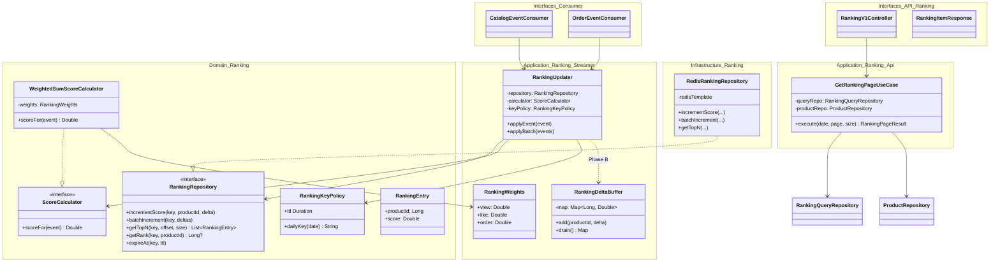
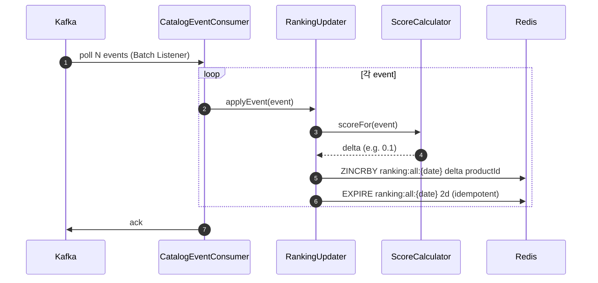
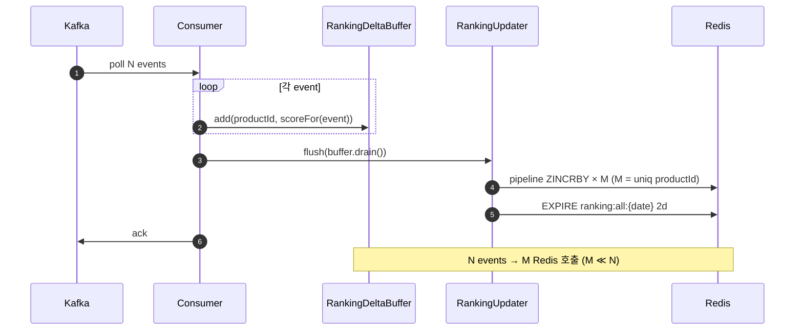
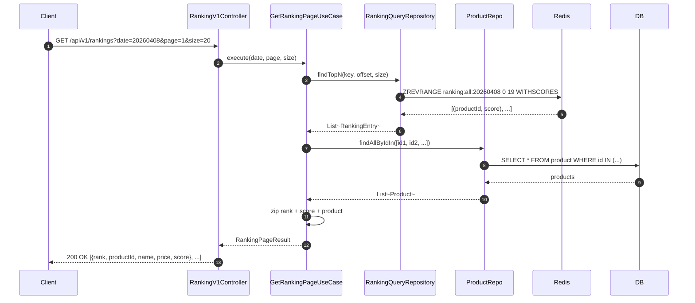
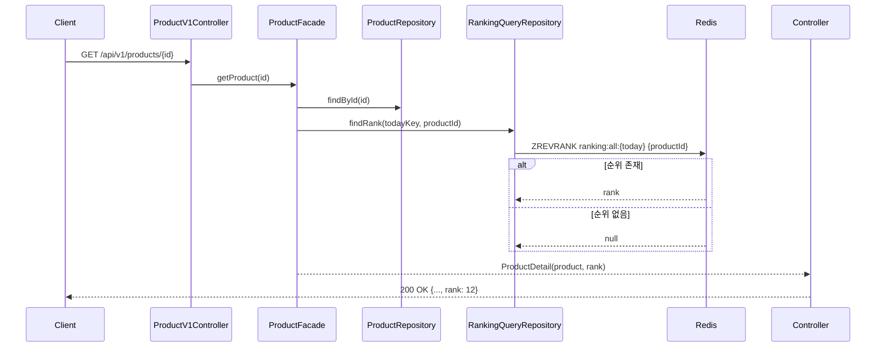

# Week 9 Implementation Notes: Redis ZSET 기반 실시간 상품 랭킹 시스템

> **Status**: 🚧 DRAFT (설계 단계 — 구현/측정 후 본 문서 갱신 예정)

## ✅ Requirements Checklist

### Must-Have
- [ ] Kafka Consumer가 일간 키(`ranking:all:{yyyyMMdd}`) ZSET에 점수를 누적
- [ ] 랭킹 ZSET TTL 2일 + 일별 키 전략
- [ ] 가중치 합산 스코어링 (view / like / order)
- [ ] 랭킹 페이지 조회 API (`GET /api/v1/rankings?date=&size=&page=`)
- [ ] 랭킹 응답에 상품 정보 Aggregation (단순 ID 아님)
- [ ] 상품 상세 조회 시 해당 상품의 순위 반환 (없으면 null)
- [ ] E2E: 이벤트 발행 → ZSET 점수 반영 → API 조회

### Nice-To-Have
- [ ] Kafka Batch Listener + Consumer 메모리 델타 집계 (Phase B)
- [ ] 콜드 스타트 완화: 23:55 Carry-Over 스케줄러
- [ ] 동적 가중치 (Config 기반, 무중단 튜닝)

### 검증
- [ ] 정합성: 단건 처리(Phase A) ↔ 배치 델타(Phase B) ZSET 스냅샷 동일
- [ ] 가중치 적용 검증 (e.g. 주문 1건 > 좋아요 3건)
- [ ] 일자 변경 후 이전 날짜 랭킹 조회 정상 동작
- [ ] TTL 만료 시 ZSET 자동 정리
- [ ] k6 부하 시나리오 5종 × 10회 측정 + Phase A vs Phase B 비교

---

## 🧭 핵심 철학 (멘토링 노트 반영)

1. **"딸깍 아키텍처"** — 확장 가능한 구조가 로직 완벽함보다 우선. Strategy 패턴으로 가중치/스코어 분리.
2. **RDB = 원장(SSOT) / Redis = 휘발성 정렬 뷰** — Redis는 언제든 RDB로 재구축 가능해야 함.
3. **단건 ZINCRBY 금지** — 1만 이벤트 = 1만 Redis 호출은 금기. Consumer 메모리에서 productId별 델타로 접어서 한 번에 반영.
4. **DLQ + Eventual Consistency** — Redis 반영 실패가 메인 트랜잭션을 막아서는 안 됨.

---

## 📁 File Structure (예정)

### commerce-streamer (랭킹 갱신 파이프라인)
- `domain/ranking/RankingRepository.kt` — Port (incrementScore, batchIncrement, getTopN, getRank, ...)
- `domain/ranking/RankingKeyPolicy.kt` — `ranking:all:{yyyyMMdd}` 키 생성 + TTL 2일 정책
- `domain/ranking/ScoreCalculator.kt` — Strategy 인터페이스 (`scoreFor(eventType, payload): Double`)
- `domain/ranking/WeightedSumScoreCalculator.kt` — 기본 구현 (view 0.1, like 0.2, order 0.7)
- `application/ranking/RankingWeightConfig.kt` — `@ConfigurationProperties("ranking.weights")` 동적 로딩
- `application/ranking/RankingUpdater.kt` — Consumer가 호출하는 진입점 (단건/배치 두 모드 지원)
- `infrastructure/ranking/RedisRankingRepository.kt` — ZADD/ZINCRBY/EXPIRE Adapter
- (Phase B) `application/ranking/RankingDeltaBuffer.kt` — Map<productId, delta> 누적 → flush

### commerce-api (랭킹 조회 + 상품 상세)
- `domain/ranking/RankingQueryRepository.kt` — Port (findTopN, findRank)
- `infrastructure/ranking/RedisRankingQueryRepository.kt` — ZREVRANGE/ZREVRANK
- `application/ranking/GetRankingPageUseCase.kt` — Top-N + Product Aggregation (N+1 방지)
- `interfaces/api/ranking/RankingV1Controller.kt` — `GET /api/v1/rankings`
- `interfaces/api/ranking/RankingV1Dto.kt` — RankingItemResponse(rank, productId, name, price, score)
- `interfaces/api/product/ProductV1Controller.kt` (수정) — 상세 응답에 `rank` 필드 추가

### Configuration
- `commerce-streamer/resources/application.yml` — `ranking.weights.view/like/order` 동적 가중치
- `commerce-api/resources/application.yml` — Redis read template

### Tests
- `RedisRankingRepositoryTest.kt` — 통합 (ZINCRBY, TTL, ZREVRANGE)
- `WeightedSumScoreCalculatorUnitTest.kt` — Score 정합성
- `GetRankingPageUseCaseTest.kt` — N+1 방지, 상품 Aggregation
- `RankingPipelineE2ETest.kt` — Kafka publish → Redis → API
- `RankingTtlExpirationTest.kt` — TTL 만료 후 키 자동 삭제 (S6)
- `k6/scripts/ranking-uniform.js` (S2)
- `k6/scripts/ranking-skewed.js` (S3)
- `k6/scripts/ranking-burst.js` (S5)

---

## 🏗️ Class Diagram



---

## 🔁 Sequence Diagrams

### Write Path — Phase A (단건 ZINCRBY)



### Write Path — Phase B (배치 델타 집계)



### Read Path — 랭킹 페이지 조회



### Read Path — 상품 상세 + 순위



---

## 🎯 Design Decisions

### 1. 가중치 적용 시점: 쓰기 시 (Option A)
- **결정**: ZINCRBY 호출 시 이미 가중치가 곱해진 score를 보냄. ZSET은 1개 (`ranking:all:{date}`).
- **Why**: 조회가 압도적으로 많은 워크로드. 읽기 비용을 최소화해야 함.
- **Trade-off**: 가중치 변경 시 과거 데이터 재계산 불가. 운영적으로 "다음 윈도우부터 적용"으로 합의.
- **Mitigation**: 가중치는 `RankingWeightConfig`로 외부화. 변경은 무중단 가능하나, 효력은 다음 일자 키부터.

### 2. 가중치 (초기값)
| 이벤트 | Weight | Score 식 |
|---|---|---|
| view | 0.1 | `0.1 * 1` |
| like | 0.2 | `0.2 * 1` |
| order | 0.7 | `0.7 * log10(price * quantity + 1)` |
- order만 log 정규화 적용 → 고가 상품이 점수를 독식하는 것 방지 (멘토 노트 Phase 2-1)
- 합 = 1.0 (정규화)

### 3. ZSET 1개 vs 3개 분리
- **결정**: ZSET 1개 (가중치 미리 적용)
- **대안**: view/like/order 분리 후 조회 시 ZUNIONSTORE → 가중치 변경 유연성↑이나 조회 비용↑
- **이번 주차에선 단순함 우선**, 변경 빈도가 낮은 가중치는 Config 재시작 또는 동적 리로드로 충분

### 4. Phase A → Phase B 단계적 도입
- **A (단건 ZINCRBY)**: Kafka Batch Listener는 그대로 쓰되, 루프 안에서 이벤트당 ZINCRBY 호출
- **B (메모리 델타 집계)**: 같은 productId의 점수를 Map으로 합산 후 flush
- **Why 단계적**: 정합성을 먼저 확보하고 (A), 그 다음 성능을 측정해 B의 효과를 정량화
- **검증 포인트**: A와 B의 ZSET 최종 스냅샷이 **bit-for-bit 동일**해야 함

### 5. 멱등성 — 기존 `EventHandledEntity` 재활용
- 기존 metrics 파이프라인이 이미 `EventHandledEntity`로 멱등 처리 중
- 랭킹 갱신도 동일 트랜잭션 안에서 수행 → metrics 성공 = 랭킹 성공
- **단**, Redis 호출은 트랜잭션 밖에서 (DB 트랜잭션이 Redis를 기다리면 안 됨)
- Redis 실패 시: 로그 + DLQ로 빠지되 메인 트랜잭션은 커밋 (Eventual Consistency)

### 6. TTL 정책
- **TTL = 2일** (윈도우 1일 × 2배)
- 쓸 때마다 EXPIRE 재설정 (멱등) — 첫 번째 ZINCRBY 호출 시 같이 수행
- 멘토 노트 권장 "윈도우 1.5~2배" 준수

### 7. 상품 정보 Aggregation (N+1 방지)
- ZREVRANGE로 productId 20개 받아오면 → `productRepository.findAllByIdIn(ids)` **단일 쿼리**
- order 보존 위해 결과 zip 시 ID → Product Map으로 lookup
- 향후: product 정보 자체를 Redis Strings로 캐싱 (이번 주차 범위 밖)

### 8. 동점자 처리 (Tie-breaking) — 이번 주차 범위 밖
- 멘토 노트에선 `score + timestamp * 1e-6` 권장
- 이번 주차엔 단순화: 동점은 ZSET 기본 동작(사전순) 허용
- 운영 환경에선 추가 적용 검토

---

## 📊 Redis Key Design

| Key | Type | 용도 | TTL |
|---|---|---|---|
| `ranking:all:{yyyyMMdd}` | Sorted Set | 일간 상품 랭킹 (member=productId, score=가중치 합산) | 2일 |
| (옵션) `ranking:all:{yyyyMMdd}:carryover` | Sorted Set | 23:55 Carry-Over로 미리 만든 다음날 키 | 2일 |

### 키 라이프사이클
```
[D-1 23:55]  스케줄러 → ZUNIONSTORE D키→D+1키 (top-100, weight 0.001)
[D 00:00]    이벤트 인입 시작 → ZINCRBY 누적
[D 24:00]    윈도우 종료 (키는 계속 살아 있음, 조회 가능)
[D+2 00:00]  TTL 만료 → 키 자동 삭제
```

---

## 🧪 Test Strategy

### 정합성 시나리오 (JUnit 통합)

#### S1: Baseline — 균등 분포 저트래픽
- 1,000 events / 100 products / view:like:order = 7:2:1
- **목적**: 기본 동작 + Phase A/B 결과 동일성 검증
- **단정**: 모든 productId의 ZSCORE가 두 모드에서 동일

#### S4: 가중치 정합성 — 결정론적
- product A: view 100 + like 10 + order 1 (price=10,000)
- product B: order 5 (price=10,000)
- product C: view 1,000
- **단정**: 예상 score (수식 직접 계산값) == ZSCORE
- 추가: B(주문 5건) > A > C 순서 보장 검증

#### S6: TTL 만료 시나리오
- 짧은 TTL(예: 3초)로 키 생성 → 데이터 인입 → TTL 후 `EXISTS key` == false
- 다음 일자 키는 영향 없음 검증

### 성능 시나리오 (k6, 각 10회 반복)

#### S2: 고트래픽 — 균등 분포
- 100,000 events / 1,000 products / 7:2:1
- 측정: 처리 시간, RPS, Redis 호출 수, p95 latency

#### S3: Hot-Key 집중 (Skewed) — 80/20
- 100,000 events / 1,000 products / 상위 20개에 80% 집중
- **Phase B 효과 극대화 시나리오** — Redis 호출 압축률 측정 (~99% 기대)

#### S5: 버스트 — 5초 안에 50,000 이벤트
- 측정: Consumer Lag 곡선, 손실 0건, 처리 완료 시간

### 측정 지표 매트릭스
| 지표 | 출처 |
|---|---|
| 처리 시간 (총/p95) | k6 trend |
| RPS (events/sec) | k6 counter |
| Redis 명령 수 | Spring Actuator + Lettuce metric |
| Consumer Lag | Kafka Actuator metric |
| 정합성 (스냅샷 diff) | `ZRANGE 0 -1 WITHSCORES` 후 JSON 비교 |

### 결과 보고 형식 (각 시나리오)
| Run | Phase A 시간 | Phase A Redis 호출 | Phase B 시간 | Phase B Redis 호출 | 정합성 |
|---|---|---|---|---|---|
| 1~10 | ... | ... | ... | ... | ✅ |
| **avg** | | | | | |
| **p95** | | | | | |

---

## 🗂️ Commit Plan

| # | 커밋 메시지 | 내용 |
|---|---|---|
| 1 | `[ADD] Ranking 도메인 + ScoreCalculator + 동적 Weight Config` | Strategy 분리, 단위 테스트 |
| 2 | `[ADD] RedisRankingRepository (ZINCRBY/ZREVRANGE/EXPIRE) + 통합 테스트` | Adapter |
| 3 | `[ADD] Streamer에 RankingUpdater 연결 (Phase A 단건 ZINCRBY)` | Catalog/Order Consumer wiring |
| 4 | `[ADD] Ranking API (페이지 + 상품 Aggregation)` | GET /api/v1/rankings |
| 5 | `[ADD] 상품 상세에 랭킹 정보 추가 (ZREVRANK)` | Product Detail rank |
| 6 | `[ADD] 정합성 통합 테스트 (S1, S4, S6 TTL)` | JUnit |
| 7 | `[ADD] k6 부하 테스트 + Phase A 측정 결과 (S2/S3/S5 × 10회)` | k6/results 적재 |
| 8 | `[REFACTOR] Batch Listener + Delta 집계 (Phase B)` | RankingDeltaBuffer |
| 9 | `[ADD] k6 측정 — Phase B + 비교 분석` | week-9.md 보고 갱신 |
| 10 | `[ADD] Carry-Over 스케줄러 (23:55 ZUNIONSTORE)` | nice-to-have |
| 11 | `[DOCS] week-9 최종본 + PR 노트` | 회고 + 측정 결과 정리 |

---

## 🎯 Open Questions (구현 중 결정)

1. **EXPIRE 호출 빈도** — 매 ZINCRBY마다 호출 vs 키 생성 시 1회만 (Lua script로 원자성 확보?)
2. **order 점수 식** — `log10(price * qty + 1)` vs 단순 `price * qty / 1000` — 실제 데이터로 분포 확인 후 결정
3. **Phase B flush 단위** — Kafka batch 단위 vs 시간 기반 (예: 100ms 타이머)
4. **상품 상세 rank 조회 비용** — 매 요청마다 Redis 호출 vs 짧은 캐시 (여기선 매 호출, 향후 캐싱)

---

## 🔗 References

- [Redis Sorted Sets](https://redisgate.kr/redis/command/zsets.php)
- [Spring Data Redis - Template](https://docs.spring.io/spring-data/redis/reference/redis/template.html)
- 멘토링 노트 (Devin) — "딸깍 아키텍처", "단건 ZINCRBY 금지", "RDB는 원장, Redis는 계산기"
- Week 7 — Kafka Outbox + Collector 파이프라인
- Week 8 — Redis Sorted Set 대기열 (ZSET 운영 경험)
